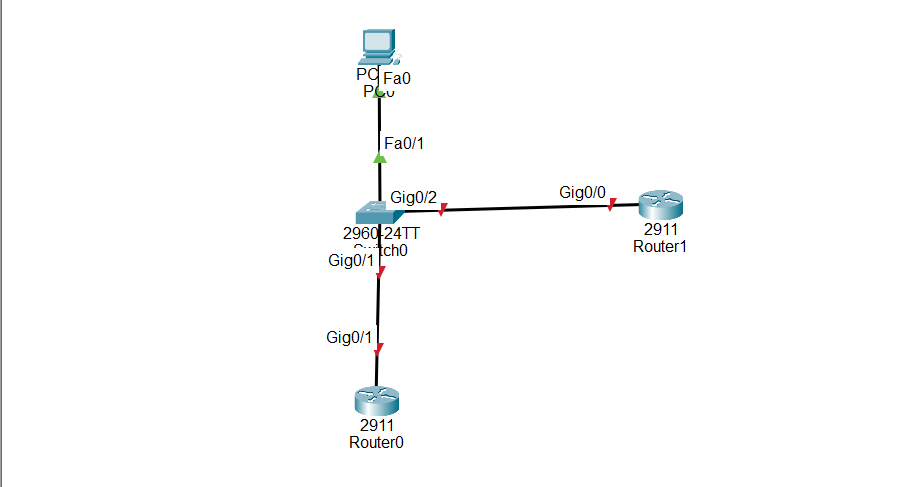

# 🖥️ Hostname Configuration in Cisco Router and Switch

## What is Hostname?

A **hostname** is a name assigned to a Cisco device such as a router or switch to identify it easily in a network.

By default, Cisco devices use names like:

```
Router#
Switch#
```

After configuring a hostname, the device will display a custom name:

```
MainRouter#
CoreSwitch#
```

The hostname helps network administrators identify devices during configuration and troubleshooting.

---

# Hostname is used to:

- Identify network devices easily

- Differentiate between multiple routers and switches

- Improve network management

- Make troubleshooting easier

- Organize network infrastructure

---

# Important Notes:

Hostname configuration can be performed on:

- Cisco routers

- Cisco switches

- Cisco IOS-based devices


Hostname configuration:

- Does not change IP addresses

- Does not affect network connectivity

- Only changes the device identification name

Example:

Before configuration:

```
Router#
```

After configuration:

```
BranchRouter#
```

---

# Why Hostname Configuration is Important

- Makes devices easier to identify

- Prevents configuration mistakes

- Helps engineers manage large networks

- Improves network organization

- Common basic configuration tested in CCNA labs

---

# Step-by-Step Configuration

## Step 1 — Enter Privileged Mode

Access privileged EXEC mode:

```
Router> enable
```

Output:

```
Router#
```

---

# Step 2 — Enter Global Configuration Mode

Enter configuration mode:

```
Router# configure terminal
```

Output:

```
Router(config)#
```

---

# Step 3 — Configure Hostname

Use the hostname command.

Syntax:

```
hostname device-name
```

Example:

```
Router(config)# hostname MainRouter
```

The device name changes immediately:

Before:

```
Router(config)#
```

After:

```
MainRouter(config)#
```

---

# Step 4 — Exit Configuration Mode

Return to privileged mode:

```
MainRouter(config)# end
```

---

# Step 5 — Save Configuration

Save the hostname permanently:

```
MainRouter# copy running-config startup-config
```

---

# 🌐 Topology Screenshot



---

# 🎯 Packet Tracer Tasks

## Task 1 — Configure Router Hostname

Requirements:

- Change the default router name

- Configure hostname as **MainRouter**

- Save the configuration


Commands:

```
enable

configure terminal

hostname MainRouter

end

copy running-config startup-config
```

---

## Task 2 — Configure Switch Hostname

Requirements:

- Change the default switch name

- Configure hostname as **CoreSwitch**

- Save the configuration


Commands:

```
enable

configure terminal

hostname CoreSwitch

end

copy running-config startup-config
```

---

## Task 3 — Configure Branch Router Hostname

Requirements:

- Configure a second router

- Use hostname **BranchRouter**

- Save the configuration


Commands:

```
enable

configure terminal

hostname BranchRouter

end

copy running-config startup-config
```

---

# Verification Commands

## Check Hostname Configuration

```
show running-config | include hostname
```

---

## Check Device Information

```
show version
```

---

## Check Saved Configuration

```
show startup-config
```

---

## Check Running Configuration

```
show running-config
```

---

# Expected Result

After configuration:

✅ Routers and switches have meaningful names

✅ Devices are easier to identify

✅ Hostname configuration is saved permanently

✅ Network management becomes easier

---

# Conclusion

Hostname configuration is a basic Cisco IOS configuration used by network engineers.

It helps identify routers and switches, improves network organization, and makes troubleshooting easier in real-world networks.