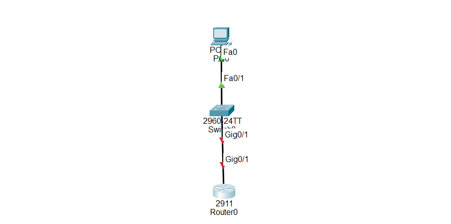

# 🔐 Enable Secret Password Configuration in Cisco Router

## What is Enable Secret Password?

**Enable Secret Password** is a Cisco IOS security feature used to protect access to privileged EXEC mode.

Privileged EXEC mode allows administrators to access advanced commands and make configuration changes on Cisco devices.

By default, when accessing a router:

```
Router>
```

After typing:

```
enable
```

The user enters privileged mode:

```
Router#
```

Without password protection, anyone with access to the device can enter privileged mode and modify the configuration.

After configuring enable secret:

```
Router# enable

Password:
```

The user must enter the correct password before accessing privileged EXEC mode.

---

# Enable Secret Password is used to:

- Protect privileged EXEC mode

- Prevent unauthorized configuration changes

- Improve Cisco device security

- Control administrator access

- Secure network devices

---

# Important Notes:

Enable secret password can be configured on:

- Cisco routers

- Cisco switches

- Cisco IOS-based devices


Enable secret password:

- Protects privileged EXEC mode

- Is encrypted automatically

- Provides stronger security than enable password

- Should be used in professional networks


Example:

Enable password:

```
enable password cisco
```

Enable secret password:

```
enable secret cisco123
```

The enable secret password is encrypted and more secure.

---

# Why Enable Secret Password is Important

- Prevents unauthorized users from accessing privileged mode

- Protects device configuration

- Improves network security

- Provides authentication for administrators

- Common security feature tested in CCNA labs

---

# Step-by-Step Configuration

## Step 1 — Enter Privileged Mode

Access privileged EXEC mode:

```
Router> enable
```

Output:

```
Router#
```

---

# Step 2 — Enter Global Configuration Mode

Enter configuration mode:

```
Router# configure terminal
```

Output:

```
Router(config)#
```

---

# Step 3 — Configure Enable Secret Password

Use the enable secret command.

Syntax:

```
enable secret password
```

Example:

```
Router(config)# enable secret cisco123
```

The password is encrypted automatically in the configuration.

---

# Step 4 — Exit Configuration Mode

Return to privileged mode:

```
Router(config)# end
```

---

# Step 5 — Save Configuration

Save the configuration permanently:

```
Router# copy running-config startup-config
```

---

# 🌐 Topology Screenshot



# 🎯 Packet Tracer Tasks

## Task 1 — Configure Enable Secret Password on Router

Requirements:

- Access router CLI

- Configure enable secret password

- Use password:

```
cisco123
```

- Save the configuration


Commands:

```
enable

configure terminal

enable secret cisco123

end

copy running-config startup-config
```

---

## Task 2 — Test Enable Secret Password

Requirements:

- Exit privileged mode

- Enter enable mode again

Commands:

```
exit

enable
```

Expected output:

```
Password:
```

Enter:

```
cisco123
```

Expected result:

```
Router#
```

---

## Task 3 — Verify Password Encryption

Requirements:

- Check the running configuration

Command:

```
show running-config
```

Expected result:

The password should appear encrypted.

Example:

```
enable secret 5 $1$xxxxxxxx
```

---

# Verification Commands

## Check Enable Secret Password

```
show running-config | include enable secret
```

---

## Check Running Configuration

```
show running-config
```

---

## Check Saved Configuration

```
show startup-config
```

---

## Check Device Information

```
show version
```

---

# Expected Result

After configuration:

✅ Privileged EXEC mode is protected

✅ Users must enter a password before accessing Router#

✅ Enable secret password is encrypted

✅ Configuration is saved permanently

✅ Cisco device security is improved

---

# Conclusion

Enable secret password configuration is a basic Cisco IOS security feature used to protect privileged access.

It prevents unauthorized users from making configuration changes and is one of the first security configurations learned in CCNA labs.