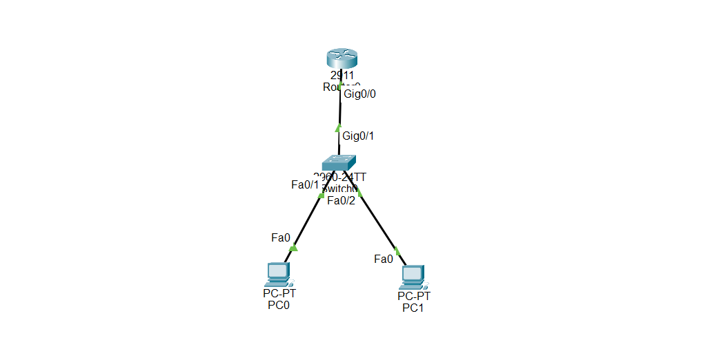

# 🔒 SSH Configuration in Cisco Router

## What is SSH?

**Secure Shell (SSH)** is a secure remote access protocol that allows network administrators to connect to and manage Cisco routers and switches over an IP network using an encrypted connection.

Unlike Telnet, SSH encrypts all transmitted data, including usernames and passwords, making it much more secure.

SSH is the recommended protocol for remote device management in modern networks.

---

# SSH is used to:

- Securely manage Cisco routers and switches remotely

- Encrypt remote management traffic

- Protect usernames and passwords during transmission

- Replace insecure Telnet connections

- Practice secure remote administration in CCNA labs

---

# Important Notes

SSH can be configured on:

- Cisco Routers

- Cisco Switches

- Cisco IOS-based devices

Before SSH can work, the device must have:

- A hostname

- A domain name

- RSA encryption keys

- A local username and password

- An IP address configured

- VTY lines configured

- SSH Version 2 enabled

Example:

```
hostname R1

ip domain-name ccna.local

crypto key generate rsa

ip ssh version 2

username admin privilege 15 secret admin123

line vty 0 4

login local

transport input ssh
```

SSH encrypts all management traffic and is recommended instead of Telnet.

---

# Why SSH is Important

- Encrypts remote management traffic

- Protects usernames and passwords

- Prevents attackers from reading transmitted data

- Industry standard for secure remote administration

- One of the most important CCNA security topics

---

# Step-by-Step Configuration

## Step 1 — Enter Privileged EXEC Mode

```
Router> enable
```

Output:

```
Router#
```

---

## Step 2 — Enter Global Configuration Mode

```
Router# configure terminal
```

Output:

```
Router(config)#
```

---

## Step 3 — Configure the Hostname

```
Router(config)# hostname R1
```

Output:

```
R1(config)#
```

---

## Step 4 — Configure the Domain Name

```
R1(config)# ip domain-name ccna.local
```

---

## Step 5 — Configure an Enable Secret Password

```
R1(config)# enable secret cisco123
```

---

## Step 6 — Configure the Router Interface

```
R1(config)# interface gigabitEthernet0/0

R1(config-if)# ip address 192.168.10.1 255.255.255.0

R1(config-if)# no shutdown
```

---

## Step 7 — Generate RSA Keys

```
R1(config)# crypto key generate rsa
```

When prompted:

```
How many bits in the modulus [512]:
```

Enter:

```
2048
```

---

## Step 8 — Enable SSH Version 2

```
R1(config)# ip ssh version 2
```

---

## Step 9 — Create a Local Administrator

```
R1(config)# username admin privilege 15 secret admin123
```

---

## Step 10 — Configure the VTY Lines

```
R1(config)# line vty 0 4

R1(config-line)# login local

R1(config-line)# transport input ssh
```

---

## Step 11 — Exit Configuration Mode

```
R1(config-line)# end
```

---

## Step 12 — Save the Configuration

```
R1# copy running-config startup-config
```

---


---

# Devices Required

## Router

- 1 × Cisco 2911 Router

## Switch

- 1 × Cisco 2960 Switch

## End Devices

- 2 × PCs

---

# Cable Connections

Use **Copper Straight-Through Cables**.

| Device | Interface | Connected To | Interface |
|---------|-----------|--------------|-----------|
| R1 | G0/0 | Switch0 | G0/1 |
| Switch0 | Fa0/1 | PC0 | FastEthernet0 |
| Switch0 | Fa0/2 | PC1 | FastEthernet0 |

---

# IP Addressing Table

| Device | Interface | IP Address | Subnet Mask |
|---------|-----------|------------|-------------|
| R1 | G0/0 | 192.168.10.1 | 255.255.255.0 |
| PC0 | Fa0 | 192.168.10.10 | 255.255.255.0 |
| PC1 | Fa0 | 192.168.10.20 | 255.255.255.0 |

Default Gateway:

```
192.168.10.1
```

---

# 🌐 Topology Screenshot



---

# 🎯 Packet Tracer Tasks

## Task 1 — Configure the Router Interface

```
enable

configure terminal

interface g0/0

ip address 192.168.10.1 255.255.255.0

no shutdown

end
```

---

## Task 2 — Configure SSH

Requirements:

- Configure hostname

- Configure domain name

- Configure enable secret

- Generate RSA keys

- Enable SSH Version 2

- Create a local administrator

- Configure VTY lines

Commands:

```
configure terminal

hostname R1

ip domain-name ccna.local

enable secret cisco123

crypto key generate rsa

2048

ip ssh version 2

username admin privilege 15 secret admin123

line vty 0 4

login local

transport input ssh

end

copy running-config startup-config
```

---

## Task 3 — Configure PC0

- IP Address: **192.168.10.10**

- Subnet Mask: **255.255.255.0**

- Default Gateway: **192.168.10.1**

---

## Task 4 — Configure PC1

- IP Address: **192.168.10.20**

- Subnet Mask: **255.255.255.0**

- Default Gateway: **192.168.10.1**

---

## Task 5 — Verify Connectivity

From PC0:

```
ping 192.168.10.1
```

From PC1:

```
ping 192.168.10.1
```

Expected Result:

- Both PCs successfully ping the router.

---

## Task 6 — Test SSH from PC0

Open:

```
Desktop → Command Prompt
```

Run:

```
ssh -l admin 192.168.10.1
```

Password:

```
admin123
```

Expected Result:

```
R1>
```

Enter privileged mode:

```
enable
```

Password:

```
cisco123
```

Expected Result:

```
R1#
```

---

## Task 7 — Test SSH from PC1

Repeat the same SSH test from PC1.

Expected Result:

- PC1 successfully establishes an encrypted SSH session with the router.

---

# Verification Commands

## Check SSH Status

```
show ip ssh
```

---

## Check RSA Keys

```
show crypto key mypubkey rsa
```

---

## Check Active SSH Sessions

```
show users
```

---

## Check Interface Status

```
show ip interface brief
```

---

## Check Running Configuration

```
show running-config
```

---

# Expected Result

After configuration:

✅ SSH Version 2 is enabled

✅ Router accepts secure SSH connections

✅ Telnet access is disabled

✅ Users authenticate using a local username and password

✅ Remote management traffic is encrypted

✅ Only authorized users can remotely manage the router

---

# Conclusion

SSH is the industry-standard protocol for securely managing Cisco devices remotely. Unlike Telnet, SSH encrypts all communication, protecting usernames, passwords, and management traffic from interception.

SSH is an essential CCNA topic and a fundamental security feature used in enterprise networks worldwide.