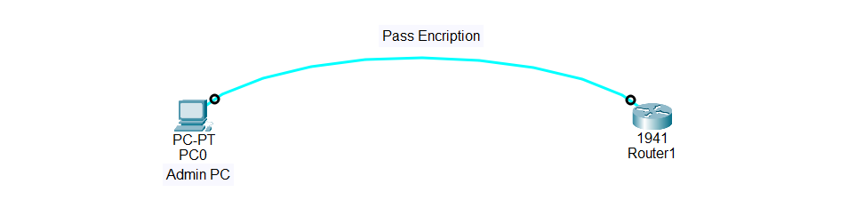

# 🔒 Password Encryption Configuration on Cisco Router

## Description

In a real-world Cisco network, protecting device passwords is a fundamental security practice. By default, some passwords configured on Cisco routers (such as console, AUX, and VTY passwords) are stored in plain text within the running configuration, making them visible to anyone with privileged access.

Cisco IOS provides the `service password-encryption` command to encrypt these passwords using **Type 7 encryption**. Additionally, administrators should always use the **enable secret** command instead of **enable password**, because `enable secret` uses a much stronger cryptographic hash.

---

# Objective

Learn how to encrypt passwords on a Cisco router using the `service password-encryption` command and secure privileged EXEC mode using the `enable secret` command.

---

# Company Scenario

You have recently joined **TechSolutions Ltd.** as a **Junior Network Administrator**.

Your company has several Cisco routers used in branch offices. During a security audit, the network administrator discovers that console, AUX, and VTY passwords are stored in plain text.

Your manager asks you to encrypt all passwords, configure a secure enable secret password, verify the configuration, and save the router configuration.

Your task is to complete the following practice projects.

---

# What is Password Encryption?

Password encryption is the process of converting readable passwords into an unreadable format so they cannot be easily viewed inside the router configuration.

Cisco IOS uses the `service password-encryption` command to encrypt all current and future **plain-text passwords**.

For privileged EXEC mode, Cisco recommends using **enable secret**, which stores the password using a much stronger one-way hash than **enable password**.

---

# Password Encryption is used to:

- Protect passwords from being viewed in plain text.

- Improve router security.

- Secure console, AUX, and VTY passwords.

- Protect privileged EXEC mode.

- Follow Cisco security best practices.

---

# Important Notes

Password encryption:

- Encrypts console passwords.

- Encrypts AUX passwords.

- Encrypts VTY (Telnet) passwords.

- Does **not** encrypt passwords already configured with `enable secret`.

- Uses Cisco Type 7 encryption for line passwords.

Example before encryption:

```text
line console 0
 password cisco123
```

Example after encryption:

```text
line console 0
 password 7 0822455D0A16
```

---

# Why Password Encryption is Important

- Prevents passwords from being easily read.

- Improves Cisco device security.

- Protects administrator credentials.

- Meets basic network security standards.

- Common security topic tested in CCNA.

---

# Step-by-Step Configuration

## Step 1 — Enter Privileged EXEC Mode

```bash
Router> enable
```

Output:

```text
Router#
```

---

## Step 2 — Enter Global Configuration Mode

```bash
Router# configure terminal
```

Output:

```text
Router(config)#
```

---

## Step 3 — Configure the Enable Secret Password

Example:

```bash
Router(config)# enable secret Cisco@123
```

---

## Step 4 — Enable Password Encryption

```bash
Router(config)# service password-encryption
```

This encrypts all plain-text passwords stored in the configuration.

---

## Step 5 — Exit Configuration Mode

```bash
Router(config)# end
```

---

## Step 6 — Save the Configuration

```bash
Router# copy running-config startup-config
```

# 🌐 Topology Screenshot



### Devices Required

- 1 Cisco Router (1941, 2911, or 4321)
- 1 PC
- 1 Console Cable (Light Blue)

**Purpose of the Topology**

- Configure password encryption.
- Configure an enable secret password.
- Verify encrypted passwords.
- Save the router configuration.

---

# 🎯 Packet Tracer Tasks

## Task 1 — Configure Enable Secret

### Requirements

- Enter privileged mode.
- Configure the enable secret password.
- Use **Cisco@123**.

### Commands

```bash
enable

configure terminal

enable secret Cisco@123

end
```

---

## Task 2 — Enable Password Encryption

### Requirements

- Encrypt all plain-text passwords.

### Commands

```bash
configure terminal

service password-encryption

end
```

---

## Task 3 — Verify Password Encryption

### Requirements

- Display the running configuration.
- Confirm that line passwords are encrypted.
- Confirm that the enable secret is configured.

### Commands

```bash
show running-config
```

---

## Task 4 — Save the Configuration

### Commands

```bash
copy running-config startup-config
```

---

# Verification Commands

## Display the Running Configuration

```bash
show running-config
```

---

## Display the Startup Configuration

```bash
show startup-config
```

---

## Display the Saved Configuration

```bash
show running-config | include enable
```

---

# Expected Result

After configuration:

- ✅ Enable Secret password is configured.

- ✅ Console, AUX, and VTY passwords appear encrypted.

- ✅ Passwords are no longer displayed in plain text.

- ✅ Configuration is permanently saved.

- ✅ Router security is improved.

---

# What I Learned

- Configure the `enable secret` password.

- Encrypt plain-text passwords using `service password-encryption`.

- Understand the difference between `enable password` and `enable secret`.

- Verify encrypted passwords using `show running-config`.

- Save the router configuration using `copy running-config startup-config`.

- Apply Cisco password security best practices.

- Strengthen Cisco router security using password encryption.

- Perform a common CCNA router security configuration.