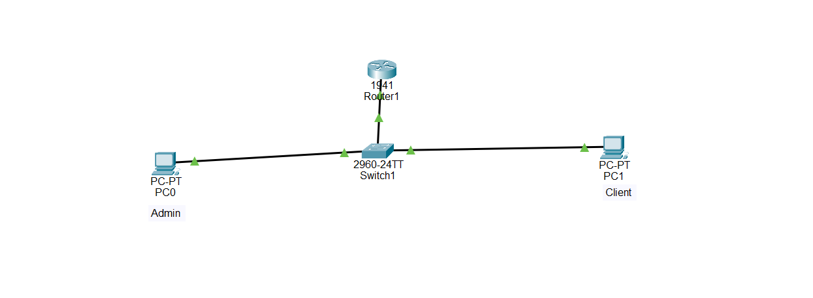

# 📢 Banner Configuration on Cisco Router

## Description

In a real-world Cisco network, banners are used to display important security and informational messages to users before or after they log in to a network device. These messages can warn unauthorized users, display legal notices, or welcome network administrators.

Cisco IOS supports three common banner types:

- **Message of the Day (MOTD)**
- **Login Banner**
- **EXEC Banner**

Configuring banners is considered a basic Cisco security practice and is commonly tested in CCNA certification exams.

---

# Objective

Learn how to configure different Cisco banner types to improve network security and inform users connecting to a router.

---

# Company Scenario

You have recently joined **TechSolutions Ltd.** as a **Junior Network Administrator**.

The company's security policy requires every Cisco router to display warning messages before users log in. After successful authentication, administrators should also receive a welcome message.

Your manager asks you to configure the router banners, verify that they appear correctly, and save the configuration.

Your task is to complete the following Packet Tracer projects.

---

# What is a Banner?

A **banner** is a message displayed by a Cisco router or switch before or after user authentication.

Banners help notify users about security policies, legal notices, and administrative information.

---

# Banner is used to:

- Warn unauthorized users
- Display legal notices
- Welcome administrators
- Inform users about company policies
- Improve device security

---

# Types of Cisco Banners

## 1. Message of the Day (MOTD)

Displays a message immediately after connecting to the router and before the login prompt.

Example

```text
************************************************
WARNING!
Authorized Access Only.
************************************************
```

Configuration

```bash
banner motd # WARNING! Authorized Access Only. #
```

---

## 2. Login Banner

Displays a warning immediately before username/password authentication.

Example

```text
Unauthorized access is prohibited.
```

Configuration

```bash
banner login # Unauthorized access is prohibited. #
```

---

## 3. EXEC Banner

Displays a message after successful login.

Example

```text
Welcome Network Administrator.
```

Configuration

```bash
banner exec # Welcome Network Administrator. #
```

---

# Important Notes

Cisco banners:

- Can contain multiple words and spaces
- Must begin and end with the same delimiter
- The delimiter can be:

```
#
!
@
$
%
&
```

Example

```bash
banner motd # Authorized Access Only #
```

---

# Why Banner Configuration is Important

- Warns unauthorized users
- Meets company security policies
- Displays legal notices
- Improves network administration
- Common CCNA security topic

---

# Step-by-Step Configuration

## Step 1 — Enter Privileged EXEC Mode

```bash
Router> enable
```

Output

```text
Router#
```

---

## Step 2 — Enter Global Configuration Mode

```bash
Router# configure terminal
```

Output

```text
Router(config)#
```

---

## Step 3 — Configure the MOTD Banner

```bash
Router(config)# banner motd # Authorized Access Only! #
```

---

## Step 4 — Configure the Login Banner

```bash
Router(config)# banner login # Unauthorized users are prohibited. #
```

---

## Step 5 — Configure the EXEC Banner

```bash
Router(config)# banner exec # Welcome Network Administrator! #
```

---

## Step 6 — Exit Configuration Mode

```bash
Router(config)# end
```

---

## Step 7 — Save the Configuration

```bash
Router# copy running-config startup-config
```

---

# 🌐 Topology Screenshot




# Devices Required

- 1 Cisco Router (1941 or 2911)
- 1 Cisco Switch (2960)
- 2 PCs
- 1 Console Cable
- 2 Copper Straight-Through Cables

---

# Cable Connections

| Device | Interface | Connects To | Interface | Cable |
|---------|-----------|-------------|-----------|-------|
| PC1 | RS-232 | Router R1 | Console | Console Cable |
| Router R1 | G0/0 | Switch S1 | G0/1 | Copper Straight-Through |
| PC1 | Fa0 | Switch S1 | Fa0/1 | Copper Straight-Through |
| PC2 | Fa0 | Switch S1 | Fa0/2 | Copper Straight-Through |

---

# Purpose of the Topology

- Access the router using the console cable.
- Configure Cisco banners.
- Verify banner messages.
- Save the router configuration.
- Practice Cisco IOS administration.

---

# 🎯 Packet Tracer Tasks

## Task 1 — Configure the MOTD Banner

### Requirements

- Display a security warning.
- Configure a Message of the Day banner.

Commands

```bash
enable

configure terminal

banner motd # WARNING! Authorized Access Only. #

end
```

---

## Task 2 — Configure the Login Banner

### Requirements

- Display a warning before authentication.

Commands

```bash
configure terminal

banner login # Unauthorized access is prohibited. #

end
```

---

## Task 3 — Configure the EXEC Banner

### Requirements

- Display a welcome message after login.

Commands

```bash
configure terminal

banner exec # Welcome Network Administrator. #

end
```

---

## Task 4 — Save the Configuration

Commands

```bash
copy running-config startup-config
```

---

## Task 5 — Verify the Banner Messages

Disconnect from the router and reconnect through the console cable.

Expected Result

- MOTD banner appears first.
- Login banner appears before login.
- EXEC banner appears after successful login.

---

# Verification Commands

## Display Running Configuration

```bash
show running-config
```

---

## Display Startup Configuration

```bash
show startup-config
```

---

## Verify Banner Configuration

```bash
show running-config | include banner
```

---

# Expected Result

After configuration:

- ✅ MOTD banner displays before login.
- ✅ Login banner displays before authentication.
- ✅ EXEC banner displays after successful login.
- ✅ Banner configuration is saved permanently.
- ✅ Router security awareness is improved.

---

## Screenshots

### Project 1

```text
screenshots/project1.png
```

---

### Project 2

```text
screenshots/project2.png
```

---

### Project 3

```text
screenshots/project3.png
```

---

### Project 4

```text
screenshots/project4.png
```

---

### Project 5

```text
screenshots/project5.png
```

---

# What I Learned

- Configure the Message of the Day (MOTD) banner.
- Configure the Login banner.
- Configure the EXEC banner.
- Use delimiter characters correctly.
- Verify banner configuration using Cisco IOS commands.
- Save router configurations permanently.
- Apply Cisco security best practices.
- Understand how banners improve network security.
- Practice a common CCNA router security configuration.