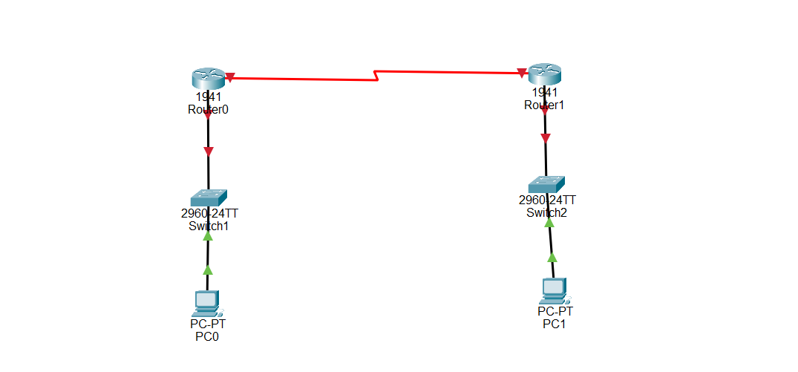

# 🕒 Clock and Timezone Configuration on Cisco Router

## Description

In a real-world Cisco network, routers use an internal clock to maintain the current date and time. The router's clock is used to timestamp log messages, record security events, troubleshoot network issues, and support time-dependent services.

Because routers may be deployed in different countries or regions, administrators also configure a **timezone** so that the displayed time matches the local time instead of Coordinated Universal Time (UTC).

Clock and timezone configuration is a basic Cisco IOS administration task and is commonly covered in CCNA.

---

# Objective

Learn how to configure the system clock and timezone on Cisco routers, verify the configuration, and save it permanently.

---

# Company Scenario

You have recently joined **TechSolutions Ltd.** as a **Junior Network Administrator**.

The company has branch offices located in different countries. Each router must display the correct local time so that log files, security events, and troubleshooting information are accurate.

Your manager asks you to configure the timezone and manually set the clock on multiple Cisco routers.

Your task is to complete the following Packet Tracer projects.

---

# What is the Clock?

The **clock** is the internal date and time maintained by a Cisco router.

The router uses the clock to:

- Record system logs
- Timestamp security events
- Schedule network tasks
- Troubleshoot network problems
- Support time-based network services

Example:

```text
14:30:15 CAT Tue Jul 28 2026
```

---

# What is a Timezone?

A **timezone** tells the router which local time zone it should use when displaying the current time.

Without a configured timezone, the router normally displays the time in **UTC (Coordinated Universal Time)**.

Example:

```text
UTC +2 = Central Africa Time (CAT)
```

Configuration Example:

```bash
clock timezone CAT 2
```

Where:

- **CAT** = Central Africa Time
- **2** = Two hours ahead of UTC

---

# Clock and Timezone are used to:

- Display the correct local time
- Record accurate log messages
- Improve troubleshooting
- Timestamp security events
- Support scheduled network operations

---

# Important Notes

Clock configuration:

- Can be configured manually.
- Can also be synchronized automatically using an NTP server.
- Is stored in the running configuration.
- Helps administrators identify when network events occurred.

Timezone configuration:

- Changes only how the time is displayed.
- Does not change UTC itself.
- Should match the geographical location of the router.

---

# Why Clock and Timezone Configuration is Important

- Makes troubleshooting easier.
- Provides accurate timestamps.
- Improves security auditing.
- Helps monitor network events.
- Common Cisco IOS configuration tested in CCNA.

---

# Step-by-Step Configuration

## Step 1 — Enter Privileged EXEC Mode

```bash
Router> enable
```

Output

```text
Router#
```

---

## Step 2 — Enter Global Configuration Mode

```bash
Router# configure terminal
```

Output

```text
Router(config)#
```

---

## Step 3 — Configure the Timezone

Example (Central Africa Time)

```bash
Router(config)# clock timezone CAT 2
```

---

## Step 4 — Exit Configuration Mode

```bash
Router(config)# end
```

---

## Step 5 — Configure the Manual Clock

Syntax

```bash
clock set HH:MM:SS DAY MONTH YEAR
```

Example

```bash
Router# clock set 14:30:00 28 July 2026
```

---

## Step 6 — Save the Configuration

```bash
Router# copy running-config startup-config
```

---

# 🌐 Topology Screenshot



---

# Devices Required

- 2 Cisco Routers (1941 or 2911)
- 2 Cisco Switches (2960)
- 2 PCs
- 2 Console Cables
- 4 Copper Straight-Through Cables
- 1 Copper Cross-Over Cable (or Auto Connection) between R1 and R2

---

# Cable Connections

| Device | Interface | Connects To | Interface | Cable |
|---------|-----------|-------------|-----------|-------|
| PC1 | RS-232 | Router R1 | Console | Console Cable |
| PC2 | RS-232 | Router R2 | Console | Console Cable |
| Router R1 | G0/0 | Switch S1 | G0/1 | Copper Straight-Through |
| Router R2 | G0/0 | Switch S2 | G0/1 | Copper Straight-Through |
| PC1 | Fa0 | Switch S1 | Fa0/1 | Copper Straight-Through |
| PC2 | Fa0 | Switch S2 | Fa0/2 | Copper Straight-Through |
| Router R1 | G0/1 | Router R2 | G0/1 | Copper Cross-Over |

---

# 🎯 Packet Tracer Tasks

## Task 1 — Configure the Timezone on R1

### Requirements

- Configure timezone as **CAT (UTC +2)**.
- Save the configuration.

Commands

```bash
enable

configure terminal

clock timezone CAT 2

end

copy running-config startup-config
```

---

## Task 2 — Configure the Clock on R1

### Requirements

- Configure the date and time manually.

Commands

```bash
clock set 14:30:00 28 July 2026
```

---

## Task 3 — Configure R2

### Requirements

- Configure the same timezone.
- Configure the clock.
- Save the configuration.

Commands

```bash
enable

configure terminal

clock timezone CAT 2

end

clock set 14:35:00 28 July 2026

copy running-config startup-config
```

---

## Task 4 — Verify the Configuration

Commands

```bash
show clock

show clock detail
```

---

# Verification Commands

## Display Current Time

```bash
show clock
```

---

## Display Clock Details

```bash
show clock detail
```

---

## Display Running Configuration

```bash
show running-config
```

---

## Display Startup Configuration

```bash
show startup-config
```

---

# Expected Result

After configuration:

- ✅ Both routers display the correct local time.
- ✅ Timezone is configured correctly.
- ✅ Clock settings are verified successfully.
- ✅ Configuration is saved permanently.
- ✅ Network logs contain accurate timestamps.

---

## Screenshots

### Project 1

```text
screenshots/project1.png
```

---

### Project 2

```text
screenshots/project2.png
```

---

### Project 3

```text
screenshots/project3.png
```

---

### Project 4

```text
screenshots/project4.png
```

---

# What I Learned

- Configure the Cisco router clock.
- Configure the router timezone.
- Set the date and time manually.
- Verify the clock using `show clock`.
- View detailed clock information with `show clock detail`.
- Save router configurations permanently.
- Understand the importance of accurate timestamps.
- Practice a common Cisco IOS administration task covered in CCNA.