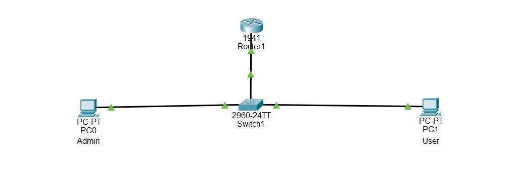

# 🌐 Disable DNS Lookup Configuration on Cisco Router

## Description

In a real-world Cisco network, administrators frequently configure routers using the Cisco IOS Command-Line Interface (CLI). During configuration, typing mistakes are common. By default, if an invalid command is entered, the router assumes it is a hostname and attempts to resolve it using a DNS server. This causes the CLI to pause for several seconds, slowing down configuration and troubleshooting.

To prevent this delay, Cisco network engineers disable DNS lookup using the **no ip domain-lookup** command. This is one of the first configurations performed on a new Cisco router and is commonly practiced in CCNA labs.

---

# Objective

Learn how to disable DNS lookup on Cisco routers to prevent unnecessary delays caused by mistyped commands.

---

# Company Scenario

You have recently joined **TechSolutions Ltd.** as a **Junior Network Administrator**.

Your team is preparing new Cisco routers for deployment across different branch offices. During initial configuration, engineers notice that every mistyped command causes the router to pause while trying to contact a DNS server.

Your manager asks you to disable DNS lookup on all newly installed routers to improve CLI performance and speed up device configuration.

Your task is to complete the following Packet Tracer projects.

---

# What is DNS Lookup?

**DNS (Domain Name System) Lookup** is the process of translating a hostname into an IP address.

Example:

```
server.company.com
        ↓
192.168.10.10
```

Normally, routers use DNS only when administrators intentionally use hostnames instead of IP addresses.

---

# Why Disable DNS Lookup?

When an invalid command is entered, Cisco IOS assumes it is a hostname.

Example:

```bash
R1# shwo ip interface brief
```

Instead of immediately reporting an error, the router displays:

```text
Translating "shwo"...domain server (255.255.255.255)
```

The router waits several seconds trying to contact a DNS server.

Disabling DNS lookup prevents this delay.

---

# DNS Lookup is used to:

- Resolve hostnames into IP addresses.
- Allow administrators to use hostnames instead of IP addresses.
- Support DNS-based network communication.

---

# Disabling DNS Lookup is used to:

- Prevent CLI delays.
- Improve configuration speed.
- Speed up troubleshooting.
- Stop unnecessary DNS requests.
- Improve the administrator's experience.

---

# Important Notes

The command:

```bash
no ip domain-lookup
```

- Does **not** disable Internet access.
- Does **not** affect routing.
- Does **not** block DNS traffic from PCs.
- Only disables DNS lookups performed by the router itself.

---

# Why Disable DNS Lookup is Important

- Eliminates CLI freezing after typing mistakes.
- Makes Cisco IOS easier to use.
- Speeds up configuration.
- Reduces unnecessary DNS requests.
- Common basic configuration tested in CCNA labs.

---

# Step-by-Step Configuration

## Step 1 — Enter Privileged EXEC Mode

```bash
Router> enable
```

Output:

```text
Router#
```

---

## Step 2 — Enter Global Configuration Mode

```bash
Router# configure terminal
```

Output:

```text
Router(config)#
```

---

## Step 3 — Disable DNS Lookup

```bash
Router(config)# no ip domain-lookup
```

---

## Step 4 — Exit Configuration Mode

```bash
Router(config)# end
```

---

## Step 5 — Save the Configuration

```bash
Router# copy running-config startup-config
```

---

# 🌐 Topology Screenshot



---

# Devices Required

- 1 Cisco Router (1941 or 2911)
- 1 Cisco Switch (2960)
- 2 PCs
- 1 Console Cable
- 3 Copper Straight-Through Cables

---

# Cable Connections

| Device | Interface | Connects To | Interface | Cable |
|---------|-----------|-------------|-----------|-------|
| PC1 | RS-232 | Router R1 | Console | Console Cable |
| Router R1 | G0/0 | Switch S1 | G0/1 | Copper Straight-Through |
| PC1 | Fa0 | Switch S1 | Fa0/1 | Copper Straight-Through |
| PC2 | Fa0 | Switch S1 | Fa0/2 | Copper Straight-Through |

---

# 🎯 Packet Tracer Tasks

## Task 1 — Disable DNS Lookup

### Requirements

- Enter privileged mode.
- Disable DNS lookup.
- Save the configuration.

Commands

```bash
enable

configure terminal

no ip domain-lookup

end

copy running-config startup-config
```

---

## Task 2 — Verify the Configuration

### Requirements

- Mistype a command.
- Verify that the router no longer pauses while attempting DNS resolution.

Example

```bash
shwo ip interface brief
```

Expected Result

```text
% Invalid input detected at '^' marker.
```

The router immediately displays an error without showing:

```text
Translating "..."
```

---

## Task 3 — Compare Router Behavior

### Requirements

- Observe the router before disabling DNS lookup.
- Disable DNS lookup.
- Repeat the same mistyped command.
- Compare the response time.

---

# Verification Commands

## Display Running Configuration

```bash
show running-config
```

---

## Search for Domain Lookup Configuration

```bash
show running-config | include domain
```

Expected Output

```text
no ip domain-lookup
```

---

## Display Startup Configuration

```bash
show startup-config
```

---

# Expected Result

After configuration:

- ✅ DNS lookup is disabled.
- ✅ Mistyped commands no longer cause CLI delays.
- ✅ Router responds immediately to invalid commands.
- ✅ Configuration is saved permanently.
- ✅ CLI performance is improved.

---

## Screenshots

### Project 1

```text
screenshots/project1.png
```

---

### Project 2

```text
screenshots/project2.png
```

---

### Project 3

```text
screenshots/project3.png
```

---

# What I Learned

- Understand how DNS lookup works in Cisco IOS.
- Disable DNS lookup using `no ip domain-lookup`.
- Prevent CLI delays caused by mistyped commands.
- Verify DNS lookup settings using the running configuration.
- Save Cisco router configurations permanently.
- Practice a common initial router configuration used in CCNA and real-world networks.