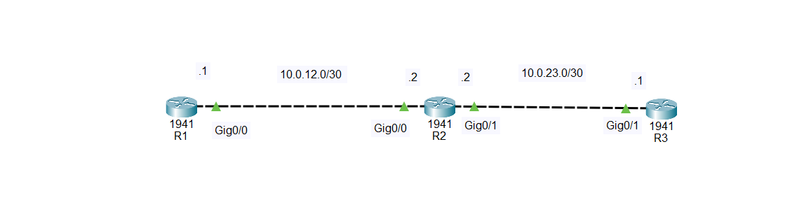

# 🌐 Configure LAN Interfaces on Connected Cisco Routers

## Description

In a real-world Cisco network, routers are often connected directly to one another to form a wide-area network (WAN) or backbone network. Before routers can exchange routing information or forward traffic, each connected interface must be configured with an IP address, enabled, and verified.

Configuring router interfaces is one of the first tasks performed by network engineers during network deployment. It is also a fundamental skill covered in the **Cisco Certified Network Associate (CCNA)** certification and is commonly practiced in Packet Tracer labs.

---

# Objective

Learn how to configure Ethernet interfaces on connected Cisco routers by assigning IP addresses, enabling the interfaces, and verifying connectivity between routers.

---

# Company Scenario

You have recently joined **TechSolutions Ltd.** as a **Junior Network Administrator**.

The company is expanding its branch offices and has installed multiple Cisco routers to connect different locations. Before routing protocols can be configured, every connection between the routers must be properly configured and tested.

Your manager asks you to configure the interfaces on all connected routers and verify that they can communicate with one another.

Your task is to complete the following Packet Tracer projects.

---

# What is a Router Interface?

A router interface is a physical port that allows a router to communicate with another network device, such as another router.

Common router interfaces include:

- GigabitEthernet0/0
- GigabitEthernet0/1
- FastEthernet0/0
- FastEthernet0/1

Example:

```
R1 -------- R2 -------- R3
```

Each interface requires:

- An IP address
- A subnet mask
- The `no shutdown` command

---

# Why Configure Router Interfaces?

Without configuring router interfaces:

- Routers cannot communicate.
- Routing protocols cannot exchange routes.
- Network connectivity cannot be established.
- Remote networks become unreachable.

---

# Router Interface Configuration is used to:

- Connect routers together.
- Build enterprise networks.
- Enable routing.
- Exchange routing information.
- Support communication between different networks.

---

# Important Notes

The following commands configure and enable a router interface:

```bash
interface gigabitethernet 0/0
ip address 10.0.12.1 255.255.255.252
no shutdown
```

These commands:

- Assign an IPv4 address.
- Enable the interface.
- Prepare the router for communication.
- Must be saved to remain after a reboot.

---

# Why Configuring Router Interfaces is Important

- Establishes communication between routers.
- Prepares the network for routing protocols.
- Allows packet forwarding.
- Fundamental CCNA configuration skill.

---

# Step-by-Step Configuration

## Step 1 — Enter Privileged EXEC Mode

```bash
Router> enable
```

Output

```text
Router#
```

---

## Step 2 — Enter Global Configuration Mode

```bash
Router# configure terminal
```

Output

```text
Router(config)#
```

---

## Step 3 — Select the Interface

```bash
Router(config)# interface gigabitethernet 0/0
```

Output

```text
Router(config-if)#
```

---

## Step 4 — Assign an IP Address

```bash
Router(config-if)# ip address 10.0.12.1 255.255.255.252
```

---

## Step 5 — Enable the Interface

```bash
Router(config-if)# no shutdown
```

Expected Output

```text
%LINK-5-CHANGED: Interface GigabitEthernet0/0, changed state to up
```

---

## Step 6 — Exit Configuration Mode

```bash
Router(config-if)# end
```

---

## Step 7 — Save the Configuration

```bash
Router# copy running-config startup-config
```

---

# 🌐 Topology Screenshot



---

# Devices Required

- 3 Cisco Routers (1941 or 2911)
- 2 Copper Cross-Over Cables (or Automatic Connection in Packet Tracer)

---

# Cable Connections

| Device | Interface | Connects To | Interface | Cable |
|---------|-----------|-------------|-----------|-------|
| Router R1 | G0/0 | Router R2 | G0/0 | Copper Cross-Over |
| Router R2 | G0/1 | Router R3 | G0/0 | Copper Cross-Over |

---

# IP Addressing Plan

| Router | Interface | IP Address | Subnet Mask |
|---------|-----------|------------|-------------|
| R1 | G0/0 | 10.0.12.1 | 255.255.255.252 |
| R2 | G0/0 | 10.0.12.2 | 255.255.255.252 |
| R2 | G0/1 | 10.0.23.1 | 255.255.255.252 |
| R3 | G0/0 | 10.0.23.2 | 255.255.255.252 |

---

# 🎯 Packet Tracer Tasks

## Task 1 — Configure Router R1

### Requirements

- Configure GigabitEthernet0/0.
- Assign IP address **10.0.12.1/30**.
- Enable the interface.
- Save the configuration.

Commands

```bash
enable

configure terminal

interface gigabitethernet 0/0

ip address 10.0.12.1 255.255.255.252

no shutdown

end

copy running-config startup-config
```

---

## Task 2 — Configure Router R2

### Requirements

- Configure both interfaces.
- Assign IP addresses.
- Enable both interfaces.
- Save the configuration.

Commands

```bash
enable

configure terminal

interface gigabitethernet 0/0
ip address 10.0.12.2 255.255.255.252
no shutdown

interface gigabitethernet 0/1
ip address 10.0.23.1 255.255.255.252
no shutdown

end

copy running-config startup-config
```

---

## Task 3 — Configure Router R3

### Requirements

- Configure GigabitEthernet0/0.
- Assign IP address **10.0.23.2/30**.
- Enable the interface.
- Save the configuration.

Commands

```bash
enable

configure terminal

interface gigabitethernet 0/0

ip address 10.0.23.2 255.255.255.252

no shutdown

end

copy running-config startup-config
```

---

# Verification Commands

## Display Interface Summary

```bash
show ip interface brief
```

---

## Display Interface Details

```bash
show interfaces
```

---

## Verify Connectivity

From R1

```bash
ping 10.0.12.2
```

From R2

```bash
ping 10.0.23.2
```

From R3

```bash
ping 10.0.23.1
```

---

# Expected Result

After configuration:

- ✅ All router interfaces are assigned the correct IP addresses.
- ✅ All interfaces are in the **up/up** state.
- ✅ Routers can successfully ping directly connected neighbors.
- ✅ The configuration is saved permanently.
- ✅ The routers are ready for routing protocol configuration.


# What I Learned

- Configure interfaces on connected Cisco routers.
- Assign IPv4 addresses using /30 subnets.
- Enable interfaces using the `no shutdown` command.
- Verify interface status with `show ip interface brief`.
- Test connectivity using the `ping` command.
- Save configurations using `copy running-config startup-config`.
- Practice a fundamental CCNA skill required before implementing routing protocols.