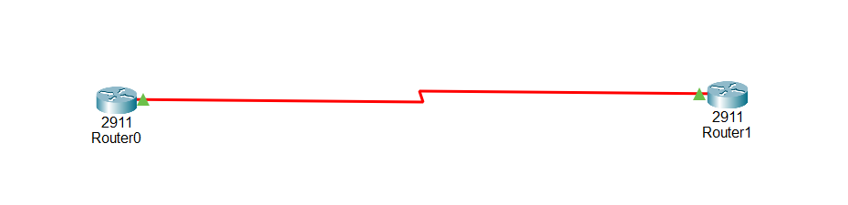

# 🌐 Configure Serial WAN Interfaces Between Cisco Routers

## Description

In enterprise networks, routers are commonly connected through **Serial WAN links** to enable communication between geographically separated locations. Before routers can exchange routing information or forward packets, each serial interface must be configured with an IP address, encapsulation method, clock rate (on the DCE side), enabled, and verified.

Configuring serial interfaces is a fundamental networking skill covered in the **Cisco Certified Network Associate (CCNA)** certification and is frequently practiced in Cisco Packet Tracer labs.

---

# Objective

Learn how to configure Serial WAN interfaces on connected Cisco routers by assigning IP addresses, selecting the encapsulation protocol, configuring the clock rate on the DCE router, enabling the interfaces, and verifying connectivity.

---

# Company Scenario

You have recently joined **TechSolutions Ltd.** as a **Junior Network Administrator**.

The company has opened a new remote branch office that must communicate with the headquarters through a dedicated leased serial WAN connection.

Your manager has installed two Cisco routers connected with a serial cable and asks you to configure the WAN link before implementing routing protocols.

Your task is to configure both routers, verify the serial connection, and ensure successful communication across the WAN.

---

# What is a Serial WAN Interface?

A Serial WAN interface is a physical router interface used to connect routers over long-distance Wide Area Networks (WANs).

Common serial interfaces include:

- Serial0/0/0
- Serial0/0/1
- Serial0/1/0

Example:

```
Router R1 ========= Router R2
      Serial WAN Link
```

Each serial interface requires:

- An IP address
- A subnet mask
- Encapsulation (PPP or HDLC)
- Clock rate (DCE side only)
- The `no shutdown` command

---

# Why Configure Serial WAN Interfaces?

Without configuring serial interfaces:

- Routers cannot communicate across the WAN.
- Routing protocols cannot exchange routing information.
- Remote networks remain unreachable.
- WAN connectivity cannot be established.

---

# Serial WAN Configuration is used to:

- Connect branch offices.
- Build Wide Area Networks (WANs).
- Enable communication between distant networks.
- Prepare routers for routing protocols.
- Simulate ISP connections in Packet Tracer.

---

# Important Notes

The following commands configure a serial interface:

```bash
interface serial 0/0/0
ip address 192.168.1.1 255.255.255.252
encapsulation ppp
clock rate 64000
no shutdown
```

These commands:

- Assign an IPv4 address.
- Configure PPP encapsulation.
- Set the clock rate on the DCE router.
- Enable the interface.
- Prepare the WAN connection.
- Should be saved after configuration.

---

# Why Configuring Serial Interfaces is Important

- Establishes WAN connectivity.
- Enables communication between remote routers.
- Prepares routers for dynamic routing protocols.
- Essential CCNA networking skill.

---

# Step-by-Step Configuration

## Step 1 — Enter Privileged EXEC Mode

```bash
Router> enable
```

Output

```text
Router#
```

---

## Step 2 — Enter Global Configuration Mode

```bash
Router# configure terminal
```

Output

```text
Router(config)#
```

---

## Step 3 — Select the Serial Interface

```bash
Router(config)# interface serial 0/0/0
```

Output

```text
Router(config-if)#
```

---

## Step 4 — Assign an IP Address

```bash
Router(config-if)# ip address 192.168.1.1 255.255.255.252
```

---

## Step 5 — Configure PPP Encapsulation

```bash
Router(config-if)# encapsulation ppp
```

---

## Step 6 — Configure the Clock Rate (DCE Router Only)

```bash
Router(config-if)# clock rate 64000
```

> **Note:** Configure the clock rate only on the router connected to the **DCE cable**.

---

## Step 7 — Enable the Interface

```bash
Router(config-if)# no shutdown
```

Expected Output

```text
%LINK-5-CHANGED: Interface Serial0/0/0, changed state to up
```

---

## Step 8 — Exit Configuration Mode

```bash
Router(config-if)# end
```

---

## Step 9 — Save the Configuration

```bash
Router# copy running-config startup-config
```

---

# 🌐 Topology Screenshot



---

# Devices Required

- 2 Cisco Routers (1941 or 2911)
- 1 Serial DCE Cable

---

# Cable Connections

| Device | Interface | Connects To | Interface | Cable |
|---------|-----------|-------------|-----------|--------|
| Router R1 | Serial0/0/0 | Router R2 | Serial0/0/0 | Serial DCE |

---

# IP Addressing Plan

| Router | Interface | IP Address | Subnet Mask |
|---------|-----------|------------|-------------|
| R1 | Serial0/0/0 | 192.168.1.1 | 255.255.255.252 |
| R2 | Serial0/0/0 | 192.168.1.2 | 255.255.255.252 |

---

# 🎯 Packet Tracer Tasks

## Task 1 — Configure Router R1 (DCE)

### Requirements

- Configure Serial0/0/0.
- Assign IP address **192.168.1.1/30**.
- Configure PPP encapsulation.
- Set clock rate **64000**.
- Enable the interface.
- Save the configuration.

Commands

```bash
enable

configure terminal

interface serial 0/0/0

ip address 192.168.1.1 255.255.255.252

encapsulation ppp

clock rate 64000

no shutdown

end

copy running-config startup-config
```

---

## Task 2 — Configure Router R2 (DTE)

### Requirements

- Configure Serial0/0/0.
- Assign IP address **192.168.1.2/30**.
- Configure PPP encapsulation.
- Enable the interface.
- Save the configuration.

Commands

```bash
enable

configure terminal

interface serial 0/0/0

ip address 192.168.1.2 255.255.255.252

encapsulation ppp

no shutdown

end

copy running-config startup-config
```

---

# Verification Commands

## Display Interface Summary

```bash
show ip interface brief
```

---

## Display Serial Interface Details

```bash
show interface serial 0/0/0
```

---

## Verify Connectivity

From R1

```bash
ping 192.168.1.2
```

From R2

```bash
ping 192.168.1.1
```

---

# Expected Result

After configuration:

- ✅ Both serial interfaces have the correct IP addresses.
- ✅ PPP encapsulation is enabled.
- ✅ The DCE router provides the clock rate.
- ✅ Both serial interfaces are in the **up/up** state.
- ✅ Both routers can successfully ping each other.
- ✅ The configuration is saved permanently.
- ✅ The WAN link is ready for routing protocol configuration.

---

# What I Learned

- Configure Cisco Serial WAN interfaces.
- Assign IPv4 addresses using /30 subnets.
- Configure PPP encapsulation.
- Configure the clock rate on the DCE router.
- Enable interfaces using the `no shutdown` command.
- Verify interface status using `show ip interface brief` and `show interface serial`.
- Test WAN connectivity using the `ping` command.
- Save configurations using `copy running-config startup-config`.
- Practice a fundamental CCNA WAN configuration skill.