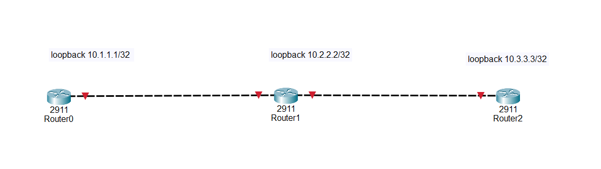

# 🔄 Configure Loopback Interfaces on Cisco Routers

## Description

A **Loopback Interface** is a virtual (logical) interface on a Cisco router that is always available as long as the router is powered on. Unlike physical interfaces, a loopback interface does not depend on cables or hardware connections, making it an ideal interface for router identification, management, testing, and routing protocols.

Loopback interfaces are widely used in enterprise networks and are a fundamental topic in the **Cisco Certified Network Associate (CCNA)** certification. Routing protocols such as **OSPF**, **EIGRP**, **IS-IS**, and **BGP** commonly use loopback interfaces as stable router identifiers because they remain active regardless of the status of physical interfaces.

---

# 🎯 Objective

Learn how to configure Loopback interfaces on Cisco routers, assign IP addresses, verify their operation, and understand why they are important in enterprise networking.

---

# 🏢 Company Scenario

You have recently joined **GlobalNet Technologies** as a **Junior Network Engineer**.

The company is preparing its routers for a new enterprise routing infrastructure using **OSPF**. Before configuring the routing protocol, every router must have a unique Loopback interface that will serve as a permanent Router ID and management address.

Your manager asks you to configure Loopback interfaces on all routers, verify that they are operational, and prepare them for future routing protocol deployment.

---

# 🔍 What is a Loopback Interface?

A Loopback Interface is a **logical (virtual)** interface that exists entirely in software.

Unlike Ethernet or Serial interfaces:

- It does **not** require a cable.
- It never loses connectivity because of cable failure.
- It remains **up** unless manually removed or the router shuts down.
- It is commonly used as the router's permanent identity.

Example:

```
                 +----------------------+
                 |      Router R1       |
                 |                      |
                 |  Lo0 10.1.1.1/32     |
                 |                      |
                 +----------------------+
```

---

# ⭐ Why Use a Loopback Interface?

Loopback interfaces provide a stable address that never changes during normal network operation.

They are commonly used for:

- Router identification
- OSPF Router ID
- EIGRP Router ID
- BGP update source
- Network management
- Device monitoring
- Reachability testing
- Network troubleshooting

---

# 💡 Advantages of Loopback Interfaces

- Always available while the router is powered on.
- Independent of physical ports.
- More reliable than Ethernet or Serial interfaces.
- Preferred Router ID for routing protocols.
- Simplifies network management.
- Ideal for testing connectivity.

---

# ⚠ Important Notes

A Loopback interface:

- Is **virtual** (software-based).
- Is automatically in the **up/up** state after creation.
- Does **not** require the `no shutdown` command.
- Has **no MAC address**.
- Is commonly configured with a **/32 subnet mask (255.255.255.255)**.

---

# 🛠 Step-by-Step Configuration

## Step 1 — Enter Privileged EXEC Mode

```bash
Router> enable
```

Output

```text
Router#
```

---

## Step 2 — Enter Global Configuration Mode

```bash
Router# configure terminal
```

Output

```text
Router(config)#
```

---

## Step 3 — Create the Loopback Interface

```bash
Router(config)# interface loopback 0
```

Output

```text
Router(config-if)#
```

---

## Step 4 — Assign an IP Address

```bash
Router(config-if)# ip address 10.1.1.1 255.255.255.255
```

---

## Step 5 — Exit Configuration Mode

```bash
Router(config-if)# end
```

---

## Step 6 — Save the Configuration

```bash
Router# copy running-config startup-config
```

---

# 🌐 Topology Screenshot



---

# 🖥 Devices Required

- 3 Cisco Routers (1941 or 2911)

---


# 📋 IP Addressing Plan

| Router | Interface | IP Address | Subnet Mask |
|---------|-----------|------------|-------------|
| R1 | Loopback0 | 10.1.1.1 | 255.255.255.255 |
| R2 | Loopback0 | 10.2.2.2 | 255.255.255.255 |
| R3 | Loopback0 | 10.3.3.3 | 255.255.255.255 |

---

# 🎯 Packet Tracer Tasks

## Task 1 — Configure Router R1

### Requirements

- Create Loopback0.
- Assign IP address **10.1.1.1/32**.
- Save the configuration.

Commands

```bash
enable

configure terminal

interface loopback 0

ip address 10.1.1.1 255.255.255.255

end

copy running-config startup-config
```

---

## Task 2 — Configure Router R2

### Requirements

- Create Loopback0.
- Assign IP address **10.2.2.2/32**.
- Save the configuration.

Commands

```bash
enable

configure terminal

interface loopback 0

ip address 10.2.2.2 255.255.255.255

end

copy running-config startup-config
```

---

## Task 3 — Configure Router R3

### Requirements

- Create Loopback0.
- Assign IP address **10.3.3.3/32**.
- Save the configuration.

Commands

```bash
enable

configure terminal

interface loopback 0

ip address 10.3.3.3 255.255.255.255

end

copy running-config startup-config
```

---

# 🔍 Verification Commands

## Display Loopback Interface Information

```bash
show interfaces loopback 0
```

---

## Display All Configured Interfaces

```bash
show ip interface brief
```

---

## Display Only Configured Interfaces

```bash
show ip interface brief | exclude unassigned
```

---

## Verify the Running Configuration

```bash
show running-config
```

---

# ✅ Expected Result

After configuration:

- ✅ Loopback0 exists on every router.
- ✅ Every router has a unique Loopback IP address.
- ✅ Loopback interfaces are automatically **up/up**.
- ✅ No `no shutdown` command is required.
- ✅ The configuration is saved permanently.
- ✅ The routers are ready for OSPF, EIGRP, BGP, and network management.

---

# 📚 What I Learned

- Create and configure Loopback interfaces.
- Assign /32 IPv4 addresses.
- Verify Loopback interfaces using Cisco IOS commands.
- Understand why Loopback interfaces are preferred over physical interfaces.
- Learn how routing protocols use Loopback interfaces as Router IDs.
- Save configurations using `copy running-config startup-config`.
- Practice an essential CCNA skill used in enterprise networking.