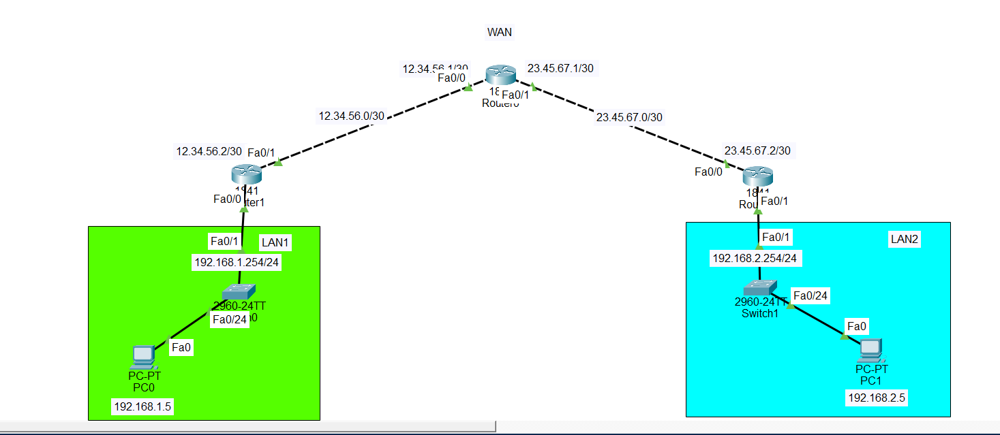

# 🔐 Configure Site-to-Site IPsec VPN Tunnel Between Two Cisco Routers

## 📌 Project Description

This project demonstrates how to configure a **Site-to-Site IPsec VPN tunnel** between two Cisco routers using **Cisco Packet Tracer**.

A site-to-site VPN creates a secure encrypted connection between two different LAN networks through an ISP/WAN network. The VPN allows devices in both LANs to communicate securely as if they were connected to the same private network.

In this topology:

- Router1 represents **Site A**
- Router2 represents **Site B**
- ISP Router represents the WAN/Internet provider
- IPsec VPN tunnel protects communication between the two LAN networks.

---

# 🌐 Topology Screenshot




---

# 🎯 Project Objectives

The goal of this project is to:

- Connect two remote LAN networks through a WAN network.
- Configure an IPsec VPN tunnel between Router1 and Router2.
- Encrypt communication between the two sites.
- Verify secure connectivity using ping tests.

---

# 🧰 Devices Used

| Device | Model | Quantity |
|---|---|---|
| Router | Cisco 1841 | 3 |
| Switch | Cisco 2950-24 | 2 |
| PC | PC-PT | 2 |
| Cables | Copper Straight-through / Serial | Required |

---

# 📌 IP Addressing Plan

## ISP Router

| Interface | IP Address | Network |
|-|-|-|
| Fa0/0 | 12.34.56.1/30 | WAN Link 1 |
| Fa0/1 | 23.45.67.1/30 | WAN Link 2 |


## Router1 (Site A)

| Interface | IP Address |
|-|-|
| Fa0/0 | 12.34.56.2/30 |
| Fa0/1 | 192.168.1.254/24 |


## Router2 (Site B)

| Interface | IP Address |
|-|-|
| Fa0/0 | 23.45.67.2/30 |
| Fa0/1 | 192.168.2.254/24 |


## End Devices

### PC2

```
IP Address: 192.168.1.5
Subnet Mask: 255.255.255.0
Default Gateway: 192.168.1.254
```

### PC3

```
IP Address: 192.168.2.5
Subnet Mask: 255.255.255.0
Default Gateway: 192.168.2.254
```

---

# ⚙️ VPN Configuration Steps

## 1. Configure WAN Interfaces

Configure Router1 and Router2 WAN interfaces with public IP addresses.

Example:

```
interface fa0/0
ip address 12.34.56.2 255.255.255.252
no shutdown
```

```
interface fa0/0
ip address 23.45.67.2 255.255.255.252
no shutdown
```

---

# 2. Configure Routing

Static routes are used to reach remote LAN networks.

### Router1

```
ip route 192.168.2.0 255.255.255.0 12.34.56.1
```


### Router2

```
ip route 192.168.1.0 255.255.255.0 23.45.67.1
```

---

# 3. Configure IPsec Phase 1 (IKE)

Phase 1 creates a secure channel between routers.

Configuration:

```
crypto isakmp policy 10
encryption aes 256
hash sha256
authentication pre-share
group 5
exit
```


Configure the shared secret:

Router1:

```
crypto isakmp key VPN123 address 23.45.67.2
```


Router2:

```
crypto isakmp key VPN123 address 12.34.56.2
```

---

# 4. Configure IPsec Phase 2

Create the transform set:

```
crypto ipsec transform-set VPN-SET esp-aes esp-sha-hmac
```

This defines:

- Encryption: AES
- Authentication: SHA

---

# 5. Define Interesting Traffic

Traffic that should pass through the VPN tunnel:

### Router1

```
access-list 100 permit ip 192.168.1.0 0.0.0.255 192.168.2.0 0.0.0.255
```


### Router2

```
access-list 100 permit ip 192.168.2.0 0.0.0.255 192.168.1.0 0.0.0.255
```

---

# 6. Create Crypto Map

Router1:

```
crypto map VPN-MAP 10 ipsec-isakmp

set peer 23.45.67.2

set transform-set VPN-SET

match address 100
```


Router2:

```
crypto map VPN-MAP 10 ipsec-isakmp

set peer 12.34.56.2

set transform-set VPN-SET

match address 100
```

---

# 7. Apply Crypto Map to WAN Interface


Router1:

```
interface fa0/0
crypto map VPN-MAP
```


Router2:

```
interface fa0/0
crypto map VPN-MAP
```

---

# 🔎 Verification Commands

Check IKE Phase 1:

```
show crypto isakmp sa
```


Check IPsec tunnel:

```
show crypto ipsec sa
```


Check routing:

```
show ip route
```

---

# ✅ Testing Connectivity

From PC2:

```
ping 192.168.2.5
```

From PC3:

```
ping 192.168.1.5
```

Successful replies confirm that the VPN tunnel is working.

---

# 🔐 Security Features Used

| Feature | Purpose |
|-|-|
| AES Encryption | Protects data confidentiality |
| SHA Authentication | Ensures data integrity |
| Pre-shared Key | Authenticates VPN peers |
| IPsec Tunnel | Creates secure communication |

---

# 📚 Technologies Used

- Cisco IOS
- IPsec VPN
- IKE Phase 1
- IPsec Phase 2
- AES Encryption
- SHA Authentication
- Static Routing
- Cisco Packet Tracer

---

# 🏁 Conclusion

The Site-to-Site IPsec VPN tunnel was successfully configured between Router1 and Router2.

The VPN provides a secure encrypted connection between:

**Site A LAN (192.168.1.0/24)**

and

**Site B LAN (192.168.2.0/24)**

allowing users from both locations to communicate securely through the WAN network.