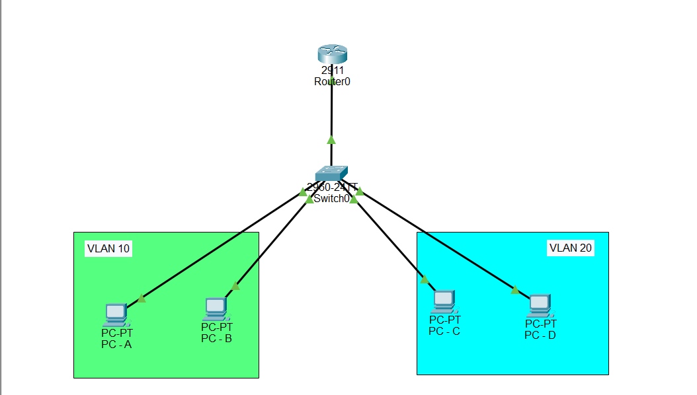

# 🌐 Configure Router-on-a-Stick (Inter-VLAN Routing) in Cisco Packet Tracer

## Description

**Router-on-a-Stick (ROAS)** is a networking technique that allows a **single physical router interface** to route traffic between multiple VLANs.

Instead of using one physical interface for every VLAN, the router creates **virtual subinterfaces**. Each subinterface belongs to one VLAN, uses **IEEE 802.1Q encapsulation**, and acts as the **default gateway** for devices in that VLAN.

This allows devices in different VLANs to communicate while keeping the networks logically separated.

---

# Router-on-a-Stick is used to:

- Enable communication between different VLANs
- Reduce the number of physical router interfaces required
- Save hardware costs
- Keep broadcast domains separated
- Improve network organization
- Perform Inter-VLAN Routing

---

# Important Notes

Router-on-a-Stick requires:

- One Cisco router
- One Layer 2 switch
- Two or more VLANs
- One trunk link between the router and switch
- Router subinterfaces configured with IEEE 802.1Q

Each router subinterface:

- Represents one VLAN
- Has its own IP address
- Uses 802.1Q encapsulation
- Acts as the default gateway for that VLAN

---

# Why Router-on-a-Stick is Important

- Allows devices in different VLANs to communicate
- Uses only one physical router interface
- Reduces hardware costs
- Simplifies network design
- Commonly used in CCNA labs and real networks

---

# Step-by-Step Configuration

## Step 1 — Create VLANs on the Switch

Enter privileged mode:

```text
Switch> enable
```

Enter global configuration mode:

```text
Switch# configure terminal
```

Create VLAN 10:

```text
Switch(config)# vlan 10
Switch(config-vlan)# name VLAN10
Switch(config-vlan)# exit
```

Create VLAN 20:

```text
Switch(config)# vlan 20
Switch(config-vlan)# name VLAN20
Switch(config-vlan)# exit
```

---

## Step 2 — Assign Switch Ports to VLANs

Assign ports Fa0/1 and Fa0/2 to VLAN 10:

```text
Switch(config)# interface range fa0/1-2
Switch(config-if-range)# switchport mode access
Switch(config-if-range)# switchport access vlan 10
Switch(config-if-range)# exit
```

Assign ports Fa0/3 and Fa0/4 to VLAN 20:

```text
Switch(config)# interface range fa0/3-4
Switch(config-if-range)# switchport mode access
Switch(config-if-range)# switchport access vlan 20
Switch(config-if-range)# exit
```

---

## Step 3 — Configure the Trunk Port

Assume the router is connected to FastEthernet0/24.

```text
Switch(config)# interface fa0/24
Switch(config-if)# switchport mode trunk
Switch(config-if)# no shutdown
Switch(config-if)# exit
```

**Note:** Some Cisco switches (such as the 2960) automatically use 802.1Q trunking and do not require the `switchport trunk encapsulation dot1q` command.

---

## Step 4 — Configure the Router Physical Interface

Enter privileged mode:

```text
Router> enable
```

Enter global configuration mode:

```text
Router# configure terminal
```

Enable the physical interface:

```text
Router(config)# interface fa0/0
Router(config-if)# no shutdown
Router(config-if)# exit
```

---

## Step 5 — Configure the VLAN 10 Subinterface

Syntax:

```text
interface physical-interface.vlan-id
encapsulation dot1Q vlan-id
ip address ip-address subnet-mask
```

Example:

```text
Router(config)# interface fa0/0.10
Router(config-subif)# encapsulation dot1Q 10
Router(config-subif)# ip address 192.168.10.1 255.255.255.0
Router(config-subif)# exit
```

Explanation:

- **fa0/0.10** → Subinterface for VLAN 10
- **encapsulation dot1Q 10** → Tags frames with VLAN ID 10
- **ip address** → Default gateway for VLAN 10

---

## Step 6 — Configure the VLAN 20 Subinterface

```text
Router(config)# interface fa0/0.20
Router(config-subif)# encapsulation dot1Q 20
Router(config-subif)# ip address 192.168.20.1 255.255.255.0
Router(config-subif)# exit
```

Explanation:

- **fa0/0.20** → Subinterface for VLAN 20
- **encapsulation dot1Q 20** → Tags frames with VLAN ID 20
- **ip address** → Default gateway for VLAN 20

---

## Step 7 — Save Configuration

```text
Router(config)# end
Router# copy running-config startup-config
```

---

# 🌐 Topology Screenshot



---

# 🎯 Packet Tracer Tasks

## Task 1 — Create VLANs

Requirements:

- Create VLAN 10
- Create VLAN 20

Commands:

```text
enable

configure terminal

vlan 10
name VLAN10
exit

vlan 20
name VLAN20
exit
```

---

## Task 2 — Assign Switch Ports

Requirements:

- PCs A and B → VLAN 10
- PCs C and D → VLAN 20

Commands:

```text
interface range fa0/1-2
switchport mode access
switchport access vlan 10
exit

interface range fa0/3-4
switchport mode access
switchport access vlan 20
exit
```

---

## Task 3 — Configure the Trunk Port

Requirements:

- Configure the router connection as a trunk

Commands:

```text
interface fa0/24
switchport mode trunk
no shutdown
```

---

## Task 4 — Configure Router-on-a-Stick

Requirements:

- Enable Fa0/0
- Create subinterfaces
- Configure encapsulation
- Configure gateway IP addresses

Commands:

```text
enable

configure terminal

interface fa0/0
no shutdown
exit

interface fa0/0.10
encapsulation dot1Q 10
ip address 192.168.10.1 255.255.255.0
exit

interface fa0/0.20
encapsulation dot1Q 20
ip address 192.168.20.1 255.255.255.0
exit

end

copy running-config startup-config
```

---

## Task 5 — Configure PC IP Addresses

### VLAN 10

PC-A

```text
IP Address: 192.168.10.10
Subnet Mask: 255.255.255.0
Default Gateway: 192.168.10.1
```

PC-B

```text
IP Address: 192.168.10.11
Subnet Mask: 255.255.255.0
Default Gateway: 192.168.10.1
```

---

### VLAN 20

PC-C

```text
IP Address: 192.168.20.10
Subnet Mask: 255.255.255.0
Default Gateway: 192.168.20.1
```

PC-D

```text
IP Address: 192.168.20.11
Subnet Mask: 255.255.255.0
Default Gateway: 192.168.20.1
```

---

## Task 6 — Test Inter-VLAN Routing

Ping from PC-A to PC-C.

Command:

```text
ping 192.168.20.10
```

Expected Result:

```text
Reply from 192.168.20.10
```

The router successfully routes traffic between VLAN 10 and VLAN 20.

---

# Verification Commands

## Verify Router Interfaces

```text
show ip interface brief
```

---

## Verify Router Configuration

```text
show running-config
```

---

## Verify VLANs

```text
show vlan brief
```

---

## Verify Trunk

```text
show interfaces trunk
```

---

## Verify Routing

```text
show ip route
```

---

# Expected Result

After configuration:

✅ VLAN 10 and VLAN 20 are created

✅ Switch ports are assigned to the correct VLANs

✅ The switch-to-router connection is configured as a trunk

✅ Router subinterfaces are configured with IEEE 802.1Q encapsulation

✅ Each VLAN has its own default gateway

✅ Devices in different VLANs can communicate successfully

✅ Configuration is saved permanently

---

# Conclusion

Router-on-a-Stick is a Cisco Inter-VLAN Routing technique that uses one physical router interface divided into multiple virtual subinterfaces. Each subinterface is assigned to a VLAN, configured with IEEE 802.1Q encapsulation, and given an IP address that serves as the default gateway for that VLAN. This method allows communication between VLANs while reducing hardware costs and is a fundamental networking concept covered in CCNA.