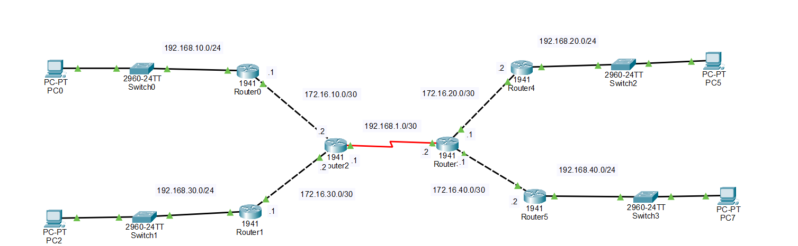

# 📡 Static Routing Between Multiple Cisco Routers

## 📌 Project Description

This project demonstrates how to configure **static routing** on Cisco routers so that multiple LAN networks can communicate with each other.

The topology contains:

* 6 Cisco routers
* 4 switches
* 4 PCs
* Multiple point-to-point links
* 4 LAN networks
* Static routes configured manually
* End-to-end connectivity tested using `ping`

The goal is to allow:

* PC0 → PC1
* PC0 → PC2
* PC0 → PC3
* PC1 → PC2
* PC1 → PC3
* PC2 → PC3

---


# 🌐 Topology Screenshot



---

# 🧮 IP Addressing Plan

## LAN Networks

| Device  | Interface | IP Address      | Subnet Mask     |
| ------- | --------- | --------------- | --------------- |
| Router0 | LAN       | `192.168.10.1`  | `255.255.255.0` |
| PC0     | NIC       | `192.168.10.10` | `255.255.255.0` |
| Router4 | LAN       | `192.168.20.1`  | `255.255.255.0` |
| PC1     | NIC       | `192.168.20.10` | `255.255.255.0` |
| Router2 | LAN       | `192.168.30.1`  | `255.255.255.0` |
| PC2     | NIC       | `192.168.30.10` | `255.255.255.0` |
| Router5 | LAN       | `192.168.40.1`  | `255.255.255.0` |
| PC3     | NIC       | `192.168.40.10` | `255.255.255.0` |

## Router-to-Router Networks

| Link    | Network          | First Router      | Second Router     |
| ------- | ---------------- | ----------------- | ----------------- |
| R0 ↔ R1 | `172.16.10.0/30` | R0: `172.16.10.1` | R1: `172.16.10.2` |
| R1 ↔ R4 | `172.16.20.0/30` | R1: `172.16.20.1` | R4: `172.16.20.2` |
| R2 ↔ R3 | `172.16.30.0/30` | R2: `172.16.30.1` | R3: `172.16.30.2` |
| R3 ↔ R5 | `172.16.40.0/30` | R3: `172.16.40.1` | R5: `172.16.40.2` |
| R1 ↔ R3 | `192.168.1.0/30` | R1: `192.168.1.1` | R3: `192.168.1.2` |

> **Important:** `/30` has the subnet mask `255.255.255.252`.

---

# 🔌 Interface Addressing

The exact interface names may be different depending on your Packet Tracer router model.

For this README, we will assume:

* `G0/0` = LAN connection
* `G0/1` = router-to-router connection

If your router uses `Fa0/0`, `Fa0/1`, etc., replace the interface name accordingly.

---

# 1️⃣ Configure Router0

Router0 connects PC0's LAN to Router1.

```cisco
enable
configure terminal

hostname Router0

interface g0/0
 ip address 192.168.10.1 255.255.255.0
 no shutdown
exit

interface g0/1
 ip address 172.16.10.1 255.255.255.252
 no shutdown
exit

! Route to PC1 LAN
ip route 192.168.20.0 255.255.255.0 172.16.10.2

! Route to PC2 LAN
ip route 192.168.30.0 255.255.255.0 172.16.10.2

! Route to PC3 LAN
ip route 192.168.40.0 255.255.255.0 172.16.10.2

end
write memory
```

### Router0 routing idea

Router0 does not directly know where these networks are:

```text
192.168.20.0
192.168.30.0
192.168.40.0
```

So we tell Router0:

```text
"Send traffic for these networks to Router1."
```

The next-hop address is:

```text
172.16.10.2
```

---

# 2️⃣ Configure Router1

Router1 is the first core router.

It connects:

* Router0
* Router4
* Router3

```cisco
enable
configure terminal

hostname Router1

interface g0/0
 ip address 172.16.10.2 255.255.255.252
 no shutdown
exit

interface g0/1
 ip address 172.16.20.1 255.255.255.252
 no shutdown
exit

interface g0/2
 ip address 192.168.1.1 255.255.255.252
 no shutdown
exit

! Route to PC0 LAN
ip route 192.168.10.0 255.255.255.0 172.16.10.1

! Route to PC1 LAN
ip route 192.168.20.0 255.255.255.0 172.16.20.2

! Route to PC2 LAN through Router3
ip route 192.168.30.0 255.255.255.0 192.168.1.2

! Route to PC3 LAN through Router3
ip route 192.168.40.0 255.255.255.0 192.168.1.2

end
write memory
```

---

# 3️⃣ Configure Router3

Router3 is the second core router.

It connects:

* Router2
* Router5
* Router1

```cisco
enable
configure terminal

hostname Router3

interface g0/0
 ip address 172.16.30.2 255.255.255.252
 no shutdown
exit

interface g0/1
 ip address 172.16.40.1 255.255.255.252
 no shutdown
exit

interface g0/2
 ip address 192.168.1.2 255.255.255.252
 no shutdown
exit

! Route to PC2 LAN
ip route 192.168.30.0 255.255.255.0 172.16.30.1

! Route to PC3 LAN
ip route 192.168.40.0 255.255.255.0 172.16.40.2

! Route to PC0 LAN through Router1
ip route 192.168.10.0 255.255.255.0 192.168.1.1

! Route to PC1 LAN through Router1
ip route 192.168.20.0 255.255.255.0 192.168.1.1

end
write memory
```

---

# 4️⃣ Configure Router2

Router2 connects PC2's LAN to Router3.

```cisco
enable
configure terminal

hostname Router2

interface g0/0
 ip address 192.168.30.1 255.255.255.0
 no shutdown
exit

interface g0/1
 ip address 172.16.30.1 255.255.255.252
 no shutdown
exit

! Route to PC0 LAN
ip route 192.168.10.0 255.255.255.0 172.16.30.2

! Route to PC1 LAN
ip route 192.168.20.0 255.255.255.0 172.16.30.2

! Route to PC3 LAN
ip route 192.168.40.0 255.255.255.0 172.16.30.2

end
write memory
```

---

# 5️⃣ Configure Router4

Router4 connects PC1's LAN to Router1.

```cisco
enable
configure terminal

hostname Router4

interface g0/0
 ip address 192.168.20.1 255.255.255.0
 no shutdown
exit

interface g0/1
 ip address 172.16.20.2 255.255.255.252
 no shutdown
exit

! Route to PC0 LAN
ip route 192.168.10.0 255.255.255.0 172.16.20.1

! Route to PC2 LAN
ip route 192.168.30.0 255.255.255.0 172.16.20.1

! Route to PC3 LAN
ip route 192.168.40.0 255.255.255.0 172.16.20.1

end
write memory
```

---

# 6️⃣ Configure Router5

Router5 connects PC3's LAN to Router3.

```cisco
enable
configure terminal

hostname Router5

interface g0/0
 ip address 192.168.40.1 255.255.255.0
 no shutdown
exit

interface g0/1
 ip address 172.16.40.2 255.255.255.252
 no shutdown
exit

! Route to PC0 LAN
ip route 192.168.10.0 255.255.255.0 172.16.40.1

! Route to PC1 LAN
ip route 192.168.20.0 255.255.255.0 172.16.40.1

! Route to PC2 LAN
ip route 192.168.30.0 255.255.255.0 172.16.40.1

end
write memory
```

---

# 💻 PC Configuration

Configure the PCs manually in:

**PC → Desktop → IP Configuration**

## PC0

```text
IP Address:      192.168.10.10
Subnet Mask:     255.255.255.0
Default Gateway: 192.168.10.1
```

## PC1

```text
IP Address:      192.168.20.10
Subnet Mask:     255.255.255.0
Default Gateway: 192.168.20.1
```

## PC2

```text
IP Address:      192.168.30.10
Subnet Mask:     255.255.255.0
Default Gateway: 192.168.30.1
```

## PC3

```text
IP Address:      192.168.40.10
Subnet Mask:     255.255.255.0
Default Gateway: 192.168.40.1
```

---

# 🧪 Testing Connectivity

After configuring everything, test the interfaces first.

## Test Router0 → Router1

On Router0:

```cisco
ping 172.16.10.2
```

You should receive:

```text
!!!!!
```

---

## Test Router1 → Router3

On Router1:

```cisco
ping 192.168.1.2
```

Expected:

```text
!!!!!
```

---

## Test Router3 → Router2

On Router3:

```cisco
ping 172.16.30.1
```

Expected:

```text
!!!!!
```

---

# 🖥️ Test PC-to-PC Connectivity

## PC0 → PC1

On PC0:

```text
ping 192.168.20.10
```

## PC0 → PC2

```text
ping 192.168.30.10
```

## PC0 → PC3

```text
ping 192.168.40.10
```

## PC1 → PC2

```text
ping 192.168.30.10
```

## PC1 → PC3

```text
ping 192.168.40.10
```

## PC2 → PC3

```text
ping 192.168.40.10
```

If everything is configured correctly, the pings should succeed.

---

# 🔎 Verify Static Routes

On every router, use:

```cisco
show ip route
```

Static routes are marked with:

```text
S
```

For example:

```text
S    192.168.20.0/24 [1/0] via 172.16.10.2
```

This means:

> To reach `192.168.20.0/24`, send the packet to `172.16.10.2`.

---

# 🔍 Verify Interfaces

Use:

```cisco
show ip interface brief
```

You should see interfaces with:

```text
Status    Protocol
up        up
```

For example:

```text
Interface              IP-Address      Status      Protocol
GigabitEthernet0/0     192.168.10.1    up          up
GigabitEthernet0/1     172.16.10.1     up          up
```

If you see:

```text
administratively down
```

enter the interface and use:

```cisco
no shutdown
```

---

# 🧭 Understanding the Static Route

The basic syntax is:

```cisco
ip route [destination-network] [subnet-mask] [next-hop-ip]
```

Example:

```cisco
ip route 192.168.30.0 255.255.255.0 172.16.10.2
```

This means:

```text
Destination network:
192.168.30.0/24

Subnet mask:
255.255.255.0

Next hop:
172.16.10.2
```

In simple English:

> "If you want to reach the 192.168.30.0 network, send the packet to 172.16.10.2."

---

# 🔄 How PC0 Reaches PC2

When PC0 wants to ping PC2:

```text
PC0
192.168.10.10
     |
     ↓
Router0
     |
172.16.10.1
     |
     ↓
Router1
     |
192.168.1.1
     |
     ↓
Router3
     |
172.16.30.2
     |
     ↓
Router2
     |
192.168.30.1
     |
     ↓
PC2
192.168.30.10
```

The packet travels through multiple routers.

Each router must know where to send the packet next.

That is why static routes are configured on **all necessary routers**.

---

# ⭐ Important Rule About Static Routing

For communication to work, routing must exist in **both directions**.

For example:

```text
PC0 → PC2
```

requires routes toward:

```text
192.168.30.0/24
```

But PC2 must also have a route back toward:

```text
192.168.10.0/24
```

Therefore, you cannot configure only the forward path.

You need a **return path** as well.

---

# 🧠 Simple Way to Remember Static Routing

Think of a router as a person directing traffic.

If Router0 receives a packet for:

```text
192.168.30.0/24
```

Router0 asks:

> "Where should I send this?"

The static route tells it:

```text
192.168.30.0/24 → 172.16.10.2
```

So Router0 sends the packet to Router1.

Then Router1 checks its routing table and sends it toward Router3.

Then Router3 sends it toward Router2.

Finally, Router2 sends it to PC2.

---

# 💾 Save Configuration

After configuring each router:

```cisco
copy running-config startup-config
```

or:

```cisco
write memory
```

---

# 🛠️ Troubleshooting

If the ping does not work, check the following.

### 1. Check interfaces

```cisco
show ip interface brief
```

Make sure interfaces are:

```text
up/up
```

### 2. Check IP addresses

```cisco
show running-config
```

Verify that the IP addresses are correct.

### 3. Check routing table

```cisco
show ip route
```

Look for the required `S` routes.

### 4. Check PC default gateway

Each PC must have the IP address of its local router as its default gateway.

Example:

```text
PC0 → 192.168.10.1
PC1 → 192.168.20.1
PC2 → 192.168.30.1
PC3 → 192.168.40.1
```

### 5. Test hop by hop

Do not immediately test PC0 → PC3.

First test:

```text
PC0 → Router0
Router0 → Router1
Router1 → Router3
Router3 → Router5
Router5 → PC3
```

This makes it easier to find where the problem is.

---

# ✅ Final Result

After completing the configuration, the network should provide full connectivity between all four LANs:

```text
192.168.10.0/24  ↔  192.168.20.0/24
       ↕                    ↕
192.168.30.0/24  ↔  192.168.40.0/24
```

The main concept demonstrated by this project is:

> **Static routing manually tells each router which next hop to use to reach remote networks.**

All routers must have the necessary routes, and every destination must have a **return route** back to the source.
