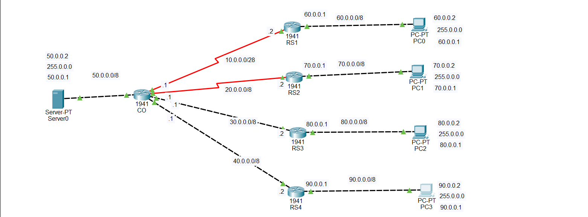

# Default Route Configuration in Cisco Packet Tracer

## Description

A **default route** is a fallback route used by a router when it does not have a specific route to the destination network.

In simple English:

> A default route tells the router: "If you don't know where the destination network is, send the packet to this next-hop router."

A default route is also called the **Gateway of Last Resort**.

For IPv4, the default route is:

```text
0.0.0.0/0
```

The Cisco command for configuring an IPv4 default route is:

```cisco
ip route 0.0.0.0 0.0.0.0 <next-hop-ip>
```

For example:

```cisco
ip route 0.0.0.0 0.0.0.0 10.0.0.1
```

This means:

> If the router does not have a specific route to the destination, send the packet to `10.0.0.1`.

---

# 🌐 Topology Screenshot



---

## IP Addressing

The topology contains five routers:

- `CO` = Central router
- `RS1` = Router connected to PC0
- `RS2` = Router connected to PC1
- `RS3` = Router connected to PC2
- `RS4` = Router connected to PC3

The networks are:

| Network | Purpose |
|---|---|
| `50.0.0.0/8` | Server network |
| `10.0.0.0/8` | CO ↔ RS1 |
| `20.0.0.0/8` | CO ↔ RS2 |
| `30.0.0.0/8` | CO ↔ RS3 |
| `40.0.0.0/8` | CO ↔ RS4 |
| `60.0.0.0/8` | PC0 LAN |
| `70.0.0.0/8` | PC1 LAN |
| `80.0.0.0/8` | PC2 LAN |
| `90.0.0.0/8` | PC3 LAN |

The subnet mask used for all `/8` networks is:

```text
255.0.0.0
```

### Server Network

```text
CO F0/0     = 50.0.0.1
Server0     = 50.0.0.2
Gateway     = 50.0.0.1
Subnet Mask = 255.0.0.0
```

### CO ↔ RS1

```text
CO S0/0/0   = 10.0.0.1
RS1 S0/0/0  = 10.0.0.2
```

### CO ↔ RS2

```text
CO S0/0/1   = 20.0.0.1
RS2 S0/0/0  = 20.0.0.2
```

### CO ↔ RS3

```text
CO S0/1/0   = 30.0.0.1
RS3 S0/0/0  = 30.0.0.2
```

### CO ↔ RS4

```text
CO S0/1/1   = 40.0.0.1
RS4 S0/0/0  = 40.0.0.2
```

### PC0 LAN

```text
RS1 F0/0    = 60.0.0.1
PC0         = 60.0.0.2
Gateway     = 60.0.0.1
Subnet Mask = 255.0.0.0
```

### PC1 LAN

```text
RS2 F0/0    = 70.0.0.1
PC1         = 70.0.0.2
Gateway     = 70.0.0.1
Subnet Mask = 255.0.0.0
```

### PC2 LAN

```text
RS3 F0/0    = 80.0.0.1
PC2         = 80.0.0.2
Gateway     = 80.0.0.1
Subnet Mask = 255.0.0.0
```

### PC3 LAN

```text
RS4 F0/0    = 90.0.0.1
PC3         = 90.0.0.2
Gateway     = 90.0.0.1
Subnet Mask = 255.0.0.0
```

---

# Configure CO Router

Enter privileged mode:

```cisco
enable
```

Enter global configuration mode:

```cisco
configure terminal
```

Set the hostname:

```cisco
hostname CO
```

Configure the interface connected to Server0:

```cisco
interface fastethernet 0/0
ip address 50.0.0.1 255.0.0.0
no shutdown
exit
```

Configure the interface connected to RS1:

```cisco
interface serial 0/0/0
ip address 10.0.0.1 255.0.0.0
no shutdown
exit
```

Configure the interface connected to RS2:

```cisco
interface serial 0/0/1
ip address 20.0.0.1 255.0.0.0
no shutdown
exit
```

Configure the interface connected to RS3:

```cisco
interface serial 0/1/0
ip address 30.0.0.1 255.0.0.0
no shutdown
exit
```

Configure the interface connected to RS4:

```cisco
interface serial 0/1/1
ip address 40.0.0.1 255.0.0.0
no shutdown
exit
```

CO needs routes to the four remote LANs.

Route to the PC0 network:

```cisco
ip route 60.0.0.0 255.0.0.0 10.0.0.2
```

Route to the PC1 network:

```cisco
ip route 70.0.0.0 255.0.0.0 20.0.0.2
```

Route to the PC2 network:

```cisco
ip route 80.0.0.0 255.0.0.0 30.0.0.2
```

Route to the PC3 network:

```cisco
ip route 90.0.0.0 255.0.0.0 40.0.0.2
```

Save the configuration:

```cisco
end
write memory
```

---

# Configure RS1

```cisco
enable
configure terminal
hostname RS1
```

Configure the serial interface:

```cisco
interface serial 0/0/0
ip address 10.0.0.2 255.0.0.0
no shutdown
exit
```

Configure the LAN interface:

```cisco
interface fastethernet 0/0
ip address 60.0.0.1 255.0.0.0
no shutdown
exit
```

Configure the default route:

```cisco
ip route 0.0.0.0 0.0.0.0 10.0.0.1
```

This means:

```text
If RS1 does not know the destination,
send the packet to CO at 10.0.0.1.
```

Save:

```cisco
end
write memory
```

---

# Configure RS2

```cisco
enable
configure terminal
hostname RS2
```

Configure the serial interface:

```cisco
interface serial 0/0/0
ip address 20.0.0.2 255.0.0.0
no shutdown
exit
```

Configure the LAN interface:

```cisco
interface fastethernet 0/0
ip address 70.0.0.1 255.0.0.0
no shutdown
exit
```

Configure the default route:

```cisco
ip route 0.0.0.0 0.0.0.0 20.0.0.1
```

This means:

```text
If RS2 does not know the destination,
send the packet to CO at 20.0.0.1.
```

Save:

```cisco
end
write memory
```

---

# Configure RS3

```cisco
enable
configure terminal
hostname RS3
```

Configure the serial interface:

```cisco
interface serial 0/0/0
ip address 30.0.0.2 255.0.0.0
no shutdown
exit
```

Configure the LAN interface:

```cisco
interface fastethernet 0/0
ip address 80.0.0.1 255.0.0.0
no shutdown
exit
```

Configure the default route:

```cisco
ip route 0.0.0.0 0.0.0.0 30.0.0.1
```

This means:

```text
If RS3 does not know the destination,
send the packet to CO at 30.0.0.1.
```

Save:

```cisco
end
write memory
```

---

# Configure RS4

```cisco
enable
configure terminal
hostname RS4
```

Configure the serial interface:

```cisco
interface serial 0/0/0
ip address 40.0.0.2 255.0.0.0
no shutdown
exit
```

Configure the LAN interface:

```cisco
interface fastethernet 0/0
ip address 90.0.0.1 255.0.0.0
no shutdown
exit
```

Configure the default route:

```cisco
ip route 0.0.0.0 0.0.0.0 40.0.0.1
```

This means:

```text
If RS4 does not know the destination,
send the packet to CO at 40.0.0.1.
```

Save:

```cisco
end
write memory
```

---

# Configure Server0

Go to:

```text
Server0 → Desktop → IP Configuration
```

Enter:

```text
IP Address:      50.0.0.2
Subnet Mask:     255.0.0.0
Default Gateway: 50.0.0.1
```

---

# Configure PC0

Go to:

```text
PC0 → Desktop → IP Configuration
```

Enter:

```text
IP Address:      60.0.0.2
Subnet Mask:     255.0.0.0
Default Gateway: 60.0.0.1
```

# Configure PC1

Go to:

```text
PC1 → Desktop → IP Configuration
```

Enter:

```text
IP Address:      70.0.0.2
Subnet Mask:     255.0.0.0
Default Gateway: 70.0.0.1
```

# Configure PC2

Go to:

```text
PC2 → Desktop → IP Configuration
```

Enter:

```text
IP Address:      80.0.0.2
Subnet Mask:     255.0.0.0
Default Gateway: 80.0.0.1
```

# Configure PC3

Go to:

```text
PC3 → Desktop → IP Configuration
```

Enter:

```text
IP Address:      90.0.0.2
Subnet Mask:     255.0.0.0
Default Gateway: 90.0.0.1
```

---

# How the Default Route Works

Suppose PC0 wants to ping PC3.

PC0:

```text
60.0.0.2
```

PC3:

```text
90.0.0.2
```

PC0 first sends the packet to its default gateway:

```text
PC0 → RS1
```

RS1 checks its routing table.

RS1 does not have a specific route for:

```text
90.0.0.0/8
```

Therefore, RS1 uses its default route:

```text
0.0.0.0/0 → 10.0.0.1
```

The packet goes:

```text
PC0 → RS1 → CO
```

CO checks its routing table.

CO has this route:

```text
90.0.0.0/8 → 40.0.0.2
```

Therefore:

```text
PC0 → RS1 → CO → RS4
```

RS4 knows that `90.0.0.0/8` is directly connected to its F0/0 interface.

Therefore:

```text
PC0 → RS1 → CO → RS4 → PC3
```

The reply follows the reverse path:

```text
PC3 → RS4 → CO → RS1 → PC0
```

This is how the default route allows the branch routers to send unknown destinations toward the central router.

---

# Verify the Configuration

Check all interfaces:

```cisco
show ip interface brief
```

The interfaces should normally show:

```text
Status    Protocol
up        up
```

Check the routing table:

```cisco
show ip route
```

On RS1, you should see a default route similar to:

```text
S* 0.0.0.0/0 via 10.0.0.1
```

On RS2:

```text
S* 0.0.0.0/0 via 20.0.0.1
```

On RS3:

```text
S* 0.0.0.0/0 via 30.0.0.1
```

On RS4:

```text
S* 0.0.0.0/0 via 40.0.0.1
```

On CO, you should see routes similar to:

```text
S 60.0.0.0/8 via 10.0.0.2
S 70.0.0.0/8 via 20.0.0.2
S 80.0.0.0/8 via 30.0.0.2
S 90.0.0.0/8 via 40.0.0.2
```

---

# Test Connectivity

From PC0:

```text
ping 70.0.0.2
ping 80.0.0.2
ping 90.0.0.2
ping 50.0.0.2
```

From PC1:

```text
ping 60.0.0.2
ping 80.0.0.2
ping 90.0.0.2
ping 50.0.0.2
```

From PC2:

```text
ping 60.0.0.2
ping 70.0.0.2
ping 90.0.0.2
ping 50.0.0.2
```

From PC3:

```text
ping 60.0.0.2
ping 70.0.0.2
ping 80.0.0.2
ping 50.0.0.2
```

From Server0:

```text
ping 60.0.0.2
ping 70.0.0.2
ping 80.0.0.2
ping 90.0.0.2
```

If the configuration is correct, the devices should be able to ping each other.

---

# Troubleshooting

If the ping fails, check the interfaces first:

```cisco
show ip interface brief
```

Make sure the required interfaces are:

```text
up
up
```

Check the routing table:

```cisco
show ip route
```

Check the default route on RS1:

```cisco
show ip route
```

Look for:

```text
S* 0.0.0.0/0 via 10.0.0.1
```

Test RS1 to CO:

```cisco
ping 10.0.0.1
```

Test RS2 to CO:

```cisco
ping 20.0.0.1
```

Test RS3 to CO:

```cisco
ping 30.0.0.1
```

Test RS4 to CO:

```cisco
ping 40.0.0.1
```

Also make sure the PCs have the correct default gateways:

```text
PC0     → 60.0.0.1
PC1     → 70.0.0.1
PC2     → 80.0.0.1
PC3     → 90.0.0.1
Server0 → 50.0.0.1
```

---

# DCE Serial Interface

If one of the serial interfaces is the DCE side, it needs a clock rate.

You can check with:

```cisco
show controllers serial 0/0/0
```

If the interface is DCE, configure:

```cisco
configure terminal
interface serial 0/0/0
clock rate 64000
no shutdown
exit
```

Only the DCE side needs the clock rate.

---

# Important Cisco Commands

Enter privileged mode:

```cisco
enable
```

Enter global configuration mode:

```cisco
configure terminal
```

Configure an interface:

```cisco
interface fastethernet 0/0
```

Configure a serial interface:

```cisco
interface serial 0/0/0
```

Assign an IP address:

```cisco
ip address <IP-address> <subnet-mask>
```

Enable an interface:

```cisco
no shutdown
```

Configure a normal static route:

```cisco
ip route <destination-network> <subnet-mask> <next-hop-IP>
```

Configure a default route:

```cisco
ip route 0.0.0.0 0.0.0.0 <next-hop-IP>
```

Check interfaces:

```cisco
show ip interface brief
```

Check the routing table:

```cisco
show ip route
```

Test connectivity:

```cisco
ping <destination-IP>
```

Trace the path:

```cisco
traceroute <destination-IP>
```

Save the configuration:

```cisco
write memory
```

or:

```cisco
copy running-config startup-config
```

---

# Final Summary

The most important concept in this lab is:

> A default route is a fallback route. When a router does not have a specific route to a destination, it forwards the packet to the next-hop router configured in the default route.

The IPv4 default route is:

```text
0.0.0.0/0
```

The Cisco command is:

```cisco
ip route 0.0.0.0 0.0.0.0 <next-hop-IP>
```

In this topology:

```text
RS1 → CO = 10.0.0.1
RS2 → CO = 20.0.0.1
RS3 → CO = 30.0.0.1
RS4 → CO = 40.0.0.1
```

Therefore, the default routes are:

```cisco
RS1:
ip route 0.0.0.0 0.0.0.0 10.0.0.1

RS2:
ip route 0.0.0.0 0.0.0.0 20.0.0.1

RS3:
ip route 0.0.0.0 0.0.0.0 30.0.0.1

RS4:
ip route 0.0.0.0 0.0.0.0 40.0.0.1
```

The CO router uses specific static routes to reach the remote LANs:

```cisco
ip route 60.0.0.0 255.0.0.0 10.0.0.2
ip route 70.0.0.0 255.0.0.0 20.0.0.2
ip route 80.0.0.0 255.0.0.0 30.0.0.2
ip route 90.0.0.0 255.0.0.0 40.0.0.2
```

The final packet path between PC0 and PC3 is:

```text
PC0 → RS1 → CO → RS4 → PC3
```

The return path is:

```text
PC3 → RS4 → CO → RS1 → PC0
```

This lab demonstrates how a **default route** can be used together with **static routes** to provide connectivity between multiple networks in Cisco Packet Tracer.