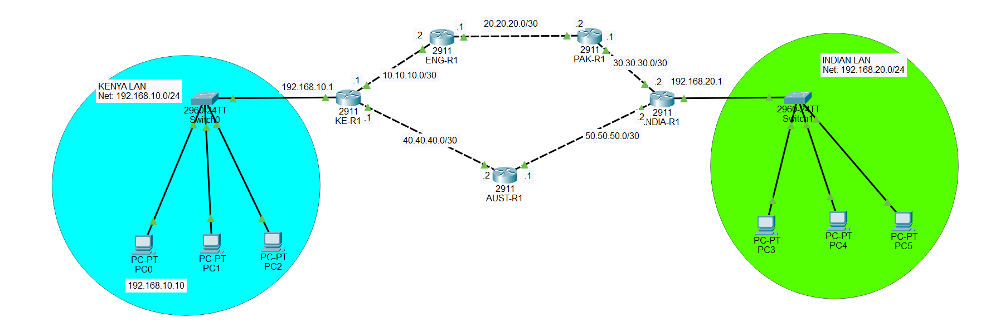

# Floating Static Route Configuration in Cisco Packet Tracer

## Description

A **Floating Static Route** is a backup static route that is configured with a **higher Administrative Distance (AD)** than the main static route.

It is called "floating" because the backup route normally stays out of the routing table. It only becomes active when the main route is no longer available.

In this topology, there are two paths between the **Kenya LAN** and the **India LAN**:

```text
PRIMARY / MAIN PATH:

KENYA → ENG → PAK → INDIA


SECONDARY / BACKUP PATH:

KENYA → AUST → INDIA
```

The **main path uses normal static routes**.

The **backup path uses floating static routes**.

The main route has the default static-route Administrative Distance:

```text
AD = 1
```

The floating static route is configured with a higher AD, for example:

```text
AD = 5
```

Because `1` is lower than `5`, the router prefers the main route.

If the main route disappears, the route with AD `5` becomes active.

---

# 🌐 Topology Screenshot



---

# How the Topology Works

There are five routers:

```text
KE-R1    = Kenya Router
ENG-R1   = England Router
PAK-R1   = Pakistan Router
INDIA-R1 = India Router
AUST-R1  = Australia Router
```

There are two paths between Kenya and India.

## Main Path

```text
KENYA
  |
  ↓
ENG
  |
  ↓
PAK
  |
  ↓
INDIA
```

The main path uses:

```text
10.10.10.0/30
20.20.20.0/30
30.30.30.0/30
```

Normal static routes are configured for this path.

---

## Backup Path

```text
KENYA
  |
  ↓
AUST
  |
  ↓
INDIA
```

The backup path uses:

```text
40.40.40.0/30
50.50.50.0/30
```

Floating static routes are configured for this path.

The backup routes have a higher Administrative Distance:

```text
AD = 5
```

Therefore, the router prefers the main static route with:

```text
AD = 1
```

---

# IP Addressing

The following IP addressing scheme is used in this lab.

## Kenya LAN

```text
Network:       192.168.10.0/24
KE-R1 LAN:     192.168.10.1
PC0:           192.168.10.10
PC1:           192.168.10.11
PC2:           192.168.10.12
Subnet Mask:   255.255.255.0
Gateway:       192.168.10.1
```

## India LAN

```text
Network:       192.168.20.0/24
INDIA-R1 LAN:  192.168.20.1
PC3:           192.168.20.10
PC4:           192.168.20.11
PC5:           192.168.20.12
Subnet Mask:   255.255.255.0
Gateway:       192.168.20.1
```

---

# Main Link IP Addresses

## KE-R1 ↔ ENG-R1

Network:

```text
10.10.10.0/30
```

Use:

```text
KE-R1  = 10.10.10.1
ENG-R1 = 10.10.10.2
```

Subnet mask:

```text
255.255.255.252
```

## ENG-R1 ↔ PAK-R1

Network:

```text
20.20.20.0/30
```

Use:

```text
ENG-R1 = 20.20.20.1
PAK-R1 = 20.20.20.2
```

Subnet mask:

```text
255.255.255.252
```

## PAK-R1 ↔ INDIA-R1

Network:

```text
30.30.30.0/30
```

Use:

```text
PAK-R1   = 30.30.30.1
INDIA-R1 = 30.30.30.2
```

Subnet mask:

```text
255.255.255.252
```

---

# Backup Link IP Addresses

## KE-R1 ↔ AUST-R1

Network:

```text
40.40.40.0/30
```

Use:

```text
KE-R1   = 40.40.40.1
AUST-R1 = 40.40.40.2
```

Subnet mask:

```text
255.255.255.252
```

## AUST-R1 ↔ INDIA-R1

Network:

```text
50.50.50.0/30
```

Use:

```text
AUST-R1  = 50.50.50.1
INDIA-R1 = 50.50.50.2
```

Subnet mask:

```text
255.255.255.252
```

---

# Configuration

## 1. Configure KE-R1

Enter privileged mode:

```cisco
enable
```

Enter global configuration mode:

```cisco
configure terminal
```

Set hostname:

```cisco
hostname KE-R1
```

Configure the Kenya LAN interface:

```cisco
interface gigabitEthernet 0/0
ip address 192.168.10.1 255.255.255.0
no shutdown
exit
```

Configure the main link toward ENG-R1:

```cisco
interface gigabitEthernet 0/1
ip address 10.10.10.1 255.255.255.252
no shutdown
exit
```

Configure the backup link toward AUST-R1:

```cisco
interface gigabitEthernet 0/2
ip address 40.40.40.1 255.255.255.252
no shutdown
exit
```

### Main Static Route

Configure a normal static route toward the India LAN through ENG-R1:

```cisco
ip route 192.168.20.0 255.255.255.0 10.10.10.2
```

This is the **primary route**.

It has the default static-route AD:

```text
AD = 1
```

### Floating Static Route

Now configure the backup route through AUST-R1:

```cisco
ip route 192.168.20.0 255.255.255.0 40.40.40.2 5
```

The `5` at the end is the Administrative Distance.

Therefore:

```text
Main route:
192.168.20.0/24 → 10.10.10.2 → AD 1

Backup route:
192.168.20.0/24 → 40.40.40.2 → AD 5
```

The router prefers AD 1.

The AD 5 route remains inactive until the primary route disappears.

Save:

```cisco
end
write memory
```

---

# 2. Configure ENG-R1

Enter:

```cisco
enable
configure terminal
hostname ENG-R1
```

Configure the interface toward KE-R1:

```cisco
interface gigabitEthernet 0/0
ip address 10.10.10.2 255.255.255.252
no shutdown
exit
```

Configure the interface toward PAK-R1:

```cisco
interface gigabitEthernet 0/1
ip address 20.20.20.1 255.255.255.252
no shutdown
exit
```

Configure a static route to the Kenya LAN:

```cisco
ip route 192.168.10.0 255.255.255.0 10.10.10.1
```

Configure a static route to the India LAN:

```cisco
ip route 192.168.20.0 255.255.255.0 20.20.20.2
```

Save:

```cisco
end
write memory
```

---

# 3. Configure PAK-R1

Enter:

```cisco
enable
configure terminal
hostname PAK-R1
```

Configure the interface toward ENG-R1:

```cisco
interface gigabitEthernet 0/0
ip address 20.20.20.2 255.255.255.252
no shutdown
exit
```

Configure the interface toward INDIA-R1:

```cisco
interface gigabitEthernet 0/1
ip address 30.30.30.1 255.255.255.252
no shutdown
exit
```

Configure a static route to the Kenya LAN:

```cisco
ip route 192.168.10.0 255.255.255.0 20.20.20.1
```

Configure a static route to the India LAN:

```cisco
ip route 192.168.20.0 255.255.255.0 30.30.30.2
```

Save:

```cisco
end
write memory
```

---

# 4. Configure INDIA-R1

Enter:

```cisco
enable
configure terminal
hostname INDIA-R1
```

Configure the India LAN interface:

```cisco
interface gigabitEthernet 0/0
ip address 192.168.20.1 255.255.255.0
no shutdown
exit
```

Configure the main link toward PAK-R1:

```cisco
interface gigabitEthernet 0/1
ip address 30.30.30.2 255.255.255.252
no shutdown
exit
```

Configure the backup link toward AUST-R1:

```cisco
interface gigabitEthernet 0/2
ip address 50.50.50.2 255.255.255.252
no shutdown
exit
```

### Main Static Route

Configure a normal static route toward the Kenya LAN through PAK-R1:

```cisco
ip route 192.168.10.0 255.255.255.0 30.30.30.1
```

This is the primary route.

It has:

```text
AD = 1
```

### Floating Static Route

Configure the backup route through AUST-R1:

```cisco
ip route 192.168.10.0 255.255.255.0 50.50.50.1 5
```

This route has:

```text
AD = 5
```

Therefore:

```text
Main route:
192.168.10.0/24 → 30.30.30.1 → AD 1

Backup route:
192.168.10.0/24 → 50.50.50.1 → AD 5
```

Save:

```cisco
end
write memory
```

---

# 5. Configure AUST-R1

Enter:

```cisco
enable
configure terminal
hostname AUST-R1
```

Configure the interface toward KE-R1:

```cisco
interface gigabitEthernet 0/0
ip address 40.40.40.2 255.255.255.252
no shutdown
exit
```

Configure the interface toward INDIA-R1:

```cisco
interface gigabitEthernet 0/1
ip address 50.50.50.1 255.255.255.252
no shutdown
exit
```

Configure a static route to the Kenya LAN:

```cisco
ip route 192.168.10.0 255.255.255.0 40.40.40.1
```

Configure a static route to the India LAN:

```cisco
ip route 192.168.20.0 255.255.255.0 50.50.50.2
```

Save:

```cisco
end
write memory
```

---

# Configure the PCs

## PC0

Go to:

```text
PC0 → Desktop → IP Configuration
```

Enter:

```text
IP Address:      192.168.10.10
Subnet Mask:     255.255.255.0
Default Gateway: 192.168.10.1
```

## PC1

```text
IP Address:      192.168.10.11
Subnet Mask:     255.255.255.0
Default Gateway: 192.168.10.1
```

## PC2

```text
IP Address:      192.168.10.12
Subnet Mask:     255.255.255.0
Default Gateway: 192.168.10.1
```

## PC3

```text
IP Address:      192.168.20.10
Subnet Mask:     255.255.255.0
Default Gateway: 192.168.20.1
```

## PC4

```text
IP Address:      192.168.20.11
Subnet Mask:     255.255.255.0
Default Gateway: 192.168.20.1
```

## PC5

```text
IP Address:      192.168.20.12
Subnet Mask:     255.255.255.0
Default Gateway: 192.168.20.1
```

---

# How the Main Static Route Works

Suppose PC0 wants to communicate with PC3.

PC0:

```text
192.168.10.10
```

PC3:

```text
192.168.20.10
```

PC0 sends the packet to its default gateway:

```text
PC0 → KE-R1
```

KE-R1 checks its routing table.

It has:

```text
192.168.20.0/24
via 10.10.10.2
```

So KE-R1 uses the **main path**:

```text
PC0
 ↓
KE-R1
 ↓
ENG-R1
 ↓
PAK-R1
 ↓
INDIA-R1
 ↓
PC3
```

The main path is:

```text
KENYA → ENG → PAK → INDIA
```

---

# Why the Backup Route Does Not Normally Appear

KE-R1 has two routes to:

```text
192.168.20.0/24
```

The routes are:

```text
Main:
ip route 192.168.20.0 255.255.255.0 10.10.10.2
```

and:

```text
Backup:
ip route 192.168.20.0 255.255.255.0 40.40.40.2 5
```

Their Administrative Distances are:

```text
Main route   = AD 1
Backup route = AD 5
```

The router always prefers the route with the **lower Administrative Distance** when comparing routes to the same destination.

Therefore:

```text
AD 1 < AD 5
```

The main route is selected.

The floating route stays inactive until the primary route is removed from the routing table.

---

# How the Floating Static Route Works

Now imagine that the main link between:

```text
KE-R1 ↔ ENG-R1
```

fails.

The main route:

```text
192.168.20.0/24 → 10.10.10.2
```

can no longer be used.

KE-R1 then uses the backup route:

```text
192.168.20.0/24 → 40.40.40.2
```

The traffic now travels:

```text
PC0
 ↓
KE-R1
 ↓
AUST-R1
 ↓
INDIA-R1
 ↓
PC3
```

The backup path is:

```text
KENYA → AUST → INDIA
```

This is the purpose of a floating static route.

---

# Important: The Backup Path Also Needs Routes

A common mistake is to configure the floating static route only on KE-R1.

That is not enough.

For the backup path to work, AUST-R1 must also know how to reach both LANs.

AUST-R1 has:

```cisco
ip route 192.168.10.0 255.255.255.0 40.40.40.1
ip route 192.168.20.0 255.255.255.0 50.50.50.2
```

INDIA-R1 also has a floating route back to Kenya:

```cisco
ip route 192.168.10.0 255.255.255.0 50.50.50.1 5
```

This is important because communication must work in both directions.

---

# Verify the Interfaces

On every router, use:

```cisco
show ip interface brief
```

You should see the required interfaces as:

```text
Status: up
Protocol: up
```

If an interface is administratively down, enter the interface and use:

```cisco
no shutdown
```

---

# Verify the Routing Table

On KE-R1:

```cisco
show ip route
```

Normally, the primary route should be installed:

```text
S    192.168.20.0/24 [1/0] via 10.10.10.2
```

The floating route with AD 5 should not normally be installed because the better AD 1 route exists.

On INDIA-R1:

```cisco
show ip route
```

You should normally see:

```text
S    192.168.10.0/24 [1/0] via 30.30.30.1
```

---

# Test the Main Path

From PC0:

```text
ping 192.168.20.10
```

The ping should succeed.

You can also test from PC1:

```text
ping 192.168.20.11
```

From PC2:

```text
ping 192.168.20.12
```

The traffic should use:

```text
KENYA → ENG → PAK → INDIA
```

---

# Test the Backup Path

To test the floating static route, simulate a failure on the main path.

For example, on KE-R1:

```cisco
enable
configure terminal
interface gigabitEthernet 0/1
shutdown
```

This shuts down the main link between KE-R1 and ENG-R1.

Now check the routing table:

```cisco
show ip route
```

The primary route through:

```text
10.10.10.2
```

should disappear.

The floating route should now become active:

```text
S    192.168.20.0/24 [5/0] via 40.40.40.2
```

Notice the Administrative Distance:

```text
[5/0]
```

The `5` is the Administrative Distance.

Now test the connection again from PC0:

```text
ping 192.168.20.10
```

The ping should still succeed if the backup path is correctly configured.

The traffic should now use:

```text
PC0
 ↓
KE-R1
 ↓
AUST-R1
 ↓
INDIA-R1
 ↓
PC3
```

---

# Restore the Main Path

After testing the backup path, restore the main interface:

```cisco
enable
configure terminal
interface gigabitEthernet 0/1
no shutdown
```

Now check:

```cisco
show ip route
```

The main route should return:

```text
S    192.168.20.0/24 [1/0] via 10.10.10.2
```

The router will prefer the main route again because:

```text
AD 1 < AD 5
```

Therefore traffic returns to:

```text
KENYA → ENG → PAK → INDIA
```

---

# Useful Verification Commands

Check interface status:

```cisco
show ip interface brief
```

Check the routing table:

```cisco
show ip route
```

Check only static routes:

```cisco
show ip route static
```

Test a neighboring router:

```cisco
ping 10.10.10.2
```

Test the main path:

```cisco
ping 192.168.20.10
```

Check the path taken by packets:

```cisco
traceroute 192.168.20.10
```

Save the configuration:

```cisco
write memory
```

or:

```cisco
copy running-config startup-config
```

---

# Static Route vs Floating Static Route

A normal static route is:

```cisco
ip route 192.168.20.0 255.255.255.0 10.10.10.2
```

It uses the default static-route Administrative Distance:

```text
AD = 1
```

A floating static route is:

```cisco
ip route 192.168.20.0 255.255.255.0 40.40.40.2 5
```

The `5` means:

```text
Administrative Distance = 5
```

Therefore:

```text
Normal static route:
AD 1 → PRIMARY

Floating static route:
AD 5 → BACKUP
```

The lower AD wins.

So:

```text
AD 1 → preferred
AD 5 → backup
```

---

# Final Routing Design

## KE-R1

Primary route to India:

```cisco
ip route 192.168.20.0 255.255.255.0 10.10.10.2
```

Floating backup route to India:

```cisco
ip route 192.168.20.0 255.255.255.0 40.40.40.2 5
```

## ENG-R1

Route to Kenya:

```cisco
ip route 192.168.10.0 255.255.255.0 10.10.10.1
```

Route to India:

```cisco
ip route 192.168.20.0 255.255.255.0 20.20.20.2
```

## PAK-R1

Route to Kenya:

```cisco
ip route 192.168.10.0 255.255.255.0 20.20.20.1
```

Route to India:

```cisco
ip route 192.168.20.0 255.255.255.0 30.30.30.2
```

## INDIA-R1

Primary route to Kenya:

```cisco
ip route 192.168.10.0 255.255.255.0 30.30.30.1
```

Floating backup route to Kenya:

```cisco
ip route 192.168.10.0 255.255.255.0 50.50.50.1 5
```

## AUST-R1

Route to Kenya:

```cisco
ip route 192.168.10.0 255.255.255.0 40.40.40.1
```

Route to India:

```cisco
ip route 192.168.20.0 255.255.255.0 50.50.50.2
```

---

# Final Concept

The main idea of this lab is:

```text
                 PRIMARY PATH
KENYA ─────→ ENG ─────→ PAK ─────→ INDIA
  │                                  │
  │                                  │
  └──────────→ AUST ─────────────────┘
                 BACKUP
```

Normally, traffic uses:

```text
KENYA → ENG → PAK → INDIA
```

because the main static route has:

```text
AD = 1
```

The backup route has:

```text
AD = 5
```

so it remains inactive.

If the main path fails:

```text
KENYA → ENG → PAK → INDIA
          X
```

the floating static route becomes active:

```text
KENYA → AUST → INDIA
```

The most important command to remember is:

```cisco
ip route <destination-network> <subnet-mask> <next-hop> <AD>
```

For a normal static route:

```cisco
ip route 192.168.20.0 255.255.255.0 10.10.10.2
```

For a floating static route:

```cisco
ip route 192.168.20.0 255.255.255.0 40.40.40.2 5
```

The final `5` makes the route a **floating static route** because its Administrative Distance is higher than the primary route.

**Primary = lower AD**

**Backup = higher AD**

```text
AD 1 → Main path
AD 5 → Backup path
```

This provides automatic backup connectivity without using a dynamic routing protocol.