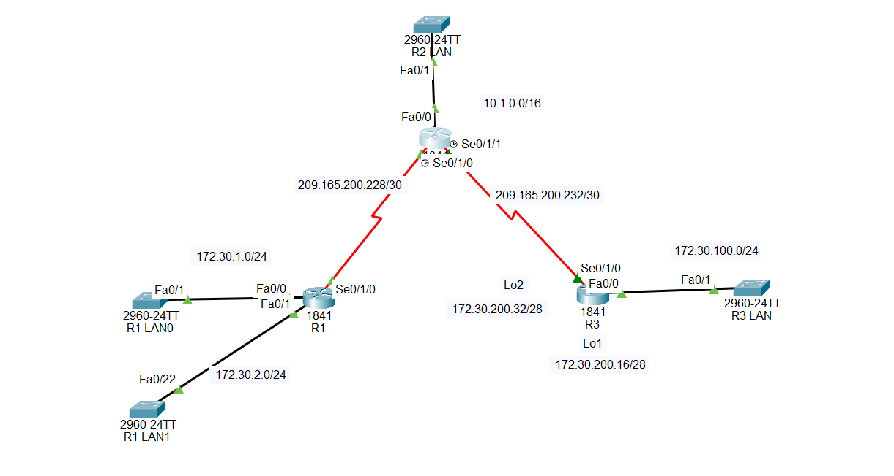

# RIPv2 Configuration in Cisco Packet Tracer

## Description

**RIPv2 (Routing Information Protocol version 2)** is a dynamic routing protocol that allows routers to automatically learn routes to remote networks.

In simple English:

> RIPv2 allows routers to exchange information about their networks so they can automatically learn how to reach networks that are not directly connected.

In this topology, there are **three Cisco 1841 routers: R1, R2, and R3**.

RIPv2 will allow the three routers to automatically learn all remote networks without configuring static routes.

---

# 🌐 Topology Screenshot



---

# Devices Used

| Device  | Model           | Purpose                             |
| ------- | --------------- | ----------------------------------- |
| R1      | Cisco 1841      | Connects R1 LAN0, R1 LAN1, and R2   |
| R2      | Cisco 1841      | Central router connecting R1 and R3 |
| R3      | Cisco 1841      | Connects R3 LAN, R2, and loopbacks  |
| R1 LAN0 | Cisco 2960-24TT | Switch for 172.30.1.0/24            |
| R1 LAN1 | Cisco 2960-24TT | Switch for 172.30.2.0/24            |
| R2 LAN  | Cisco 2960-24TT | Switch for 10.1.0.0/16              |
| R3 LAN  | Cisco 2960-24TT | Switch for 172.30.100.0/24          |

---

# Networks Used

| Network              | Purpose             |
| -------------------- | ------------------- |
| `172.30.1.0/24`      | R1 LAN0             |
| `172.30.2.0/24`      | R1 LAN1             |
| `209.165.200.228/30` | R1 ↔ R2 serial link |
| `209.165.200.232/30` | R2 ↔ R3 serial link |
| `10.1.0.0/16`        | R2 LAN              |
| `172.30.100.0/24`    | R3 LAN              |
| `172.30.200.16/28`   | R3 Loopback1        |
| `172.30.200.32/28`   | R3 Loopback2        |

---

# IP Addressing

## R1

```text
FastEthernet0/0 = 172.30.1.1/24
FastEthernet0/1 = 172.30.2.1/24
Serial0/1/0     = 209.165.200.229/30
```

R1 is connected to:

```text
R1 LAN0
R1 LAN1
R2
```

---

## R2

```text
FastEthernet0/0 = 10.1.0.1/16

Serial0/1/0 = 209.165.200.230/30
Serial0/1/1 = 209.165.200.233/30
```

R2 is the central router.

It connects:

```text
R1
R3
R2 LAN
```

---

## R3

```text
FastEthernet0/0 = 172.30.100.1/24

Serial0/1/0 = 209.165.200.234/30

Loopback1 = 172.30.200.17/28
Loopback2 = 172.30.200.33/28
```

R3 is connected to:

```text
R2
R3 LAN
Loopback1
Loopback2
```

---

# Serial Link Addressing

## R1 ↔ R2

Network:

```text
209.165.200.228/30
```

Usable IP addresses:

```text
209.165.200.229
209.165.200.230
```

Configuration:

```text
R1 Serial0/1/0 = 209.165.200.229
R2 Serial0/1/0 = 209.165.200.230
```

---

## R2 ↔ R3

Network:

```text
209.165.200.232/30
```

Usable IP addresses:

```text
209.165.200.233
209.165.200.234
```

Configuration:

```text
R2 Serial0/1/1 = 209.165.200.233
R3 Serial0/1/0 = 209.165.200.234
```

---

# How RIPv2 Works

Before configuring RIPv2, each router knows only its **directly connected networks**.

For example, R1 initially knows:

```text
172.30.1.0/24
172.30.2.0/24
209.165.200.228/30
```

R2 initially knows:

```text
10.1.0.0/16
209.165.200.228/30
209.165.200.232/30
```

R3 initially knows:

```text
172.30.100.0/24
209.165.200.232/30
172.30.200.16/28
172.30.200.32/28
```

After RIPv2 is configured:

```text
R1 learns networks behind R2 and R3.

R2 learns networks behind R1 and R3.

R3 learns networks behind R1 and R2.
```

Therefore, all three routers can reach the remote networks automatically.

---

# RIPv2 Basic Configuration

The basic RIPv2 configuration is:

```cisco
router rip
version 2
no auto-summary
network <network-address>
```

### `router rip`

Starts the RIP routing process.

### `version 2`

Enables RIPv2.

### `no auto-summary`

Disables automatic classful route summarization.

This is important because our topology uses different subnet sizes, including:

```text
/16
/24
/28
/30
```

### `network`

Specifies the directly connected networks that participate in RIP.

---

# Configure R1

Enter privileged EXEC mode:

```cisco
enable
```

Enter global configuration mode:

```cisco
configure terminal
```

Change the hostname:

```cisco
hostname R1
```

## Configure R1 LAN0

R1 LAN0 uses:

```text
Network: 172.30.1.0/24
R1 Fa0/0: 172.30.1.1
```

Configure:

```cisco
interface fastethernet 0/0
ip address 172.30.1.1 255.255.255.0
no shutdown
exit
```

---

## Configure R1 LAN1

R1 LAN1 uses:

```text
Network: 172.30.2.0/24
R1 Fa0/1: 172.30.2.1
```

Configure:

```cisco
interface fastethernet 0/1
ip address 172.30.2.1 255.255.255.0
no shutdown
exit
```

---

## Configure R1 ↔ R2 Serial Link

R1 uses:

```text
Serial0/1/0
IP: 209.165.200.229
Mask: 255.255.255.252
```

Configure:

```cisco
interface serial 0/1/0
ip address 209.165.200.229 255.255.255.252
no shutdown
exit
```

If R1 is the **DCE side** of this serial connection, configure:

```cisco
interface serial 0/1/0
clock rate 64000
exit
```

Only the DCE side needs the clock rate.

---

## Configure RIPv2 on R1

```cisco
router rip
version 2
no auto-summary
network 172.30.1.0
network 172.30.2.0
network 209.165.200.0
exit
```

Save:

```cisco
end
write memory
```

---

# Complete R1 Configuration

```cisco
enable
configure terminal
hostname R1

interface fastethernet 0/0
ip address 172.30.1.1 255.255.255.0
no shutdown
exit

interface fastethernet 0/1
ip address 172.30.2.1 255.255.255.0
no shutdown
exit

interface serial 0/1/0
ip address 209.165.200.229 255.255.255.252
no shutdown
exit

router rip
version 2
no auto-summary
network 172.30.1.0
network 172.30.2.0
network 209.165.200.0
exit

end
write memory
```

> If R1 is the DCE side of the R1-R2 serial connection, add `clock rate 64000` under `Serial0/1/0`.

---

# Configure R2

Enter configuration mode:

```cisco
enable
configure terminal
hostname R2
```

## Configure R2 LAN

R2 LAN uses:

```text
Network: 10.1.0.0/16
R2 Fa0/0: 10.1.0.1
```

Configure:

```cisco
interface fastethernet 0/0
ip address 10.1.0.1 255.255.0.0
no shutdown
exit
```

---

## Configure R2 Serial0/1/0 Toward R1

R2 uses:

```text
Serial0/1/0
IP: 209.165.200.230
```

Configure:

```cisco
interface serial 0/1/0
ip address 209.165.200.230 255.255.255.252
no shutdown
exit
```

---

## Configure R2 Serial0/1/1 Toward R3

R2 uses:

```text
Serial0/1/1
IP: 209.165.200.233
```

Configure:

```cisco
interface serial 0/1/1
ip address 209.165.200.233 255.255.255.252
no shutdown
exit
```

If R2 is the DCE side of the R2-R3 serial connection:

```cisco
interface serial 0/1/1
clock rate 64000
exit
```

---

## Configure RIPv2 on R2

R2 participates in:

```text
10.1.0.0/16
209.165.200.228/30
209.165.200.232/30
```

Configure:

```cisco
router rip
version 2
no auto-summary
network 10.0.0.0
network 209.165.200.0
exit
```

Save:

```cisco
end
write memory
```

---

# Complete R2 Configuration

```cisco
enable
configure terminal
hostname R2

interface fastethernet 0/0
ip address 10.1.0.1 255.255.0.0
no shutdown
exit

interface serial 0/1/0
ip address 209.165.200.230 255.255.255.252
no shutdown
exit

interface serial 0/1/1
ip address 209.165.200.233 255.255.255.252
no shutdown
exit

router rip
version 2
no auto-summary
network 10.0.0.0
network 209.165.200.0
exit

end
write memory
```

> If R2 is the DCE side of the R2-R3 serial connection, add `clock rate 64000` under `Serial0/1/1`.

---

# Configure R3

Enter configuration mode:

```cisco
enable
configure terminal
hostname R3
```

## Configure R3 LAN

R3 LAN uses:

```text
Network: 172.30.100.0/24
R3 Fa0/0: 172.30.100.1
```

Configure:

```cisco
interface fastethernet 0/0
ip address 172.30.100.1 255.255.255.0
no shutdown
exit
```

---

## Configure R3 Serial0/1/0

R3 connects to R2 using:

```text
R3 Serial0/1/0
IP: 209.165.200.234
```

Configure:

```cisco
interface serial 0/1/0
ip address 209.165.200.234 255.255.255.252
no shutdown
exit
```

---

# Configure R3 Loopback1

Loopback1 uses:

```text
Network: 172.30.200.16/28
R3 Lo1: 172.30.200.17
```

Configure:

```cisco
interface loopback 1
ip address 172.30.200.17 255.255.255.240
exit
```

A loopback interface does not require `no shutdown`.

---

# Configure R3 Loopback2

Loopback2 uses:

```text
Network: 172.30.200.32/28
R3 Lo2: 172.30.200.33
```

Configure:

```cisco
interface loopback 2
ip address 172.30.200.33 255.255.255.240
exit
```

---

# Configure RIPv2 on R3

R3 participates in:

```text
172.30.100.0/24
209.165.200.232/30
172.30.200.16/28
172.30.200.32/28
```

Configure:

```cisco
router rip
version 2
no auto-summary
network 172.30.100.0
network 209.165.200.0
network 172.30.200.0
exit
```

Save:

```cisco
end
write memory
```

---

# Complete R3 Configuration

```cisco
enable
configure terminal
hostname R3

interface fastethernet 0/0
ip address 172.30.100.1 255.255.255.0
no shutdown
exit

interface serial 0/1/0
ip address 209.165.200.234 255.255.255.252
no shutdown
exit

interface loopback 1
ip address 172.30.200.17 255.255.255.240
exit

interface loopback 2
ip address 172.30.200.33 255.255.255.240
exit

router rip
version 2
no auto-summary
network 172.30.100.0
network 209.165.200.0
network 172.30.200.0
exit

end
write memory
```

---

# Important Note About the RIP Network Commands

You may notice that the RIP configuration uses:

```cisco
network 209.165.200.0
```

even though the actual serial networks are:

```text
209.165.200.228/30
209.165.200.232/30
```

This is because the Cisco RIP `network` command identifies the interfaces participating in RIP using the major network.

Since both serial networks belong to:

```text
209.165.200.0
```

the command:

```cisco
network 209.165.200.0
```

enables RIP on the matching interfaces.

Similarly, on R3:

```cisco
network 172.30.200.0
```

allows RIP to advertise both:

```text
172.30.200.16/28
172.30.200.32/28
```

when `no auto-summary` is configured.

---

# Verify Interfaces

On each router, use:

```cisco
show ip interface brief
```

## R1 should show

```text
FastEthernet0/0    172.30.1.1       up    up
FastEthernet0/1    172.30.2.1       up    up
Serial0/1/0        209.165.200.229  up    up
```

## R2 should show

```text
FastEthernet0/0    10.1.0.1         up    up
Serial0/1/0        209.165.200.230  up    up
Serial0/1/1        209.165.200.233  up    up
```

## R3 should show

```text
FastEthernet0/0    172.30.100.1     up    up
Serial0/1/0        209.165.200.234  up    up
Loopback1          172.30.200.17    up    up
Loopback2          172.30.200.33    up    up
```

---

# Verify RIPv2

Use:

```cisco
show ip protocols
```

You should see information showing that:

```text
Routing Protocol is "rip"
Sending updates using version 2
Automatic network summarization is not in effect
```

You can also check the routing table:

```cisco
show ip route
```

---

# RIPv2 Routes in the Routing Table

Routes learned through RIP are identified by:

```text
R
```

For example, on R1 you should eventually see routes to remote networks such as:

```text
R 10.0.0.0/16
R 172.30.100.0/24
R 172.30.200.16/28
R 172.30.200.32/28
```

On R2, you should learn networks behind R1 and R3.

On R3, you should learn networks behind R1 and R2.

---

# Check Only RIP Routes

Use:

```cisco
show ip route rip
```

This displays only routes learned through RIP.

---

# Test Direct Serial Connectivity

Before testing the entire network, test the directly connected serial neighbors.

## From R1

```cisco
ping 209.165.200.230
```

Expected path:

```text
R1 → R2
```

## From R2

Test R1:

```cisco
ping 209.165.200.229
```

Test R3:

```cisco
ping 209.165.200.234
```

## From R3

```cisco
ping 209.165.200.233
```

If these work, the serial links are functioning.

---

# Test RIPv2 Connectivity

After RIPv2 has exchanged routes, test remote networks.

## From R1

Test R2 LAN:

```cisco
ping 10.1.0.1
```

Test R3 LAN:

```cisco
ping 172.30.100.1
```

Test R3 Loopback1:

```cisco
ping 172.30.200.17
```

Test R3 Loopback2:

```cisco
ping 172.30.200.33
```

---

## From R3

Test R1 LAN0:

```cisco
ping 172.30.1.1
```

Test R1 LAN1:

```cisco
ping 172.30.2.1
```

Test R2 LAN:

```cisco
ping 10.1.0.1
```

---

# Test the Routing Path

Use:

```cisco
traceroute 172.30.100.1
```

When traffic travels from R1 to R3, the expected router path is:

```text
R1 → R2 → R3
```

R2 is the middle router between R1 and R3.

---

# RIPv2 Metric

RIPv2 uses **hop count** as its routing metric.

A hop means one router.

For example:

```text
R1 → R2
```

has:

```text
1 hop
```

And:

```text
R1 → R2 → R3
```

has:

```text
2 hops
```

RIP prefers the route with the lowest hop count.

The maximum valid RIP metric is:

```text
15 hops
```

A metric of:

```text
16
```

means the destination is unreachable.

---

# Administrative Distance

The default Administrative Distance of RIP is:

```text
120
```

You may see a route like:

```text
R 172.30.100.0/24 [120/2] via 209.165.200.230
```

This means:

```text
R       = route learned by RIP
120     = Administrative Distance
2       = RIP metric / hop count
```

---

# RIP Updates

RIP sends routing updates periodically.

The routers use these updates to tell their neighbors which networks they know.

For example:

```text
R1 tells R2:
"I know 172.30.1.0/24 and 172.30.2.0/24."

R2 tells R1:
"I know 10.1.0.0/16 and the network toward R3."

R3 tells R2:
"I know 172.30.100.0/24 and my two loopback networks."
```

The routers then place the learned routes into their routing tables.

---

# Troubleshooting

## 1. Check Interface Status

Use:

```cisco
show ip interface brief
```

Interfaces should normally show:

```text
Status = up
Protocol = up
```

If an interface is administratively down:

```cisco
configure terminal
interface <interface>
no shutdown
```

---

## 2. Check the Routing Table

Use:

```cisco
show ip route
```

Look for routes marked:

```text
R
```

If there are no RIP routes, check the RIP configuration.

---

## 3. Check RIP

Use:

```cisco
show ip protocols
```

Verify:

```text
RIP is enabled
Version 2 is being used
Auto-summary is disabled
Correct networks are participating
```

---

## 4. Check Serial Interfaces

Use:

```cisco
show ip interface brief
```

Check:

```text
R1 Serial0/1/0
R2 Serial0/1/0
R2 Serial0/1/1
R3 Serial0/1/0
```

They should be:

```text
up
up
```

---

## 5. Check the DCE Side

Use:

```cisco
show controllers serial 0/1/0
```

or:

```cisco
show controllers serial 0/1/1
```

If the interface is DCE, configure a clock rate:

```cisco
interface serial 0/1/0
clock rate 64000
```

or:

```cisco
interface serial 0/1/1
clock rate 64000
```

Only the **DCE side** needs the clock rate.

---

# Complete Configuration Summary

## R1

```cisco
enable
configure terminal
hostname R1

interface fastethernet 0/0
ip address 172.30.1.1 255.255.255.0
no shutdown
exit

interface fastethernet 0/1
ip address 172.30.2.1 255.255.255.0
no shutdown
exit

interface serial 0/1/0
ip address 209.165.200.229 255.255.255.252
no shutdown
exit

router rip
version 2
no auto-summary
network 172.30.1.0
network 172.30.2.0
network 209.165.200.0
exit

end
write memory
```

---

## R2

```cisco
enable
configure terminal
hostname R2

interface fastethernet 0/0
ip address 10.1.0.1 255.255.0.0
no shutdown
exit

interface serial 0/1/0
ip address 209.165.200.230 255.255.255.252
no shutdown
exit

interface serial 0/1/1
ip address 209.165.200.233 255.255.255.252
no shutdown
exit

router rip
version 2
no auto-summary
network 10.0.0.0
network 209.165.200.0
exit

end
write memory
```

---

## R3

```cisco
enable
configure terminal
hostname R3

interface fastethernet 0/0
ip address 172.30.100.1 255.255.255.0
no shutdown
exit

interface serial 0/1/0
ip address 209.165.200.234 255.255.255.252
no shutdown
exit

interface loopback 1
ip address 172.30.200.17 255.255.255.240
exit

interface loopback 2
ip address 172.30.200.33 255.255.255.240
exit

router rip
version 2
no auto-summary
network 172.30.100.0
network 209.165.200.0
network 172.30.200.0
exit

end
write memory
```

---

# Final Result

After configuring RIPv2, the topology should work like this:

```text
                    R2
                  /    \
                 /      \
                R1      R3
```

R1 learns the networks behind R2 and R3.

R2 learns the networks behind R1 and R3.

R3 learns the networks behind R2 and R1.

Therefore, the routers can automatically exchange routing information and forward packets between the different LANs and R3's loopback networks.

The main RIPv2 commands to remember are:

```cisco
router rip
version 2
no auto-summary
network <network-address>
```

The most important verification commands are:

```cisco
show ip interface brief
show ip route
show ip route rip
show ip protocols
ping <destination-IP>
traceroute <destination-IP>
```

The important interfaces for **this exact topology** are:

```text
R1:
Fa0/0       → R1 LAN0
Fa0/1       → R1 LAN1
Se0/1/0     → R2

R2:
Fa0/0       → R2 LAN
Se0/1/0     → R1
Se0/1/1     → R3

R3:
Fa0/0       → R3 LAN
Se0/1/0     → R2
Lo1         → 172.30.200.16/28
Lo2         → 172.30.200.32/28
```
