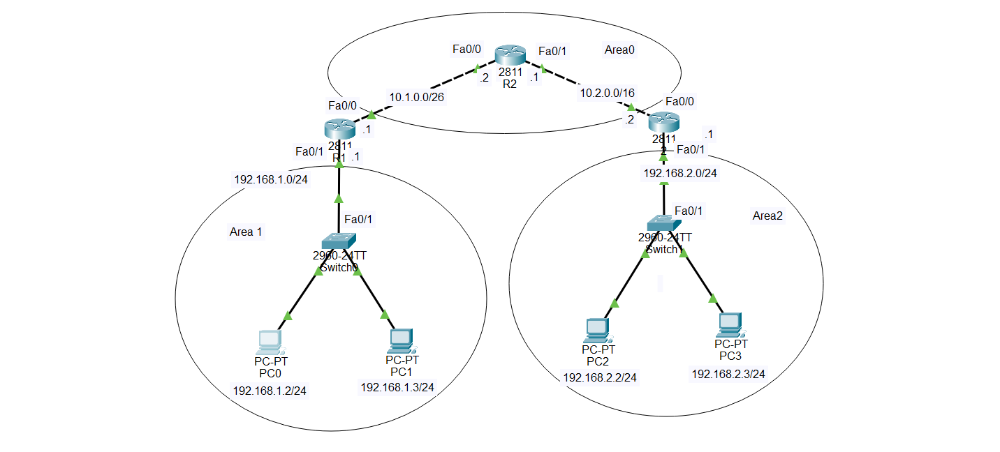

# OSPF Configuration in Cisco Packet Tracer

## Description

**OSPF (Open Shortest Path First)** is a dynamic routing protocol used by routers to automatically learn routes to remote networks.

In simple English:

> OSPF allows routers to exchange information about their networks and automatically calculate the best path to reach remote networks.

Unlike RIP, which uses **hop count**, OSPF uses a **cost** based mainly on interface bandwidth to choose the best path.

This topology contains **three Cisco 2811 routers**:

```text
R1
R2
R3
```

The OSPF network is divided into **three areas**:

```text
Area 0 = Backbone area
Area 1 = R1 LAN area
Area 2 = R3 LAN area
```

R2 is the central router and belongs entirely to **Area 0**.

R1 connects:

```text
Area 0 ↔ Area 1
```

R3 connects:

```text
Area 0 ↔ Area 2
```

Therefore, R1 and R3 act as **Area Border Routers (ABRs)**.

---

# 🌐 Topology Screenshot



---

# OSPF Areas in This Topology

There are three OSPF areas.

## Area 0

Area 0 is the **backbone area**.

It contains the links:

```text
R1 ↔ R2
R2 ↔ R3
```

The networks in Area 0 are:

```text
10.1.0.0/26
10.2.0.0/16
```

---

## Area 1

Area 1 contains the R1 LAN:

```text
192.168.1.0/24
```

R1 connects Area 1 to Area 0.

Therefore:

```text
R1 = Area Border Router (ABR)
```

---

## Area 2

Area 2 contains the R3 LAN:

```text
192.168.2.0/24
```

R3 connects Area 2 to Area 0.

Therefore:

```text
R3 = Area Border Router (ABR)
```

---

# Network Addressing

| Device | Interface | IP Address       | Network          | OSPF Area |
| ------ | --------- | ---------------- | ---------------- | --------- |
| R1     | Fa0/0     | `10.1.0.1/26`    | `10.1.0.0/26`    | Area 0    |
| R1     | Fa0/1     | `192.168.1.1/24` | `192.168.1.0/24` | Area 1    |
| R2     | Fa0/0     | `10.1.0.2/26`    | `10.1.0.0/26`    | Area 0    |
| R2     | Fa0/1     | `10.2.0.1/16`    | `10.2.0.0/16`    | Area 0    |
| R3     | Fa0/0     | `10.2.0.2/16`    | `10.2.0.0/16`    | Area 0    |
| R3     | Fa0/1     | `192.168.2.1/24` | `192.168.2.0/24` | Area 2    |

---

# PC Addressing

## Area 1 PCs

### PC0

```text
IP Address:      192.168.1.2
Subnet Mask:     255.255.255.0
Default Gateway: 192.168.1.1
```

### PC1

```text
IP Address:      192.168.1.3
Subnet Mask:     255.255.255.0
Default Gateway: 192.168.1.1
```

Both PCs are connected to Switch0, which connects to R1.

---

## Area 2 PCs

### PC2

```text
IP Address:      192.168.2.2
Subnet Mask:     255.255.255.0
Default Gateway: 192.168.2.1
```

### PC3

```text
IP Address:      192.168.2.3
Subnet Mask:     255.255.255.0
Default Gateway: 192.168.2.1
```

Both PCs are connected to Switch1, which connects to R3.

---

# What OSPF Does in This Topology

Initially, R1 knows only its directly connected networks:

```text
10.1.0.0/26
192.168.1.0/24
```

R2 knows:

```text
10.1.0.0/26
10.2.0.0/16
```

R3 knows:

```text
10.2.0.0/16
192.168.2.0/24
```

After OSPF is configured, the routers exchange routing information.

R1 learns:

```text
10.2.0.0/16
192.168.2.0/24
```

R2 learns:

```text
192.168.1.0/24
192.168.2.0/24
```

R3 learns:

```text
10.1.0.0/26
192.168.1.0/24
```

Therefore, PC0 can communicate with PC2 even though they are on different networks and different OSPF areas.

The path is:

```text
PC0
 ↓
R1
 ↓
R2
 ↓
R3
 ↓
PC2
```

---

# Important OSPF Concepts

## OSPF Router ID

Every OSPF router has a **Router ID**.

The Router ID uniquely identifies the router inside the OSPF process.

For this lab, we can manually configure:

```text
R1 = 1.1.1.1
R2 = 2.2.2.2
R3 = 3.3.3.3
```

These do not have to be real physical interfaces.

They are simply identifiers for OSPF.

---

# OSPF Area 0

**Area 0** is the OSPF backbone area.

In this topology:

```text
R1 ───── R2 ───── R3
```

The two networks connecting the routers belong to Area 0:

```text
10.1.0.0/26
10.2.0.0/16
```

---

# OSPF Area 1

R1's LAN belongs to Area 1:

```text
192.168.1.0/24
```

Therefore R1 has interfaces in two areas:

```text
Fa0/0 → Area 0
Fa0/1 → Area 1
```

This makes R1 an **ABR**.

---

# OSPF Area 2

R3's LAN belongs to Area 2:

```text
192.168.2.0/24
```

Therefore R3 has interfaces in two areas:

```text
Fa0/0 → Area 0
Fa0/1 → Area 2
```

This makes R3 an **ABR**.

---

# OSPF Wildcard Masks

OSPF uses **wildcard masks** instead of subnet masks in the `network` command.

## 10.1.0.0/26

Subnet mask:

```text
255.255.255.192
```

Wildcard mask:

```text
0.0.0.63
```

Therefore:

```cisco
network 10.1.0.0 0.0.0.63 area 0
```

---

## 10.2.0.0/16

Subnet mask:

```text
255.255.0.0
```

Wildcard mask:

```text
0.0.255.255
```

Therefore:

```cisco
network 10.2.0.0 0.0.255.255 area 0
```

---

## 192.168.1.0/24

Subnet mask:

```text
255.255.255.0
```

Wildcard mask:

```text
0.0.0.255
```

Therefore:

```cisco
network 192.168.1.0 0.0.0.255 area 1
```

---

## 192.168.2.0/24

Wildcard mask:

```text
0.0.0.255
```

Therefore:

```cisco
network 192.168.2.0 0.0.0.255 area 2
```

---

# Configure R1

Enter privileged EXEC mode:

```cisco
enable
```

Enter global configuration mode:

```cisco
configure terminal
```

Set hostname:

```cisco
hostname R1
```

---

## Configure R1 Fa0/0

This interface connects R1 to R2.

```text
Network: 10.1.0.0/26
R1 Fa0/0: 10.1.0.1
R2 Fa0/0: 10.1.0.2
Area: 0
```

Configuration:

```cisco
interface fastethernet 0/0
ip address 10.1.0.1 255.255.255.192
no shutdown
exit
```

---

## Configure R1 Fa0/1

This interface connects R1 to the Area 1 LAN.

```text
Network: 192.168.1.0/24
R1 Fa0/1: 192.168.1.1
Area: 1
```

Configuration:

```cisco
interface fastethernet 0/1
ip address 192.168.1.1 255.255.255.0
no shutdown
exit
```

---

# Configure OSPF on R1

Start OSPF process 1:

```cisco
router ospf 1
```

Configure the Router ID:

```cisco
router-id 1.1.1.1
```

Advertise the R1-R2 network into Area 0:

```cisco
network 10.1.0.0 0.0.0.63 area 0
```

Advertise the R1 LAN into Area 1:

```cisco
network 192.168.1.0 0.0.0.255 area 1
```

Exit:

```cisco
exit
```

Save:

```cisco
end
write memory
```

---

# Complete R1 Configuration

```cisco
enable
configure terminal
hostname R1

interface fastethernet 0/0
ip address 10.1.0.1 255.255.255.192
no shutdown
exit

interface fastethernet 0/1
ip address 192.168.1.1 255.255.255.0
no shutdown
exit

router ospf 1
router-id 1.1.1.1
network 10.1.0.0 0.0.0.63 area 0
network 192.168.1.0 0.0.0.255 area 1
exit

end
write memory
```

---

# Configure R2

R2 is the central router.

Both of its interfaces belong to **Area 0**.

Enter configuration mode:

```cisco
enable
configure terminal
hostname R2
```

---

## Configure R2 Fa0/0

R2 Fa0/0 connects to R1.

```text
Network: 10.1.0.0/26
R2 Fa0/0: 10.1.0.2
Area: 0
```

Configuration:

```cisco
interface fastethernet 0/0
ip address 10.1.0.2 255.255.255.192
no shutdown
exit
```

---

## Configure R2 Fa0/1

R2 Fa0/1 connects to R3.

```text
Network: 10.2.0.0/16
R2 Fa0/1: 10.2.0.1
Area: 0
```

Configuration:

```cisco
interface fastethernet 0/1
ip address 10.2.0.1 255.255.0.0
no shutdown
exit
```

---

# Configure OSPF on R2

Start OSPF:

```cisco
router ospf 1
```

Configure Router ID:

```cisco
router-id 2.2.2.2
```

Advertise the R1-R2 network:

```cisco
network 10.1.0.0 0.0.0.63 area 0
```

Advertise the R2-R3 network:

```cisco
network 10.2.0.0 0.0.255.255 area 0
```

Exit:

```cisco
exit
```

Save:

```cisco
end
write memory
```

---

# Complete R2 Configuration

```cisco
enable
configure terminal
hostname R2

interface fastethernet 0/0
ip address 10.1.0.2 255.255.255.192
no shutdown
exit

interface fastethernet 0/1
ip address 10.2.0.1 255.255.0.0
no shutdown
exit

router ospf 1
router-id 2.2.2.2
network 10.1.0.0 0.0.0.63 area 0
network 10.2.0.0 0.0.255.255 area 0
exit

end
write memory
```

---

# Configure R3

R3 connects Area 0 to Area 2.

Therefore R3 is also an **ABR**.

Enter configuration mode:

```cisco
enable
configure terminal
hostname R3
```

---

## Configure R3 Fa0/0

R3 Fa0/0 connects to R2.

```text
Network: 10.2.0.0/16
R3 Fa0/0: 10.2.0.2
Area: 0
```

Configuration:

```cisco
interface fastethernet 0/0
ip address 10.2.0.2 255.255.0.0
no shutdown
exit
```

---

## Configure R3 Fa0/1

R3 Fa0/1 connects to the Area 2 LAN.

```text
Network: 192.168.2.0/24
R3 Fa0/1: 192.168.2.1
Area: 2
```

Configuration:

```cisco
interface fastethernet 0/1
ip address 192.168.2.1 255.255.255.0
no shutdown
exit
```

---

# Configure OSPF on R3

Start OSPF:

```cisco
router ospf 1
```

Configure Router ID:

```cisco
router-id 3.3.3.3
```

Advertise the R2-R3 network into Area 0:

```cisco
network 10.2.0.0 0.0.255.255 area 0
```

Advertise the R3 LAN into Area 2:

```cisco
network 192.168.2.0 0.0.0.255 area 2
```

Exit:

```cisco
exit
```

Save:

```cisco
end
write memory
```

---

# Complete R3 Configuration

```cisco
enable
configure terminal
hostname R3

interface fastethernet 0/0
ip address 10.2.0.2 255.255.0.0
no shutdown
exit

interface fastethernet 0/1
ip address 192.168.2.1 255.255.255.0
no shutdown
exit

router ospf 1
router-id 3.3.3.3
network 10.2.0.0 0.0.255.255 area 0
network 192.168.2.0 0.0.0.255 area 2
exit

end
write memory
```

---

# Configure the PCs

The PCs do not run OSPF.

They only need:

```text
IP address
Subnet mask
Default gateway
```

---

## PC0

Go to:

```text
PC0
→ Desktop
→ IP Configuration
```

Enter:

```text
IP Address:      192.168.1.2
Subnet Mask:     255.255.255.0
Default Gateway: 192.168.1.1
```

---

## PC1

Enter:

```text
IP Address:      192.168.1.3
Subnet Mask:     255.255.255.0
Default Gateway: 192.168.1.1
```

---

## PC2

Enter:

```text
IP Address:      192.168.2.2
Subnet Mask:     255.255.255.0
Default Gateway: 192.168.2.1
```

---

## PC3

Enter:

```text
IP Address:      192.168.2.3
Subnet Mask:     255.255.255.0
Default Gateway: 192.168.2.1
```

---

# Switch Configuration

For this OSPF lab, the switches do not need any special OSPF configuration.

They are Layer 2 switches.

Their main job is to connect the PCs to the routers.

The connections are:

```text
PC0 ──┐
      │
PC1 ──┤
      │
   Switch0
      │
      │ Fa0/1
      │
     R1
```

And:

```text
PC2 ──┐
      │
PC3 ──┤
      │
   Switch1
      │
      │ Fa0/1
      │
     R3
```

No OSPF configuration is required on the 2960 switches for this topology.

---

# Verify Interface Status

On each router, use:

```cisco
show ip interface brief
```

## R1 should show

```text
Interface              IP-Address      Status       Protocol
FastEthernet0/0        10.1.0.1        up           up
FastEthernet0/1        192.168.1.1     up           up
```

## R2 should show

```text
Interface              IP-Address      Status       Protocol
FastEthernet0/0        10.1.0.2        up           up
FastEthernet0/1        10.2.0.1        up           up
```

## R3 should show

```text
Interface              IP-Address      Status       Protocol
FastEthernet0/0        10.2.0.2        up           up
FastEthernet0/1        192.168.2.1     up           up
```

The important part is:

```text
Status = up
Protocol = up
```

---

# Verify OSPF Neighbors

Use:

```cisco
show ip ospf neighbor
```

## On R1

R1 should have an OSPF neighbor with R2.

You should see a neighbor associated with:

```text
10.1.0.2
```

The state should normally become:

```text
FULL
```

---

## On R2

R2 should have two OSPF neighbors:

```text
R1
R3
```

You should see neighbors corresponding to:

```text
10.1.0.1
10.2.0.2
```

Both should eventually reach:

```text
FULL
```

---

## On R3

R3 should have an OSPF neighbor with R2.

The neighbor should correspond to:

```text
10.2.0.1
```

The state should become:

```text
FULL
```

---

# Verify the OSPF Process

Use:

```cisco
show ip protocols
```

This should show that OSPF is running.

You can also use:

```cisco
show ip ospf
```

This displays information about the OSPF process and areas.

---

# Verify OSPF Interfaces

Use:

```cisco
show ip ospf interface
```

This shows which interfaces are participating in OSPF and which areas they belong to.

For example, on R1:

```text
Fa0/0 → Area 0
Fa0/1 → Area 1
```

On R2:

```text
Fa0/0 → Area 0
Fa0/1 → Area 0
```

On R3:

```text
Fa0/0 → Area 0
Fa0/1 → Area 2
```

---

# Check the Routing Table

Use:

```cisco
show ip route
```

OSPF routes are identified by:

```text
O
```

For example, R1 should learn the R3 LAN through OSPF:

```text
O 192.168.2.0/24
```

R3 should learn the R1 LAN:

```text
O 192.168.1.0/24
```

R2 should learn both LAN networks:

```text
O 192.168.1.0/24
O 192.168.2.0/24
```

---

# Check Only OSPF Routes

Use:

```cisco
show ip route ospf
```

This displays only routes learned through OSPF.

---

# Test Router-to-Router Connectivity

Before testing PCs, test the directly connected router interfaces.

From R1:

```cisco
ping 10.1.0.2
```

From R2:

```cisco
ping 10.1.0.1
ping 10.2.0.2
```

From R3:

```cisco
ping 10.2.0.1
```

These tests verify that the directly connected networks are working.

---

# Test OSPF Between Routers

From R1:

```cisco
ping 10.2.0.1
```

R1 reaches R2's Fa0/1 through R2.

From R3:

```cisco
ping 10.1.0.1
```

R3 reaches R1's Fa0/0 through R2.

---

# Test PC-to-PC Connectivity

This is the most important test.

From PC0:

```text
Desktop
→ Command Prompt
```

Test PC2:

```text
ping 192.168.2.2
```

The expected path is:

```text
PC0
 ↓
Switch0
 ↓
R1
 ↓
R2
 ↓
R3
 ↓
Switch1
 ↓
PC2
```

Test PC3:

```text
ping 192.168.2.3
```

---

# Test From PC2

From PC2:

```text
ping 192.168.1.2
```

Test PC1:

```text
ping 192.168.1.3
```

If OSPF is working correctly, the pings should succeed.

---

# Test With Traceroute

From PC0, open Command Prompt and use:

```text
tracert 192.168.2.2
```

The path should go through:

```text
R1
R2
R3
```

Conceptually:

```text
PC0
 ↓
R1
 ↓
R2
 ↓
R3
 ↓
PC2
```

---

# OSPF Cost

OSPF uses **cost** as its metric.

In simple English:

> OSPF chooses the path with the lowest total cost.

OSPF cost is mainly related to interface bandwidth.

Unlike RIP:

```text
RIP → hop count
OSPF → cost
```

For example:

```text
Path A = cost 20
Path B = cost 50
```

OSPF chooses:

```text
Path A
```

because:

```text
20 < 50
```

---

# OSPF Administrative Distance

The default Administrative Distance of OSPF is:

```text
110
```

You may see a routing table entry such as:

```text
O 192.168.2.0/24 [110/2] via 10.1.0.2
```

This means:

```text
O       = route learned through OSPF
110     = Administrative Distance
2       = OSPF cost
```

---

# OSPF Router IDs

The Router IDs configured in this lab are:

```text
R1 = 1.1.1.1
R2 = 2.2.2.2
R3 = 3.3.3.3
```

Check the Router ID with:

```cisco
show ip ospf
```

---

# Understanding the ABRs

An **ABR (Area Border Router)** is a router that connects two or more OSPF areas.

In this topology:

```text
R1
├── Area 0
└── Area 1
```

Therefore:

```text
R1 = ABR
```

R3:

```text
R3
├── Area 0
└── Area 2
```

Therefore:

```text
R3 = ABR
```

R2:

```text
R2
├── Area 0
└── Area 0
```

R2 is **not an ABR** because all of its OSPF interfaces are in Area 0.

---

# Complete OSPF Area Design

The final OSPF design is:

```text
                         AREA 0
                  ┌─────────────────┐
                  │                 │
             R1 ──┼────── R2 ──────┼── R3
                  │                 │
                  └─────────────────┘
                  │                 │
                ABR                 ABR
                 │                   │
              AREA 1              AREA 2
                 │                   │
          192.168.1.0/24      192.168.2.0/24
```

More specifically:

```text
R1:
Fa0/0 → Area 0
Fa0/1 → Area 1

R2:
Fa0/0 → Area 0
Fa0/1 → Area 0

R3:
Fa0/0 → Area 0
Fa0/1 → Area 2
```

---

# Troubleshooting

## Problem 1: OSPF Neighbor Is Not Forming

Use:

```cisco
show ip ospf neighbor
```

If no neighbor appears, check:

```cisco
show ip interface brief
```

Make sure the interfaces are:

```text
up/up
```

Also verify the IP addresses.

R1 and R2 must be in the same subnet:

```text
R1 = 10.1.0.1/26
R2 = 10.1.0.2/26
```

R2 and R3 must be in the same subnet:

```text
R2 = 10.2.0.1/16
R3 = 10.2.0.2/16
```

---

## Problem 2: OSPF Network Command Is Wrong

Check:

```cisco
show running-config
```

R1 should contain:

```cisco
network 10.1.0.0 0.0.0.63 area 0
network 192.168.1.0 0.0.0.255 area 1
```

R2 should contain:

```cisco
network 10.1.0.0 0.0.0.63 area 0
network 10.2.0.0 0.0.255.255 area 0
```

R3 should contain:

```cisco
network 10.2.0.0 0.0.255.255 area 0
network 192.168.2.0 0.0.0.255 area 2
```

---

## Problem 3: PC Cannot Reach Another PC

First test the PC's default gateway.

From PC0:

```text
ping 192.168.1.1
```

From PC2:

```text
ping 192.168.2.1
```

If these fail, the problem is between the PC, switch, and router.

If they work, check OSPF:

```cisco
show ip route
show ip ospf neighbor
```

---

# Useful OSPF Commands

## Show OSPF neighbors

```cisco
show ip ospf neighbor
```

## Show OSPF process

```cisco
show ip ospf
```

## Show OSPF interfaces

```cisco
show ip ospf interface
```

## Show routing table

```cisco
show ip route
```

## Show only OSPF routes

```cisco
show ip route ospf
```

## Show routing protocols

```cisco
show ip protocols
```

## Show interface status

```cisco
show ip interface brief
```

## Test connectivity

```cisco
ping <destination-IP>
```

## Trace the path

```cisco
traceroute <destination-IP>
```

---

# Complete Configuration Summary

## R1

```cisco
enable
configure terminal
hostname R1

interface fastethernet 0/0
ip address 10.1.0.1 255.255.255.192
no shutdown
exit

interface fastethernet 0/1
ip address 192.168.1.1 255.255.255.0
no shutdown
exit

router ospf 1
router-id 1.1.1.1
network 10.1.0.0 0.0.0.63 area 0
network 192.168.1.0 0.0.0.255 area 1
exit

end
write memory
```

---

## R2

```cisco
enable
configure terminal
hostname R2

interface fastethernet 0/0
ip address 10.1.0.2 255.255.255.192
no shutdown
exit

interface fastethernet 0/1
ip address 10.2.0.1 255.255.0.0
no shutdown
exit

router ospf 1
router-id 2.2.2.2
network 10.1.0.0 0.0.0.63 area 0
network 10.2.0.0 0.0.255.255 area 0
exit

end
write memory
```

---

## R3

```cisco
enable
configure terminal
hostname R3

interface fastethernet 0/0
ip address 10.2.0.2 255.255.0.0
no shutdown
exit

interface fastethernet 0/1
ip address 192.168.2.1 255.255.255.0
no shutdown
exit

router ospf 1
router-id 3.3.3.3
network 10.2.0.0 0.0.255.255 area 0
network 192.168.2.0 0.0.0.255 area 2
exit

end
write memory
```

---


```text
PC0 → R1 → R2 → R3 → PC2
```

and:

```text
PC2 → R3 → R2 → R1 → PC0
```

The most important OSPF commands to remember are:

```cisco
router ospf 1
router-id <router-id>
network <network> <wildcard-mask> area <area-number>
```

The most important verification commands are:

```cisco
show ip interface brief
show ip ospf neighbor
show ip ospf
show ip ospf interface
show ip route
show ip route ospf
show ip protocols
ping <destination-IP>
traceroute <destination-IP>
```

## Quick Memory Guide

```text
R1:
Fa0/0 → 10.1.0.1/26       → Area 0
Fa0/1 → 192.168.1.1/24    → Area 1
Router ID → 1.1.1.1
ABR → YES

R2:
Fa0/0 → 10.1.0.2/26       → Area 0
Fa0/1 → 10.2.0.1/16       → Area 0
Router ID → 2.2.2.2
ABR → NO

R3:
Fa0/0 → 10.2.0.2/16       → Area 0
Fa0/1 → 192.168.2.1/24    → Area 2
Router ID → 3.3.3.3
ABR → YES

Area 0 → Backbone
Area 1 → R1 LAN
Area 2 → R3 LAN

OSPF AD → 110
OSPF metric → Cost
OSPF route code → O
```
