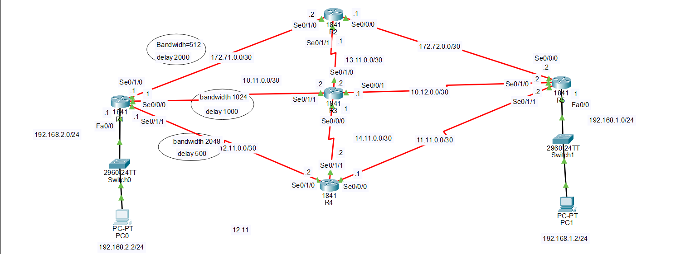

# EIGRP Configuration Lab — Successor, Feasible Successor & Unequal-Cost Load Balancing

## 1. Lab Objective

This lab demonstrates three EIGRP concepts:

1. Basic EIGRP configuration.
2. Successor and Feasible Successor selection.
3. Unequal-cost load balancing using `variance`.

The important idea is:

> You do NOT manually configure a Successor or Feasible Successor. DUAL automatically selects them based on EIGRP metrics.

You can only **influence the metric** using commands such as:

```text
bandwidth
delay
```

Then DUAL recalculates the paths.

---

# 2. Topology

The important part for studying Successor, Feasible Successor, and unequal-cost load balancing is the multiple-path section:



The exact physical connections must follow your Packet Tracer topology.

For R1, the important idea is that there are **three possible directions/paths that can eventually lead toward R5**:

```text
Path 1: R1 → R2 → ... → R5

Path 2: R1 → R3 → ... → R5

Path 3: R1 → R4 → ... → R5
```

This is important because R1 can have multiple possible paths toward the LAN behind R5.

Therefore, **R1 is the router we will use to demonstrate Successor, Feasible Successor, metric manipulation, and unequal-cost load balancing.**

---

# 3. Basic EIGRP Configuration

First configure the IP addresses and make sure the interfaces are up.

Then configure EIGRP.

## R1

```text
R1(config)# router eigrp 100
R1(config-router)# network 192.168.2.0 0.0.0.255
R1(config-router)# network 10.11.0.0 0.0.0.3
R1(config-router)# network 12.11.0.0 0.0.0.3
R1(config-router)# no auto-summary
```

## R2

```text
R2(config)# router eigrp 100
R2(config-router)# network 172.71.0.0 0.0.0.3
R2(config-router)# network 172.72.0.0 0.0.0.3
R2(config-router)# network 13.11.0.0 0.0.0.3
R2(config-router)# no auto-summary
```

## R3

```text
R3(config)# router eigrp 100
R3(config-router)# network 13.11.0.0 0.0.0.3
R3(config-router)# network 10.11.0.0 0.0.0.3
R3(config-router)# network 14.11.0.0 0.0.0.3
R3(config-router)# network 10.12.0.0 0.0.0.3
R3(config-router)# no auto-summary
```

## R4

```text
R4(config)# router eigrp 100
R4(config-router)# network 14.11.0.0 0.0.0.3
R4(config-router)# network 12.11.0.0 0.0.0.3
R4(config-router)# network 11.11.0.0 0.0.0.3
R4(config-router)# no auto-summary
```

## R5

```text
R5(config)# router eigrp 100
R5(config-router)# network 10.12.0.0 0.0.0.3
R5(config-router)# network 11.11.0.0 0.0.0.3
R5(config-router)# network 192.168.1.0 0.0.0.255
R5(config-router)# no auto-summary
```

> Use the exact interface/IP assignments from your Packet Tracer file. The ASCII topology has some interface labels that are repeated/ambiguous, so verify them with `show ip interface brief`.

---

# 4. Verify EIGRP Neighbors

After configuring EIGRP:

```text
R1# show ip eigrp neighbors
```

You should see R1's EIGRP neighbors.

Also check:

```text
R1# show ip route eigrp
```

You should see routes learned through EIGRP.

---

# 5. Verify the Initial Successor and Feasible Successor

Before changing anything, check R1's EIGRP topology:

```text
R1# show ip eigrp topology
```

You are looking for a destination such as:

```text
192.168.1.0/24
```

R1 should have paths toward the LAN behind R5.

Conceptually, R1 can learn different paths toward the destination through the available routes:

```text
R1 → R2 → ... → R5 → 192.168.1.0/24

R1 → R3 → ... → R5 → 192.168.1.0/24

R1 → R4 → ... → R5 → 192.168.1.0/24
```

DUAL compares these paths.

The path with the lowest Feasible Distance becomes:

```text
SUCCESSOR
```

If an alternative path satisfies:

```text
Reported Distance < Feasible Distance
```

it can become:

```text
FEASIBLE SUCCESSOR
```

---

# 6. Important EIGRP Values

## Feasible Distance (FD)

The Feasible Distance is the best total EIGRP metric from R1 to the destination.

```text
FD = total metric from R1 to destination
```

## Reported Distance (RD)

The Reported Distance is the metric that the neighboring router reports for reaching the destination.

The Feasibility Condition is:

```text
RD < FD
```

If this condition is true, the alternative path is considered loop-free and can become a Feasible Successor.

---

# 7. Where Do We Configure Bandwidth?

This is one of the most important parts of this lab.

You do NOT configure:

```text
successor
```

or:

```text
feasible-successor
```

There is no normal command for manually assigning them.

Instead, you modify the metric of an interface.

In this topology, we use **R1** because R1 has multiple possible paths toward R5.

R1 can have paths through:

```text
R1 → R2
R1 → R3
R1 → R4
```

Therefore, to influence R1's path selection, we configure `bandwidth` and/or `delay` on the **R1 interfaces leading toward those paths**.

---

# 8. Find the Correct R1 Interfaces First

Before changing anything, run:

```text
R1# show ip interface brief
```

Identify the interfaces connecting R1 toward:

```text
R1 → R2
R1 → R3
R1 → R4
```

The exact interface numbers depend on your Packet Tracer connections.

For example, if your topology uses:

```text
R1 → R2 = Serial0/1/0
R1 → R3 = Serial0/0/0
R1 → R4 = Serial0/1/1
```

then those are the interfaces we will modify.

> Verify the interface numbers with `show ip interface brief` before entering the commands.

---

# 9. Modify the R1 → R2 Metric

On the R1 interface facing R2:

```text
R1(config)# interface s0/1/0
R1(config-if)# bandwidth 512
R1(config-if)# delay 2000
```

This changes the bandwidth and delay values used by EIGRP when calculating the metric for paths leaving R1 through R2.

Conceptually:

```text
R1 → R2
Bandwidth = 512 Kbps
Delay = 2000 × 10 microseconds
```

---

# 10. Modify the R1 → R3 Metric

On the R1 interface facing R3:

```text
R1(config)# interface s0/0/0
R1(config-if)# bandwidth 1024
R1(config-if)# delay 1000
```

Conceptually:

```text
R1 → R3
Bandwidth = 1024 Kbps
Delay = 1000 × 10 microseconds
```

---

# 11. Modify the R1 → R4 Metric

On the R1 interface facing R4:

```text
R1(config)# interface s0/1/1
R1(config-if)# bandwidth 2048
R1(config-if)# delay 500
```

Conceptually:

```text
R1 → R4
Bandwidth = 2048 Kbps
Delay = 500 × 10 microseconds
```

---

# 12. Comparing the Three R1 Interfaces

For this lab, we deliberately use different metric values:

```text
              Bandwidth       Delay

R1 → R2       512 Kbps        2000
R1 → R3       1024 Kbps       1000
R1 → R4       2048 Kbps       500
```

Remember:

```text
Higher bandwidth → generally better
Lower delay      → better
```

Therefore, the R1→R4 interface has the most attractive first-hop metric among these three examples.

However, **this does NOT automatically mean R1→R4 will become the Successor**.

EIGRP calculates the metric of the **complete path**, including the links after R1:

```text
R1 → R2 → ... → R5

R1 → R3 → ... → R5

R1 → R4 → ... → R5
```

The complete path metrics determine the final Successor.

---

# 13. Why Are We Changing R1's Interfaces?

R1 is the router making the routing decision.

R1 is asking:

```text
"How can I reach 192.168.1.0/24?"
```

It has multiple possible paths.

By changing:

```text
bandwidth
delay
```

on R1's outgoing interfaces, we influence the metric contribution of each path.

You are NOT telling DUAL:

```text
"Make R4 the Successor."
```

Instead, you are telling EIGRP:

```text
"Use these metric values for this interface."
```

Then DUAL recalculates and decides which path is best.

---

# 14. Verify the New Metrics

After changing the interface metrics:

```text
R1# show ip eigrp topology
```

Also use:

```text
R1# show ip eigrp topology all-links
```

This allows you to compare the paths learned by R1.

You can also verify the interface configuration:

```text
R1# show interfaces s0/1/0
R1# show interfaces s0/0/0
R1# show interfaces s0/1/1
```

---

# 15. Determine the Successor

R1 compares the complete paths:

```text
R1 → R2 → ... → R5
R1 → R3 → ... → R5
R1 → R4 → ... → R5
```

The path with the lowest Feasible Distance becomes:

```text
SUCCESSOR
```

For example, DUAL could determine:

```text
R1 → R4 → ... → R5
        ↓
    SUCCESSOR
```

But the actual result must be verified with:

```text
R1# show ip eigrp topology
```

---

# 16. Determine the Feasible Successor

The remaining paths are checked using the Feasibility Condition:

```text
RD < FD
```

If an alternative path satisfies the condition, it can become a:

```text
FEASIBLE SUCCESSOR
```

For example:

```text
SUCCESSOR:
R1 → R4 → ... → R5

FEASIBLE SUCCESSOR:
R1 → R3 → ... → R5
```

Another path, such as the path through R2, may or may not become a Feasible Successor.

This depends on the actual FD and RD values.

Verify with:

```text
R1# show ip eigrp topology
```

---

# 17. Unequal-Cost Load Balancing

By default, EIGRP uses the Successor for forwarding.

A Feasible Successor is normally kept as a loop-free backup.

To allow a qualified Feasible Successor to participate in **unequal-cost load balancing**, configure `variance`.

Because R1 is the router with the multiple paths, configure `variance` on R1:

```text
R1(config)# router eigrp 100
R1(config-router)# variance 2
```

---

# 18. What Does Variance 2 Mean?

Suppose DUAL selects:

```text
Successor metric = 10,000
```

With:

```text
variance 2
```

EIGRP calculates:

```text
10,000 × 2 = 20,000
```

A qualified Feasible Successor can participate if its metric is within the allowed variance range.

For example:

```text
Successor:
R1 → R4 → ... → R5
Metric = 10,000

Feasible Successor:
R1 → R3 → ... → R5
Metric = 15,000
```

Because:

```text
15,000 < 20,000
```

the alternative path is within the variance range.

If it satisfies the EIGRP requirements, it can participate in unequal-cost load balancing.

---

# 19. Important — Variance Does Not Create a Feasible Successor

`variance` does NOT turn an arbitrary path into a Feasible Successor.

The process is:

```text
Alternative path
      ↓
Check Feasibility Condition
      ↓
RD < FD ?
      │
 ┌────┴────┐
YES        NO
 │          │
 ▼          ▼
Feasible   Not a
Successor  Feasible Successor
 │
 ▼
Check variance
 │
 ▼
Within variance range?
 │
 ▼
Unequal-cost load balancing
```

Therefore:

```text
Feasibility Condition
        ↓
Feasible Successor
        ↓
Variance
        ↓
Unequal-cost load balancing
```

---

# 20. Complete Metric Configuration on R1

Assuming the interfaces are:

```text
R1 → R2 = S0/1/0
R1 → R3 = S0/0/0
R1 → R4 = S0/1/1
```

configure:

```text
R1(config)# interface s0/1/0
R1(config-if)# bandwidth 512
R1(config-if)# delay 2000

R1(config)# interface s0/0/0
R1(config-if)# bandwidth 1024
R1(config-if)# delay 1000

R1(config)# interface s0/1/1
R1(config-if)# bandwidth 2048
R1(config-if)# delay 500
```

Then configure unequal-cost load balancing:

```text
R1(config)# router eigrp 100
R1(config-router)# variance 2
```

---

# 21. Verification Commands

## Check neighbors

```text
R1# show ip eigrp neighbors
```

## Check EIGRP routes

```text
R1# show ip route eigrp
```

## Check Successor and Feasible Successor

```text
R1# show ip eigrp topology
```

## Show all learned paths

```text
R1# show ip eigrp topology all-links
```

## Check interface metrics

```text
R1# show interfaces s0/1/0
R1# show interfaces s0/0/0
R1# show interfaces s0/1/1
```

## Check EIGRP configuration

```text
R1# show running-config | section router eigrp
```

---

# 22. Final Reminder

Do not memorize:

```text
"R1 is always the router where bandwidth must be configured."
```

Instead memorize:

> **Configure bandwidth or delay on the interface/path whose EIGRP metric you want to influence.**

In this particular lab, we demonstrate the metric manipulation from R1 because R1 has multiple paths toward the destination behind R5.

Therefore:

```text
R1 → R2 → ... → R5
R1 → R3 → ... → R5
R1 → R4 → ... → R5
```

We change the interface metrics:

```text
R1 → R2
        ↓
bandwidth + delay

R1 → R3
        ↓
bandwidth + delay

R1 → R4
        ↓
bandwidth + delay
```

Then:

```text
Interface metrics
       ↓
EIGRP metric calculation
       ↓
DUAL
       ↓
Successor
       ↓
Feasibility Condition
       ↓
Feasible Successor
       ↓
variance
       ↓
Unequal-cost load balancing
```

The Successor and Feasible Successor are **always determined automatically by DUAL**; they are not manually configured.
