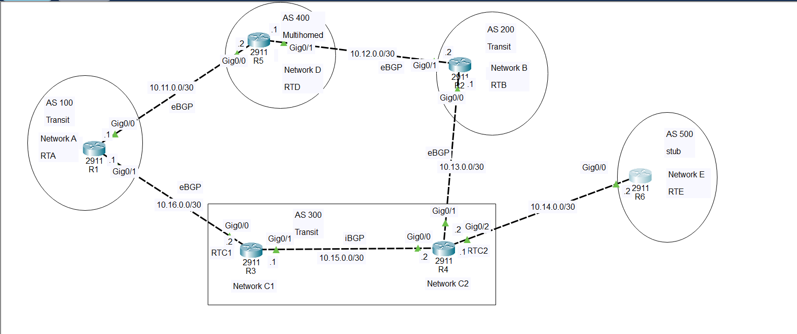

# ================================================================
#                 BGP MULTI-AS LAB
# ================================================================
#
# AS 100 = TRANSIT
# AS 200 = TRANSIT
# AS 300 = TRANSIT
# AS 400 = MULTIHOMED
# AS 500 = STUB
#
# ================================================================
# TOPOLOGY
# ================================================================

================================================================
# BGP PEERING
# ================================================================
#
# R5 (AS400) <---- eBGP ----> R1 (AS100)
# R5 (AS400) <---- eBGP ----> R2 (AS200)
#
# R1 (AS100) <---- eBGP ----> R3 (AS300)
#
# R2 (AS200) <---- eBGP ----> R4 (AS300)
#
# R3 (AS300) <---- iBGP -----> R4 (AS300)
#
# R4 (AS300) <---- eBGP ----> R6 (AS500)
#
# ================================================================
# IP ADDRESSING
# ================================================================
#
# R5 <----> R1
# Network: 10.11.0.0/30
# R5 = 10.11.0.2
# R1 = 10.11.0.1
#
# R5 <----> R2
# Network: 10.12.0.0/30
# R5 = 10.12.0.1
# R2 = 10.12.0.2
#
# R2 <----> R4
# Network: 10.13.0.0/30
# R2 = 10.13.0.1
# R4 = 10.13.0.2
#
# R4 <----> R6
# Network: 10.14.0.0/30
# R4 = 10.14.0.1
# R6 = 10.14.0.2
#
# R3 <----> R4
# Network: 10.15.0.0/30
# R3 = 10.15.0.1
# R4 = 10.15.0.2
#
# R1 <----> R3
# Network: 10.16.0.0/30
# R1 = 10.16.0.1
# R3 = 10.16.0.2
#
# ================================================================
# INTERNAL NETWORKS
# ================================================================
#
# Network A = 192.168.1.0/24  -> R1
# Network B = 192.168.2.0/24  -> R2
# Network C1 = 192.168.3.0/24 -> R3
# Network C2 = 192.168.4.0/24 -> R4
# Network D = 192.168.5.0/24  -> R5
# Network E = 192.168.6.0/24  -> R6
#
# ================================================================
#                       R1 - AS 100
#                    TRANSIT AS
# ================================================================

enable
configure terminal

hostname R1

!
! Network A
!

!
! Connection to R5
!
interface gigabitEthernet 0/1
 ip address 10.11.0.1 255.255.255.252
 no shutdown
exit

!
! Connection to R3
!
interface gigabitEthernet 0/2
 ip address 10.16.0.1 255.255.255.252
 no shutdown
exit

!
! BGP
!
router bgp 100

 neighbor 10.11.0.2 remote-as 400
 neighbor 10.16.0.2 remote-as 300

 ! Advertise networks
 network 10.11.0.0 mask 255.255.255.252
 network 10.16.0.0 mask 255.255.255.252
 exit

exit

end
copy running-config startup-config

# ================================================================
#                       R2 - AS 200
#                    TRANSIT AS
# ================================================================

enable
configure terminal

hostname R2

!
! Network B
!

!
! Connection to R5
!
interface gigabitEthernet 0/1
 ip address 10.12.0.2 255.255.255.252
 no shutdown
exit

!
! Connection to R4
!
interface gigabitEthernet 0/2
 ip address 10.13.0.1 255.255.255.252
 no shutdown
exit

!
! BGP
!
router bgp 200

 neighbor 10.12.0.1 remote-as 400
 neighbor 10.13.0.2 remote-as 300

 ! Advertise networks
 network 10.12.0.0 mask 255.255.255.252
 network 10.13.0.0 mask 255.255.255.252

exit

end
copy running-config startup-config

# ================================================================
#                       R3 - AS 300
#                    TRANSIT AS
# ================================================================

enable
configure terminal

hostname R3

!
! Connection to R1
!
interface gigabitEthernet 0/0
 ip address 10.16.0.2 255.255.255.252
 no shutdown
exit

!
! Connection to R4
!
interface gigabitEthernet 0/1
 ip address 10.15.0.1 255.255.255.252
 no shutdown
exit

!
! Network C1
!
interface gigabitEthernet 0/2
 ip address 192.168.3.1 255.255.255.0
 no shutdown
exit

!
! BGP
!
router bgp 300

!
! eBGP with R1
!
 neighbor 10.16.0.1 remote-as 100

!
! iBGP with R4
!
 neighbor 10.15.0.2 remote-as 300

network 192.168.3.0 mask 255.255.255.0

exit

end
copy running-config startup-config

# ================================================================
#                       R4 - AS 300
#                    TRANSIT AS
# ================================================================

enable
configure terminal

hostname R4

!
! Connection to R2
!
interface gigabitEthernet 0/0
 ip address 10.13.0.2 255.255.255.252
 no shutdown
exit

!
! Connection to R3
!
interface gigabitEthernet 0/1
 ip address 10.15.0.2 255.255.255.252
 no shutdown
exit

!
! Connection to R6
!
interface gigabitEthernet 0/2
 ip address 10.14.0.1 255.255.255.252
 no shutdown
exit

!
! Network C2
!
interface gigabitEthernet 0/3
 ip address 192.168.4.1 255.255.255.0
 no shutdown
exit

!
! BGP
!
router bgp 300

!
! eBGP with R2
!
 neighbor 10.13.0.1 remote-as 200

!
! iBGP with R3
!
 neighbor 10.15.0.1 remote-as 300

!
! eBGP with R6
!
 neighbor 10.14.0.2 remote-as 500

network 192.168.4.0 mask 255.255.255.0

exit

end
copy running-config startup-config

# ================================================================
#                       R5 - AS 400
#                    MULTIHOMED AS
# ================================================================

enable
configure terminal

hostname R5

!
! Network D
!
interface gigabitEthernet 0/0
 ip address 192.168.5.1 255.255.255.0
 no shutdown
exit

!
! Connection to R1
!
interface gigabitEthernet 0/1
 ip address 10.11.0.2 255.255.255.252
 no shutdown
exit

!
! Connection to R2
!
interface gigabitEthernet 0/2
 ip address 10.12.0.1 255.255.255.252
 no shutdown
exit

!
! BGP
!
router bgp 400

!
! eBGP with R1
!
 neighbor 10.11.0.1 remote-as 100

!
! eBGP with R2
!
 neighbor 10.12.0.2 remote-as 200

network 192.168.5.0 mask 255.255.255.0

exit

end
copy running-config startup-config

# ================================================================
#                       R6 - AS 500
#                       STUB AS
# ================================================================

enable
configure terminal

hostname R6

!
! Connection to R4
!
interface gigabitEthernet 0/0
 ip address 10.14.0.2 255.255.255.252
 no shutdown
exit

!
! Network E
!
interface gigabitEthernet 0/1
 ip address 192.168.6.1 255.255.255.0
 no shutdown
exit

!
! BGP
!
router bgp 500

!
! eBGP with R4
!
 neighbor 10.14.0.1 remote-as 300

network 192.168.6.0 mask 255.255.255.0

exit

end
copy running-config startup-config

# ================================================================
#                   BGP VERIFICATION
# ================================================================
#
# Run these commands on every router.
#

show ip bgp summary

show ip bgp

show ip route

show ip protocols

# Check a specific route:

show ip bgp 192.168.1.0
show ip bgp 192.168.2.0
show ip bgp 192.168.3.0
show ip bgp 192.168.4.0
show ip bgp 192.168.5.0
show ip bgp 192.168.6.0

# Test connectivity:

R1# ping 192.168.6.1
R2# ping 192.168.5.1
R5# ping 192.168.6.1

# ================================================================
#                 EXPECTED BGP NEIGHBORS
# ================================================================
#
# R1:
#   10.11.0.2  -> AS400
#   10.16.0.2  -> AS300
#
# R2:
#   10.12.0.1  -> AS400
#   10.13.0.2  -> AS300
#
# R3:
#   10.16.0.1  -> AS100
#   10.15.0.2  -> AS300
#
# R4:
#   10.13.0.1  -> AS200
#   10.15.0.1  -> AS300
#   10.14.0.2  -> AS500
#
# R5:
#   10.11.0.1  -> AS100
#   10.12.0.2  -> AS200
#
# R6:
#   10.14.0.1  -> AS300
#
# ================================================================
#                   AS ROLE SUMMARY
# ================================================================
#
# AS 100
#   R1
#   TRANSIT
#   Connected to AS400 and AS300
#
# AS 200
#   R2
#   TRANSIT
#   Connected to AS400 and AS300
#
# AS 300
#   R3 + R4
#   TRANSIT
#   Connected to AS100, AS200 and AS500
#   R3 <-> R4 = iBGP
#
# AS 400
#   R5
#   MULTIHOMED
#   Connected to AS100 and AS200
#
# AS 500
#   R6
#   STUB
#   Connected only to AS300
#
# ================================================================
#                 IMPORTANT BGP CONCEPT
# ================================================================
#
# STUB:
#   An AS with one external AS connection.
#
#   AS500
#      |
#   AS300
#
#
# MULTIHOMED:
#   An AS with multiple external AS connections.
#
#   AS100
#      |
#     AS400
#      |
#   AS200
#
#   Therefore AS400 is MULTIHOMED.
#
#
# TRANSIT:
#   An AS that can carry routes/traffic between other ASes.
#
#   AS400 ---- AS200 ---- AS300
#                    ^
#                    |
#                  Transit
#
# ================================================================
#                   IMPORTANT REMINDER
# ================================================================
#
# eBGP = Different AS numbers
#
# Example:
# R5 AS400 <----> R1 AS100
#
# 400 != 100
#
#
# iBGP = Same AS number
#
# Example:
# R3 AS300 <----> R4 AS300
#
# 300 = 300
#
# ================================================================
#                 NETWORK ADVERTISEMENTS
# ================================================================
#
# R1 advertises:
#   192.168.1.0/24
#
# R2 advertises:
#   192.168.2.0/24
#
# R3 advertises:
#   192.168.3.0/24
#
# R4 advertises:
#   192.168.4.0/24
#
# R5 advertises:
#   192.168.5.0/24
#
# R6 advertises:
#   192.168.6.0/24
#
# ================================================================
#                 FINAL BGP STRUCTURE
# ================================================================
#
#                         AS 400
#                       MULTIHOMED
#                          R5
#                        /    \
#                     eBGP    eBGP
#                      /        \
#                   R1          R2
#                AS 100       AS 200
#                TRANSIT     TRANSIT
#                   |           |
#                 eBGP         eBGP
#                   |           |
#                   R3 ======== R4
#                       iBGP
#                      AS 300
#                      TRANSIT
#                         |
#                        eBGP
#                         |
#                        R6
#                      AS 500
#                        STUB
#
# ================================================================
#                         END
# ================================================================