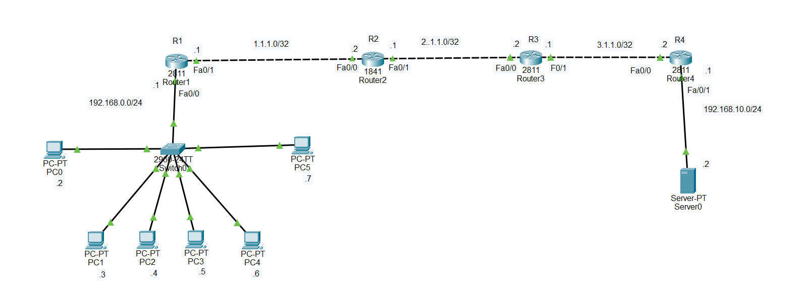

# Dynamic NAT with Static Routing — Cisco Packet Tracer

## 1. Introduction

This lab demonstrates how to configure **Dynamic Network Address Translation (Dynamic NAT)** on Cisco routers using **static routing only**.

The topology contains:

- 4 routers
- 1 switch
- 6 PCs
- 1 HTTP server
- Dynamic NAT
- Static routing
- No RIP
- No OSPF
- No EIGRP
- No BGP
- No default route

The main purpose of Dynamic NAT is to allow private IPv4 addresses inside a LAN to temporarily use public IPv4 addresses when communicating outside the private network.

The basic idea is:

    Private IP → Dynamically selected public IP

For example:

    192.168.0.2 → 1.1.1.10

The router selects the public address from a configured NAT pool.

Unlike Static NAT, the mapping is not permanently assigned to one specific internal host.

---

# 2. Exact Topology

---

# 3. Addressing Table

## R1

R1 has two interfaces.

    Fa0/1 = 1.1.1.1/32
    Fa0/0 = 192.168.0.1/24

The LAN interface is:

    192.168.0.1/24

This is the default gateway for the PCs.

---

## R2

R2 is an 1841 router.

    Fa0/1 = 1.1.1.2/32
    Fa0/0 = 2.1.1.1/32

---

## R3

R3 has:

    Fa0/1 = 2.1.1.2/32
    Fa0/0 = 3.1.1.1/32

---

## R4

R4 has:

    Fa0/0 = 3.1.1.2/32
    Fa0/1 = 192.168.10.1/24

The server LAN is:

    192.168.10.0/24

---

# 4. PC Addressing

The PCs are connected to Switch0.

The private LAN is:

    192.168.0.0/24

The PCs are:

    PC0 = 192.168.0.2/24
    PC1 = 192.168.0.3/24
    PC2 = 192.168.0.4/24
    PC3 = 192.168.0.5/24
    PC4 = 192.168.0.6/24
    PC5 = 192.168.0.7/24

Default gateway for every PC:

    192.168.0.1

Therefore:

    PC0
    192.168.0.2
         |
         v
    Gateway
    192.168.0.1
         |
         v
    R1

---

# 5. Server Addressing

The server is connected to R4.

Server:

    IP address      = 192.168.10.2
    Subnet mask     = 255.255.255.0
    Default gateway = 192.168.10.1

The server is an HTTP server.

Therefore, the server can be tested using its HTTP service.

---

# 6. Important Point About the /32 Links

In this topology, the router-to-router links are written as:

    1.1.1.0/32
    2.1.1.0/32
    3.1.1.0/32

However, there is an important issue.

A /32 subnet mask is:

    255.255.255.255

A /32 network contains exactly ONE IPv4 address.

Therefore, two directly connected router interfaces cannot normally communicate using:

    1.1.1.1/32
    1.1.1.2/32

because they are different /32 networks.

For a normal point-to-point link between two routers, use a subnet such as:

    1.1.1.0/30

which provides:

    Network = 1.1.1.0
    R1      = 1.1.1.1
    R2      = 1.1.1.2
    Broadcast = 1.1.1.3

Likewise:

    2.1.1.0/30

and:

    3.1.1.0/30

Therefore, for this Packet Tracer lab, the recommended addressing is:

    R1 Fa0/1 = 1.1.1.1/30
    R2 Fa0/1 = 1.1.1.2/30

    R2 Fa0/0 = 2.1.1.1/30
    R3 Fa0/1 = 2.1.1.2/30

    R3 Fa0/0 = 3.1.1.1/30
    R4 Fa0/0 = 3.1.1.2/30

This allows the directly connected routers to communicate correctly.

---

# 7. Routing Protocol

This lab uses:

    STATIC ROUTING ONLY

There will be:

    NO RIP
    NO OSPF
    NO EIGRP
    NO BGP
    NO DEFAULT ROUTE

Each router will have exactly:

    THREE STATIC ROUTES

The reason is that each router needs routes to three remote networks.

---

# 8. Networks in the Topology

The important networks are:

    1.1.1.0/30
    2.1.1.0/30
    3.1.1.0/30

LAN networks:

    192.168.0.0/24
    192.168.10.0/24

The complete logical path is:

    192.168.0.0/24
           |
           R1
           |
    1.1.1.0/30
           |
           R2
           |
    2.1.1.0/30
           |
           R3
           |
    3.1.1.0/30
           |
           R4
           |
    192.168.10.0/24

---

# 9. Static Routing on R1

R1 is directly connected to:

    192.168.0.0/24
    1.1.1.0/30

R1 needs routes to:

    2.1.1.0/30
    3.1.1.0/30
    192.168.10.0/24

The next-hop router is R2:

    R2 = 1.1.1.2

Configure:

    R1(config)# ip route 2.1.1.0 255.255.255.252 1.1.1.2

    R1(config)# ip route 3.1.1.0 255.255.255.252 1.1.1.2

    R1(config)# ip route 192.168.10.0 255.255.255.0 1.1.1.2

R1 now has exactly three static routes.

---

# 10. Static Routing on R2

R2 is directly connected to:

    1.1.1.0/30
    2.1.1.0/30

R2 needs routes to:

    192.168.0.0/24
    3.1.1.0/30
    192.168.10.0/24

For the LAN behind R1, use R1 as the next hop:

    R1 = 1.1.1.1

For networks beyond R3, use R3:

    R3 = 2.1.1.2

Configure:

    R2(config)# ip route 192.168.0.0 255.255.255.0 1.1.1.1

    R2(config)# ip route 3.1.1.0 255.255.255.252 2.1.1.2

    R2(config)# ip route 192.168.10.0 255.255.255.0 2.1.1.2

R2 now has exactly three static routes.

---

# 11. Static Routing on R3

R3 is directly connected to:

    2.1.1.0/30
    3.1.1.0/30

R3 needs routes to:

    1.1.1.0/30
    192.168.0.0/24
    192.168.10.0/24

For the networks behind R2 and R1, use R2:

    R2 = 2.1.1.1

For the server LAN, use R4:

    R4 = 3.1.1.2

Configure:

    R3(config)# ip route 1.1.1.0 255.255.255.252 2.1.1.1

    R3(config)# ip route 192.168.0.0 255.255.255.0 2.1.1.1

    R3(config)# ip route 192.168.10.0 255.255.255.0 3.1.1.2

R3 now has exactly three static routes.

---

# 12. Static Routing on R4

R4 is directly connected to:

    3.1.1.0/30
    192.168.10.0/24

R4 needs routes to:

    1.1.1.0/30
    2.1.1.0/30
    192.168.0.0/24

R3 is the next hop for all three:

    R3 = 3.1.1.1

Configure:

    R4(config)# ip route 1.1.1.0 255.255.255.252 3.1.1.1

    R4(config)# ip route 2.1.1.0 255.255.255.252 3.1.1.1

    R4(config)# ip route 192.168.0.0 255.255.255.0 3.1.1.1

R4 now has exactly three static routes.

---

# 13. Complete Static Routing Configuration

## R1

    R1(config)# ip route 2.1.1.0 255.255.255.252 1.1.1.2
    R1(config)# ip route 3.1.1.0 255.255.255.252 1.1.1.2
    R1(config)# ip route 192.168.10.0 255.255.255.0 1.1.1.2

## R2

    R2(config)# ip route 192.168.0.0 255.255.255.0 1.1.1.1
    R2(config)# ip route 3.1.1.0 255.255.255.252 2.1.1.2
    R2(config)# ip route 192.168.10.0 255.255.255.0 2.1.1.2

## R3

    R3(config)# ip route 1.1.1.0 255.255.255.252 2.1.1.1
    R3(config)# ip route 192.168.0.0 255.255.255.0 2.1.1.1
    R3(config)# ip route 192.168.10.0 255.255.255.0 3.1.1.2

## R4

    R4(config)# ip route 1.1.1.0 255.255.255.252 3.1.1.1
    R4(config)# ip route 2.1.1.0 255.255.255.252 3.1.1.1
    R4(config)# ip route 192.168.0.0 255.255.255.0 3.1.1.1

---

# 14. Why We Configure Static Routes First

NAT and routing perform different jobs.

Routing determines:

    WHERE the packet should go.

NAT determines:

    WHETHER the IP address should be translated.

For example:

    PC0
    192.168.0.2
       |
       v
    R1
       |
       | NAT
       v
    R2
       |
       v
    R3
       |
       v
    R4
       |
       v
    Server
    192.168.10.2

The routers must know how to reach the destination before we troubleshoot NAT.

Therefore:

    STEP 1 → Configure interfaces
    STEP 2 → Configure static routing
    STEP 3 → Test routing
    STEP 4 → Configure Dynamic NAT
    STEP 5 → Test NAT

---

# 15. Dynamic NAT

Dynamic NAT allows internal private hosts to temporarily receive a public IP address from a NAT pool.

The private network is:

    192.168.0.0/24

The NAT router is:

    R1

R1 is responsible for translating the PC addresses.

For example:

    PC0
    192.168.0.2

could be translated to:

    1.1.1.10

Another PC could receive:

    1.1.1.11

Another could receive:

    1.1.1.12

---

# 16. NAT Inside and Outside Interfaces

On R1:

    Fa0/0 = 1.1.1.1/30
    Fa0/1 = 192.168.0.1/24

The interface connected to the private LAN is:

    Fa0/0

Therefore:

    Fa0/0 = NAT INSIDE

The interface toward R2 is:

    Fa0/1

Therefore:

    Fa0/1 = NAT OUTSIDE

Configure:

    R1(config)# interface fa0/0
    R1(config-if)# ip nat inside
    R1(config-if)# exit

    R1(config)# interface fa0/1
    R1(config-if)# ip nat outside
    R1(config-if)# exit

IMPORTANT:

The NAT inside/outside designation is based on the direction of the private network relative to R1.

---

# 17. Create the Dynamic NAT Pool

We will create a pool containing three public addresses:

    1.1.1.10
    1.1.1.11
    1.1.1.12

Configure on R1:

    R1(config)# ip nat pool PUBLIC_POOL 1.1.1.10 1.1.1.12 netmask 255.255.255.252

This creates:

    PUBLIC_POOL

with addresses:

    1.1.1.10
    1.1.1.11
    1.1.1.12

IMPORTANT:

The pool addresses must be unused addresses and must not already be configured on another router interface.

---

# 18. Identify the Private Hosts

The PCs are in:

    192.168.0.0/24

Create an access list:

    R1(config)# access-list 1 permit 192.168.0.0 0.0.0.255

This tells R1:

    "These private addresses are allowed to use Dynamic NAT."

The wildcard mask:

    0.0.0.255

represents the entire:

    192.168.0.0/24

network.

---

# 19. Connect the ACL to the NAT Pool

Now connect ACL 1 to the NAT pool:

    R1(config)# ip nat inside source list 1 pool PUBLIC_POOL

This means:

    Private addresses permitted by ACL 1
                         ↓
                    NAT translation
                         ↓
                  PUBLIC_POOL

The router dynamically chooses an available public IP.

---

# 20. Complete Dynamic NAT Configuration on R1

The complete NAT configuration is:

    R1(config)# interface fa0/0
    R1(config-if)# ip nat inside
    R1(config-if)# exit

    R1(config)# interface fa0/1
    R1(config-if)# ip nat outside
    R1(config-if)# exit

    R1(config)# ip nat pool PUBLIC_POOL 1.1.1.10 1.1.1.12 netmask 255.255.255.252

    R1(config)# access-list 1 permit 192.168.0.0 0.0.0.255

    R1(config)# ip nat inside source list 1 pool PUBLIC_POOL

---

# 21. Example NAT Translation

Suppose PC0:

    192.168.0.2

starts communicating.

R1 may assign:

    1.1.1.10

The translation becomes:

    Inside Local       Inside Global
    ----------------------------------
    192.168.0.2        1.1.1.10

Then PC1 may receive:

    192.168.0.3 → 1.1.1.11

And PC2 may receive:

    192.168.0.4 → 1.1.1.12

The router dynamically chooses these mappings.

---

# 22. What Happens When All Public IPs Are Used?

Our NAT pool has only three addresses:

    1.1.1.10
    1.1.1.11
    1.1.1.12

Suppose:

    PC0 → 1.1.1.10
    PC1 → 1.1.1.11
    PC2 → 1.1.1.12

All public addresses are now in use.

If PC3:

    192.168.0.5

tries to create another NAT translation, R1 cannot assign a public IP from the pool.

The translation therefore cannot be created while the pool is exhausted.

This is one of the major limitations of Dynamic NAT.

---

# 23. Dynamic NAT vs Dynamic PAT

Do NOT use:

    ip nat inside source list 1 pool PUBLIC_POOL overload

The keyword:

    overload

changes the configuration into Dynamic PAT.

Dynamic NAT:

    Private IP → Public IP

Dynamic PAT:

    Private IP + Port → Public IP + Port

Dynamic PAT allows many internal hosts to share one public IP.

Dynamic NAT does not use port translation.

Therefore, for this lab, use:

    ip nat inside source list 1 pool PUBLIC_POOL

and NOT:

    ip nat inside source list 1 pool PUBLIC_POOL overload

---

# 24. Test the Interfaces

On each router:

    show ip interface brief

Every connected interface should show:

    Status = up
    Protocol = up

For example, R1 should show:

    Fa0/0    192.168.0.1    up    up
    Fa0/1    1.1.1.1       up    up

If an interface is administratively down, use:

    R1(config)# interface fa0/0
    R1(config-if)# no shutdown

---

# 25. Test Static Routing

Use:

    show ip route

Static routes appear with:

    S

For example, R1 should contain:

    S 2.1.1.0/30
    S 3.1.1.0/30
    S 192.168.10.0/24

R2 should contain:

    S 192.168.0.0/24
    S 3.1.1.0/30
    S 192.168.10.0/24

R3 should contain:

    S 1.1.1.0/30
    S 192.168.0.0/24
    S 192.168.10.0/24

R4 should contain:

    S 1.1.1.0/30
    S 2.1.1.0/30
    S 192.168.0.0/24

---

# 26. Test Connectivity Before NAT

First test the directly connected links.

From R1:

    R1# ping 1.1.1.2

From R2:

    R2# ping 2.1.1.2

From R3:

    R3# ping 3.1.1.2

Then test the complete path.

From R1:

    R1# ping 192.168.10.2

If this works, the static routing is working.

Then test from PC0:

    PC> ping 192.168.10.2

---

# 27. Verify Dynamic NAT

After a PC generates traffic, go to R1:

    R1# show ip nat translations

You should see a translation similar to:

    Inside local      Inside global
    --------------------------------
    192.168.0.2       1.1.1.10

The meanings are:

    Inside Local:
    The original private address.

    Inside Global:
    The translated address used outside the NAT device.

---

# 28. Check NAT Statistics

Use:

    R1# show ip nat statistics

This command shows information about:

    NAT translations
    NAT interfaces
    NAT pools
    Addresses used
    Addresses available

---

# 29. Clear Dynamic NAT Translations

To remove current dynamic translations:

    R1# clear ip nat translation *

Then generate traffic again.

R1 will dynamically select available addresses from the NAT pool.

---

# 30. Complete Traffic Flow

The complete communication path is:

    PC0
    192.168.0.2
       |
       v
    Switch0
       |
       v
    R1
    Fa0/0
    NAT INSIDE
       |
       | 192.168.0.2
       |      ↓
       | 1.1.1.10
       v
    R2
       |
       v
    R3
       |
       v
    R4
       |
       v
    Server0
    192.168.10.2

The important NAT operation occurs on R1.

Before NAT:

    Source = 192.168.0.2

After NAT:

    Source = 1.1.1.10

The destination remains the destination of the communication.

---

# 31. Final Configuration Summary

## R1 Interfaces

    R1(config)# interface fa0/0
    R1(config-if)# ip address 192.168.0.1 255.255.255.0
    R1(config-if)# ip nat inside
    R1(config-if)# no shutdown
    R1(config-if)# exit

    R1(config)# interface fa0/1
    R1(config-if)# ip address 1.1.1.1 255.255.255.252
    R1(config-if)# ip nat outside
    R1(config-if)# no shutdown
    R1(config-if)# exit

## R1 Static Routes

    R1(config)# ip route 2.1.1.0 255.255.255.252 1.1.1.2
    R1(config)# ip route 3.1.1.0 255.255.255.252 1.1.1.2
    R1(config)# ip route 192.168.10.0 255.255.255.0 1.1.1.2

## R1 Dynamic NAT

    R1(config)# ip nat pool PUBLIC_POOL 1.1.1.1 1.1.1.3 netmask 255.255.255.252
    R1(config)# access-list 1 permit 192.168.0.0 0.0.0.255
    R1(config)# ip nat inside source list 1 pool PUBLIC_POOL

---

# 32. R2 Static Routes

    R2(config)# ip route 192.168.0.0 255.255.255.0 1.1.1.1
    R2(config)# ip route 3.1.1.0 255.255.255.252 2.1.1.2
    R2(config)# ip route 192.168.10.0 255.255.255.0 2.1.1.2

Exactly three static routes.

---

# 33. R3 Static Routes

    R3(config)# ip route 1.1.1.0 255.255.255.252 2.1.1.1
    R3(config)# ip route 192.168.0.0 255.255.255.0 2.1.1.1
    R3(config)# ip route 192.168.10.0 255.255.255.0 3.1.1.2

Exactly three static routes.

---

# 34. R4 Static Routes

    R4(config)# ip route 1.1.1.0 255.255.255.252 3.1.1.1
    R4(config)# ip route 2.1.1.0 255.255.255.252 3.1.1.1
    R4(config)# ip route 192.168.0.0 255.255.255.0 3.1.1.1

Exactly three static routes.

---

# 35. Final Verification Commands

## Check interfaces

    show ip interface brief

## Check routing table

    show ip route

## Check NAT translations

    show ip nat translations

## Check NAT statistics

    show ip nat statistics

## Test connectivity

    ping 1.1.1.2
    ping 2.1.1.2
    ping 3.1.1.2
    ping 192.168.10.2

---

# 36. Final Concept

The entire lab can be understood in four stages:

    STEP 1
    PCs use private addresses:

        192.168.0.2
        192.168.0.3
        192.168.0.4
        192.168.0.5
        192.168.0.6
        192.168.0.7

    STEP 2
    R1 receives the traffic and checks the NAT rule.

    STEP 3
    R1 dynamically selects an available address from:

        1.1.1.10
        1.1.1.11
        1.1.1.12

    STEP 4
    The translated traffic travels:

        R1 → R2 → R3 → R4 → Server

Therefore:

    STATIC ROUTING
    = determines the path

    DYNAMIC NAT
    = dynamically translates private IP addresses

    NAT POOL
    = provides the available public IP addresses

    ACCESS LIST
    = identifies which private hosts can be translated

    INSIDE INTERFACE
    = interface toward the private LAN

    OUTSIDE INTERFACE
    = interface toward the external network

The complete concept is:

    Private PC
    192.168.0.x
         |
         v
       R1
         |
         | Dynamic NAT
         | 192.168.0.x → 1.1.1.x
         v
       R2
         |
         v
       R3
         |
         v
       R4
         |
         v
    HTTP Server
    192.168.10.2