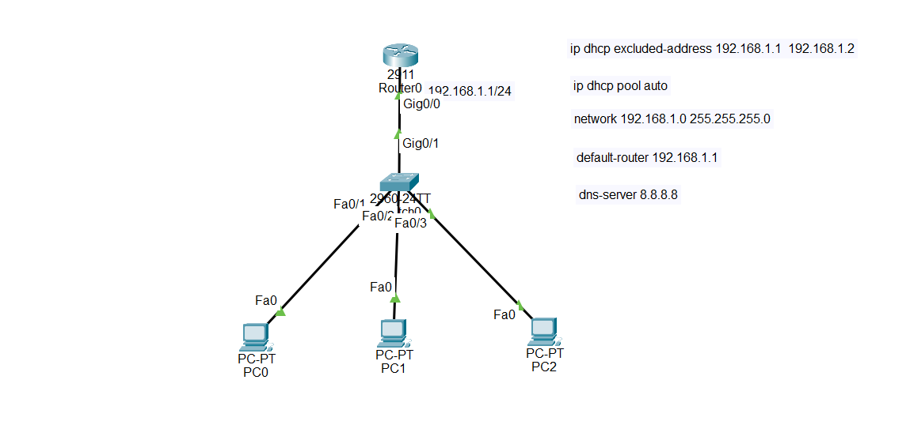

# Cisco Router DHCP Server Configuration — Packet Tracer README

## 1. Overview

**DHCP (Dynamic Host Configuration Protocol)** is a network protocol that automatically provides IP configuration information to client devices.

Instead of manually assigning an IP address, subnet mask, default gateway, and DNS server to every PC, a DHCP server automatically provides these settings to the clients.

In this Packet Tracer topology, **Router0 (2911)** is configured as the DHCP server. The router provides IP addresses to the PCs connected through **Switch0 (2960-24TT)**.

The network used in this topology is:

* Network: `192.168.1.0/24`
* Router IP: `192.168.1.1`
* Subnet mask: `255.255.255.0`
* DHCP pool name: `auto`
* DNS server: `8.8.8.8`

---

## 2. How DHCP Works

When a PC is configured to obtain its IP address automatically, it uses DHCP to request network configuration.

The basic DHCP process is commonly remembered as **DORA**:

### D — Discover

The client broadcasts a **DHCP Discover** message to find an available DHCP server.

### O — Offer

The DHCP server responds with a **DHCP Offer**, proposing an IP address and other network settings.

### R — Request

The client sends a **DHCP Request** indicating that it wants to use the offered configuration.

### A — Acknowledgment

The DHCP server sends a **DHCP Acknowledgment (ACK)** confirming the configuration.

After this process, the PC can use the assigned IP address and communicate on the network.

---

# 3. Topology Information

The topology contains:

* One Cisco 2911 router: `Router0`
* One Cisco 2960-24TT switch: `Switch0`
* Three PCs: `PC0`, `PC1`, and `PC2`

The router's LAN interface is:

* Interface: `GigabitEthernet0/0`
* IP address: `192.168.1.1`
* Subnet mask: `255.255.255.0`

The PCs are configured as DHCP clients.

The router acts as both:

* Default gateway
* DHCP server

The DNS server provided to clients is:

`8.8.8.8`

---

# 4. DHCP Address Range

The network is:

`192.168.1.0/24`

The usable host range is:

`192.168.1.1 - 192.168.1.254`

The router uses:

`192.168.1.1`

The address:

`192.168.1.2`

is also excluded from DHCP.

Therefore, DHCP can automatically assign addresses beginning from:

`192.168.1.3`

through:

`192.168.1.254`

---

# 5. Why Exclude IP Addresses?

Some devices should normally use **static IP addresses**.

Examples include:

* Routers
* Servers
* Network management devices
* Printers
* Other infrastructure devices

If the DHCP server accidentally assigns an address that is already manually configured on another device, an **IP address conflict** can occur.

Therefore, static addresses should be excluded from the DHCP pool.

In this topology:

```text
ip dhcp excluded-address 192.168.1.1 192.168.1.2
```

This tells the router not to assign `192.168.1.1` or `192.168.1.2` to DHCP clients.

---

# 6. Configure Router0's Interface

First, configure the router interface that connects to the LAN.

Enter privileged EXEC mode:

```text
enable
```

Enter global configuration mode:

```text
configure terminal
```

Enter the GigabitEthernet0/0 interface:

```text
interface gigabitEthernet 0/0
```

Assign the IP address:

```text
ip address 192.168.1.1 255.255.255.0
```

Enable the interface:

```text
no shutdown
```

Exit interface configuration mode:

```text
exit
```

The complete interface configuration is:

```text
enable
configure terminal
interface gigabitEthernet 0/0
ip address 192.168.1.1 255.255.255.0
no shutdown
exit
```

The router interface must have an IP address in the same subnet as the DHCP network because it will act as the default gateway for the clients.

---

# 7. Exclude Static IP Addresses

Configure the router to exclude the addresses reserved for static devices:

```text
ip dhcp excluded-address 192.168.1.1 192.168.1.2
```

This means:

* `192.168.1.1` → reserved for Router0
* `192.168.1.2` → reserved for another possible static device
* `192.168.1.3` and above → available for DHCP assignment

---

# 8. Create the DHCP Pool

Create a DHCP pool named `auto`:

```text
ip dhcp pool auto
```

The router enters DHCP pool configuration mode.

---

# 9. Configure the DHCP Network

Specify the network and subnet mask:

```text
network 192.168.1.0 255.255.255.0
```

This tells the router that the DHCP pool belongs to the:

`192.168.1.0/24`

network.

The router can therefore assign addresses from the available host range of that subnet.

---

# 10. Configure the Default Gateway

Configure the default gateway:

```text
default-router 192.168.1.1
```

The default gateway is the router's LAN interface.

The PCs will receive:

`192.168.1.1`

as their default gateway.

The default gateway is used when a PC needs to communicate with a network outside its local subnet.

---

# 11. Configure the DNS Server

Configure the DNS server:

```text
dns-server 8.8.8.8
```

The DHCP server will provide `8.8.8.8` as the DNS server address to DHCP clients.

DNS allows clients to resolve domain names into IP addresses.

For example, DNS can help a PC translate a domain name such as a website address into its corresponding IP address.

---

# 12. Complete DHCP Configuration

The complete DHCP configuration for Router0 is:

```text
enable
configure terminal

interface gigabitEthernet 0/0
ip address 192.168.1.1 255.255.255.0
no shutdown
exit

ip dhcp excluded-address 192.168.1.1 192.168.1.2

ip dhcp pool auto
network 192.168.1.0 255.255.255.0
default-router 192.168.1.1
dns-server 8.8.8.8
exit
```

---

# 13. Configure the PCs as DHCP Clients

After configuring the router, configure each PC to obtain its IP address automatically.

For **PC0**:

1. Open `PC0`.
2. Select **Desktop**.
3. Select **IP Configuration**.
4. Select **DHCP**.

Repeat the same process for:

* `PC1`
* `PC2`

The PCs should automatically receive their network configuration from Router0.

---

# 14. Expected PC Configuration

The exact IP address assigned to each PC can vary depending on the order in which the PCs request DHCP addresses.

For example:

```text
PC0
IP Address:       192.168.1.3
Subnet Mask:      255.255.255.0
Default Gateway:  192.168.1.1
DNS Server:       8.8.8.8
```

Another PC could receive:

```text
PC1
IP Address:       192.168.1.4
Subnet Mask:      255.255.255.0
Default Gateway:  192.168.1.1
DNS Server:       8.8.8.8
```

Another PC could receive:

```text
PC2
IP Address:       192.168.1.5
Subnet Mask:      255.255.255.0
Default Gateway:  192.168.1.1
DNS Server:       8.8.8.8
```

The important point is that the PCs receive addresses from the same `192.168.1.0/24` network.

---

# 15. Verify the Router Interface

Use:

```text
show ip interface brief
```

You should see the GigabitEthernet0/0 interface with:

```text
GigabitEthernet0/0    192.168.1.1    YES    manual    up    up
```

The important part is:

```text
up    up
```

This indicates that the interface is operational.

---

# 16. Verify the DHCP Configuration

Use:

```text
show running-config
```

Look for the DHCP configuration.

You should see something similar to:

```text
ip dhcp excluded-address 192.168.1.1 192.168.1.2

ip dhcp pool auto
 network 192.168.1.0 255.255.255.0
 default-router 192.168.1.1
 dns-server 8.8.8.8
```

---

# 17. Check DHCP Bindings

Use:

```text
show ip dhcp binding
```

This command shows the IP addresses that the DHCP server has assigned to clients.

For example, you may see:

```text
IP address       Client-ID/Hardware address       Lease expiration
192.168.1.3      ...                              ...
192.168.1.4      ...                              ...
192.168.1.5      ...                              ...
```

This confirms that Router0 is assigning addresses to the PCs.

---

# 18. Check DHCP Pool Statistics

Use:

```text
show ip dhcp pool
```

This command provides information about the DHCP pool, including:

* Pool name
* Network
* Address range
* Number of leased addresses
* Number of available addresses

For this topology, the pool is named:

```text
auto
```

and the network is:

```text
192.168.1.0/24
```

---

# 19. Test Connectivity

After the PCs receive their IP addresses, test connectivity.

From a PC, open:

**Desktop → Command Prompt**

Check the IP configuration:

```text
ipconfig
```

Then ping the default gateway:

```text
ping 192.168.1.1
```

A successful response confirms that the PC can communicate with Router0.

You can also test communication between PCs.

For example:

```text
ping 192.168.1.4
```

The exact destination depends on the IP address assigned to the other PC.

# topology



---

# 20. DHCP Configuration Logic

The configuration follows this logical sequence:

1. Configure the router's LAN interface.
2. Give the interface an IP address.
3. Enable the interface with `no shutdown`.
4. Exclude addresses reserved for static devices.
5. Create the DHCP pool.
6. Define the DHCP network.
7. Define the default gateway.
8. Define the DNS server.
9. Configure PCs to use DHCP.
10. Verify the assigned addresses.
11. Test connectivity.

---

# 21. Important Commands

### Configure router interface

```text
interface gigabitEthernet 0/0
ip address 192.168.1.1 255.255.255.0
no shutdown
```

### Exclude addresses

```text
ip dhcp excluded-address 192.168.1.1 192.168.1.2
```

### Create DHCP pool

```text
ip dhcp pool auto
```

### Configure DHCP network

```text
network 192.168.1.0 255.255.255.0
```

### Configure default gateway

```text
default-router 192.168.1.1
```

### Configure DNS

```text
dns-server 8.8.8.8
```

### Verify DHCP bindings

```text
show ip dhcp binding
```

### Verify DHCP pool

```text
show ip dhcp pool
```

### Verify router interfaces

```text
show ip interface brief
```

### Verify complete configuration

```text
show running-config
```

---

# 22. Common Problems and Troubleshooting

### PC does not receive an IP address

Check that:

* The PC is set to **DHCP**.
* The router interface is enabled.
* The router interface has the correct IP address.
* The switch and cables are connected correctly.
* The DHCP pool uses the correct network.
* The DHCP server is configured correctly.

### Router interface is down

Check:

```text
show ip interface brief
```

If the interface is administratively down, configure:

```text
interface gigabitEthernet 0/0
no shutdown
```

### PC receives an incorrect configuration

Check:

```text
show ip dhcp binding
```

and:

```text
show running-config
```

Verify the DHCP pool's:

* Network
* Subnet mask
* Default router
* DNS server

### IP address conflict

Make sure important static addresses are excluded:

```text
ip dhcp excluded-address 192.168.1.1 192.168.1.2
```

---

# 23. Final Configuration

The final Router0 configuration for this Packet Tracer exercise is:

```text
enable
configure terminal

interface gigabitEthernet 0/0
ip address 192.168.1.1 255.255.255.0
no shutdown
exit

ip dhcp excluded-address 192.168.1.1 192.168.1.2

ip dhcp pool auto
network 192.168.1.0 255.255.255.0
default-router 192.168.1.1
dns-server 8.8.8.8
exit

end
```

---

# 24. Key Concepts to Remember

**DHCP** automatically provides IP configuration to clients.

**Excluded addresses** prevent DHCP from assigning addresses reserved for static devices.

**DHCP pool** defines the group of addresses and configuration that can be provided to clients.

**Network** tells DHCP which subnet it should serve.

**Default-router** tells clients which device they should use as their default gateway.

**DNS-server** tells clients which DNS server they should use for name resolution.

**Router interface IP** must belong to the same subnet being served by the DHCP pool.

For this topology:

* **Network:** `192.168.1.0/24`
* **Router/Gateway:** `192.168.1.1`
* **Excluded addresses:** `192.168.1.1–192.168.1.2`
* **DHCP pool:** `auto`
* **DHCP addresses:** `192.168.1.3–192.168.1.254`
* **DNS:** `8.8.8.8`

The main idea is:

**Router interface → DHCP pool → IP addresses → Default gateway → DNS → DHCP clients.**
