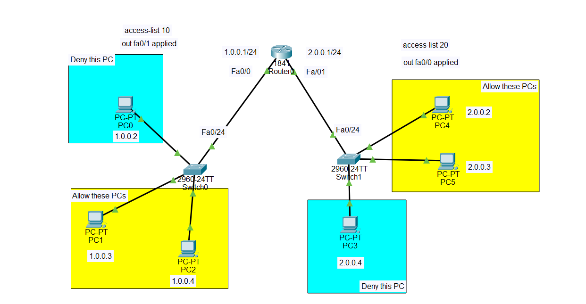

# Standard ACL Configuration in Cisco Packet Tracer

## 1. What Is a Standard ACL?

A **Standard Access Control List (Standard ACL)** is a Cisco security mechanism used to **permit or deny traffic based only on the source IPv4 address**.

A Standard ACL answers a simple question:

> **“Where did this traffic come from?”**

It does **not** examine the destination IP address, protocol, or destination port.

For example, if we configure:

```text
access-list 10 deny host 1.0.0.2
```

the router will identify packets whose **source IP address is 1.0.0.2** and deny them.

### Important characteristics

* Standard ACLs use numbers **1–99** and **1300–1999**.
* They filter traffic based on the **source IP address**.
* They can contain `permit` and `deny` statements.
* An ACL is applied to an interface using `ip access-group`.
* An ACL can be applied **inbound (`in`)** or **outbound (`out`)**.
* Every ACL has an **implicit `deny any`** at the end.

For example:

```text
access-list 10 deny host 1.0.0.2
```

is effectively followed by:

```text
deny any
```

Therefore, if you want other traffic to continue, you normally need:

```text
access-list 10 permit any
```

---

# 2. Topology




### Router interfaces

| Interface | IP address | Network    |
| --------- | ---------- | ---------- |
| Fa0/0     | 1.0.0.1/24 | 1.0.0.0/24 |
| Fa0/1     | 2.0.0.1/24 | 2.0.0.0/24 |

### PCs on Network 1

| Device | IP address | Expected result |
| ------ | ---------- | --------------- |
| PC0    | 1.0.0.2    | DENY            |
| PC1    | 1.0.0.3    | ALLOW           |
| PC2    | 1.0.0.4    | ALLOW           |

### PCs on Network 2

| Device | IP address | Expected result |
| ------ | ---------- | --------------- |
| PC3    | 2.0.0.4    | DENY            |
| PC4    | 2.0.0.2    | ALLOW           |
| PC5    | 2.0.0.3    | ALLOW           |

---

# 3. Objective of the Configuration

The objective is to use **two Standard ACLs** to control traffic between the two networks.

### ACL 10

Applied **outbound on Fa0/1**:

```text
access-list 10
out Fa0/1
```

It blocks:

```text
PC0 = 1.0.0.2
```

from reaching Network 2.

Therefore:

```text
PC0 → Router0 → Network 2 = DENIED
```

while:

```text
PC1 → Router0 → Network 2 = ALLOWED
PC2 → Router0 → Network 2 = ALLOWED
```

### ACL 20

Applied **outbound on Fa0/0**:

```text
access-list 20
out Fa0/0
```

It blocks:

```text
PC3 = 2.0.0.4
```

from reaching Network 1.

Therefore:

```text
PC3 → Router0 → Network 1 = DENIED
```

while:

```text
PC4 → Router0 → Network 1 = ALLOWED
PC5 → Router0 → Network 1 = ALLOWED
```

---

# 4. Step 1 — Build the Topology

In Cisco Packet Tracer, place:

* 1 × Cisco 1841 Router
* 2 × Cisco 2960 Switches
* 6 × PCs

Connect:

```text
PC0 ─┐
PC1 ─┼── Switch0 ─── Router0 Fa0/0
PC2 ─┘

PC3 ─┐
PC4 ─┼── Switch1 ─── Router0 Fa0/1
PC5 ─┘
```

The switches are simply connecting the PCs to the router.

The **router is where the ACLs are configured**.

---

# 5. Step 2 — Configure Router Interfaces

Enter the Router0 CLI:

```text
enable
configure terminal
```

Configure Fa0/0:

```text
interface fa0/0
ip address 1.0.0.1 255.255.255.0
no shutdown
exit
```

Configure Fa0/1:

```text
interface fa0/1
ip address 2.0.0.1 255.255.255.0
no shutdown
exit
```

Now Router0 has two directly connected networks:

```text
1.0.0.0/24
       |
     Fa0/0
       |
    Router0
       |
     Fa0/1
       |
2.0.0.0/24
```

Because both networks are directly connected to the router, **no static route or dynamic routing protocol is required** for communication between these two networks.

---

# 6. Step 3 — Configure the PCs

Configure the PCs with the following IPv4 settings.

## Network 1

### PC0

```text
IP Address:      1.0.0.2
Subnet Mask:     255.255.255.0
Default Gateway: 1.0.0.1
```

### PC1

```text
IP Address:      1.0.0.3
Subnet Mask:     255.255.255.0
Default Gateway: 1.0.0.1
```

### PC2

```text
IP Address:      1.0.0.4
Subnet Mask:     255.255.255.0
Default Gateway: 1.0.0.1
```

## Network 2

### PC3

```text
IP Address:      2.0.0.4
Subnet Mask:     255.255.255.0
Default Gateway: 2.0.0.1
```

### PC4

```text
IP Address:      2.0.0.2
Subnet Mask:     255.255.255.0
Default Gateway: 2.0.0.1
```

### PC5

```text
IP Address:      2.0.0.3
Subnet Mask:     255.255.255.0
Default Gateway: 2.0.0.1
```

---

# 7. Step 4 — Test Connectivity Before ACLs

Before creating ACLs, test communication between the networks.

From PC0:

```text
ping 2.0.0.2
```

From PC1:

```text
ping 2.0.0.2
```

From PC3:

```text
ping 1.0.0.3
```

Before the ACLs are applied, the PCs should be able to communicate because the router is routing between the two directly connected networks.

This is an important step.

> **Always test the network before applying an ACL.**

That gives you a baseline. If communication stops after the ACL is configured, you know the ACL caused the change.

---

# 8. Step 5 — Create Standard ACL 10

The first requirement is:

> **Block PC0 (1.0.0.2) from reaching Network 2, but allow PC1 and PC2.**

Create ACL 10:

```text
enable
configure terminal

access-list 10 deny host 1.0.0.2
access-list 10 permit any
```

The first statement says:

```text
deny host 1.0.0.2
```

Therefore, traffic whose **source address** is `1.0.0.2` is denied.

The second statement:

```text
permit any
```

allows everyone else.

So the ACL behaves like:

```text
Source 1.0.0.2 → DENY
All other sources → PERMIT
```

---

# 9. Step 6 — Apply ACL 10 to Fa0/1

Now apply ACL 10 outbound on Fa0/1:

```text
interface fa0/1
ip access-group 10 out
exit
```

This is important.

The ACL is placed on **Fa0/1**, because Fa0/1 is the interface through which traffic **leaves Router0 toward Network 2**.

Traffic from Network 1 going to Network 2 follows this path:

```text
PC0
  ↓
Switch0
  ↓
Fa0/0
  ↓
Router0
  ↓
Fa0/1
  ↓
Switch1
  ↓
PC4/PC5/PC3
```

When the packet reaches Fa0/1, ACL 10 checks its **source IP address**.

For PC0:

```text
Source = 1.0.0.2
```

ACL 10 says:

```text
deny host 1.0.0.2
```

Therefore:

```text
PC0 → Network 2 = DENIED
```

PC1 has:

```text
Source = 1.0.0.3
```

It does not match the deny statement.

It reaches:

```text
permit any
```

Therefore:

```text
PC1 → Network 2 = ALLOWED
```

The same happens for PC2.

---

# 10. Step 7 — Create Standard ACL 20

Now we need the opposite direction.

The requirement is:

> **Block PC3 (2.0.0.4) from reaching Network 1, but allow PC4 and PC5.**

Create ACL 20:

```text
access-list 20 deny host 2.0.0.4
access-list 20 permit any
```

This means:

```text
Source 2.0.0.4 → DENY
All other sources → PERMIT
```

---

# 11. Step 8 — Apply ACL 20 to Fa0/0

Apply ACL 20 outbound on Fa0/0:

```text
interface fa0/0
ip access-group 20 out
exit
```

Why Fa0/0?

Because Fa0/0 is the interface through which traffic **leaves Router0 toward Network 1**.

Traffic from Network 2 going to Network 1 follows:

```text
PC3
  ↓
Switch1
  ↓
Fa0/1
  ↓
Router0
  ↓
Fa0/0
  ↓
Switch0
  ↓
PC0/PC1/PC2
```

When the packet reaches Fa0/0, ACL 20 examines its source IP.

For PC3:

```text
Source = 2.0.0.4
```

ACL 20 says:

```text
deny host 2.0.0.4
```

Therefore:

```text
PC3 → Network 1 = DENIED
```

For PC4:

```text
Source = 2.0.0.2
```

It does not match the deny statement, so:

```text
permit any
```

allows it.

Therefore:

```text
PC4 → Network 1 = ALLOWED
```

The same applies to PC5.

---

# 12. Complete Router Configuration

The complete configuration can be written as:

```text
enable
configure terminal

! Configure Fa0/0
interface fa0/0
ip address 1.0.0.1 255.255.255.0
no shutdown
exit

! Configure Fa0/1
interface fa0/1
ip address 2.0.0.1 255.255.255.0
no shutdown
exit

! Standard ACL 10
! Block PC0 from reaching Network 2
access-list 10 deny host 1.0.0.2
access-list 10 permit any

! Apply ACL 10 outbound toward Network 2
interface fa0/1
ip access-group 10 out
exit

! Standard ACL 20
! Block PC3 from reaching Network 1
access-list 20 deny host 2.0.0.4
access-list 20 permit any

! Apply ACL 20 outbound toward Network 1
interface fa0/0
ip access-group 20 out
exit

end
```

---

# 13. Verify the ACL Configuration

Use:

```text
show access-lists
```

You should see ACL 10 and ACL 20.

You can also use:

```text
show ip interface fa0/0
```

and:

```text
show ip interface fa0/1
```

These commands show whether an ACL is applied to the interface and in which direction.

You should see information indicating:

```text
Inbound access list
Outbound access list
```

For Fa0/0:

```text
outbound access list is 20
```

For Fa0/1:

```text
outbound access list is 10
```

---

# 14. Testing the ACL

After configuring the ACLs, test the following.

## From PC0

```text
ping 2.0.0.2
```

Expected:

```text
DENIED
```

PC0 is `1.0.0.2`, which is explicitly denied by ACL 10.

---

## From PC1

```text
ping 2.0.0.2
```

Expected:

```text
ALLOWED
```

PC1 is `1.0.0.3`, which is not denied.

---

## From PC2

```text
ping 2.0.0.2
```

Expected:

```text
ALLOWED
```

PC2 is `1.0.0.4`, which is not denied.

---

## From PC3

```text
ping 1.0.0.3
```

Expected:

```text
DENIED
```

PC3 is `2.0.0.4`, which is explicitly denied by ACL 20.

---

## From PC4

```text
ping 1.0.0.3
```

Expected:

```text
ALLOWED
```

---

## From PC5

```text
ping 1.0.0.3
```

Expected:

```text
ALLOWED
```

---

# 15. Understanding the Direction of the ACL

This is the most important concept in this topology.

Remember:

> **An outbound ACL filters packets when they are leaving the router through that interface.**

### ACL 10

```text
access-list 10 deny host 1.0.0.2
access-list 10 permit any

interface fa0/1
ip access-group 10 out
```

Fa0/1 leads toward:

```text
2.0.0.0/24
```

Therefore, ACL 10 controls traffic **leaving Router0 toward Network 2**.

```text
Network 1
   |
   | PC0, PC1, PC2
   ↓
Router0
   |
   | Fa0/1 OUT
   ↓
Network 2
```

PC0 is blocked.

---

### ACL 20

```text
access-list 20 deny host 2.0.0.4
access-list 20 permit any

interface fa0/0
ip access-group 20 out
```

Fa0/0 leads toward:

```text
1.0.0.0/24
```

Therefore, ACL 20 controls traffic **leaving Router0 toward Network 1**.

```text
Network 2
   |
   | PC3, PC4, PC5
   ↓
Router0
   |
   | Fa0/0 OUT
   ↓
Network 1
```

PC3 is blocked.

---

# 16. Why We Used `host`

Instead of writing:

```text
access-list 10 deny 1.0.0.2 0.0.0.0
```

we can simply write:

```text
access-list 10 deny host 1.0.0.2
```

The `host` keyword means:

> **Match exactly this one IP address.**

Therefore:

```text
host 1.0.0.2
```

matches only:

```text
1.0.0.2
```

It does not match:

```text
1.0.0.3
1.0.0.4
1.0.0.5
```

---

# 17. Why `permit any` Is Important

Consider:

```text
access-list 10 deny host 1.0.0.2
```

It might look like only PC0 is denied.

However, Cisco ACLs have an **implicit deny any** at the end.

Conceptually, the ACL becomes:

```text
deny host 1.0.0.2
deny any
```

That means **everyone** would eventually be denied.

Therefore, to allow the other PCs, we add:

```text
access-list 10 permit any
```

So the final logic becomes:

```text
1.0.0.2 → DENY
Everything else → PERMIT
```

Similarly:

```text
access-list 20 deny host 2.0.0.4
access-list 20 permit any
```

means:

```text
2.0.0.4 → DENY
Everything else → PERMIT
```

---

# 18. Traffic Flow Summary

## Network 1 → Network 2

```text
PC0 (1.0.0.2)
      ↓
   Switch0
      ↓
Router0 Fa0/0
      ↓
Router0
      ↓
Fa0/1 OUT
      ↓
   ACL 10
      ↓
   DENY
```

PC0 cannot reach Network 2.

For PC1 and PC2:

```text
PC1/PC2
   ↓
Router0
   ↓
ACL 10
   ↓
permit any
   ↓
Network 2
```

They are allowed.

---

## Network 2 → Network 1

```text
PC3 (2.0.0.4)
      ↓
   Switch1
      ↓
Router0 Fa0/1
      ↓
Router0
      ↓
Fa0/0 OUT
      ↓
   ACL 20
      ↓
   DENY
```

PC3 cannot reach Network 1.

For PC4 and PC5:

```text
PC4/PC5
   ↓
Router0
   ↓
ACL 20
   ↓
permit any
   ↓
Network 1
```

They are allowed.

---

# 19. Final Result

| Source PC | Source IP | Destination Network | ACL    | Result  |
| --------- | --------- | ------------------- | ------ | ------- |
| PC0       | 1.0.0.2   | 2.0.0.0/24          | ACL 10 | ❌ DENY  |
| PC1       | 1.0.0.3   | 2.0.0.0/24          | ACL 10 | ✅ ALLOW |
| PC2       | 1.0.0.4   | 2.0.0.0/24          | ACL 10 | ✅ ALLOW |
| PC3       | 2.0.0.4   | 1.0.0.0/24          | ACL 20 | ❌ DENY  |
| PC4       | 2.0.0.2   | 1.0.0.0/24          | ACL 20 | ✅ ALLOW |
| PC5       | 2.0.0.3   | 1.0.0.0/24          | ACL 20 | ✅ ALLOW |

## Key Concept to Remember

The most important thing to understand from this lab is:

> **A Standard ACL checks the SOURCE IP address, while the interface direction determines where the router filters the packet.**

In this topology:

```text
ACL 10 → Fa0/1 OUT → controls traffic going toward 2.0.0.0/24
ACL 20 → Fa0/0 OUT → controls traffic going toward 1.0.0.0/24
```

So the ACL does not mean **“block PC0 because it is on Fa0/0.”**

Instead, the router receives PC0's packet on Fa0/0, routes it toward Network 2, and then checks ACL 10 when the packet is **leaving through Fa0/1**.

That is why the outbound placement on the destination-side interface works for this topology.
