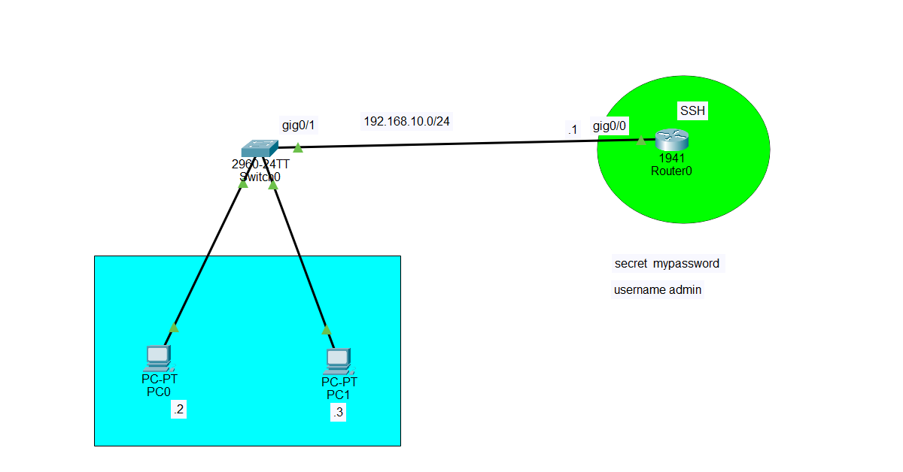

# SSH Configuration in Cisco Packet Tracer

## 1. What is SSH?

**SSH (Secure Shell)** is a protocol used to remotely access and manage network devices such as Cisco routers and switches. SSH provides an encrypted and secure connection between the administrator's computer and the network device.

SSH uses **TCP port 22**.

Compared with Telnet:

* SSH → encrypted and secure
* Telnet → unencrypted
* SSH → TCP port 22
* Telnet → TCP port 23

In this topology, PC0 and PC1 will remotely access Router0 using SSH.

## 2. Topology



## 3. IP Addressing

```text
Router0 G0/0: 192.168.10.1/24
PC0:          192.168.10.2/24
PC1:          192.168.10.3/24

Default gateway for PC0 and PC1:
192.168.10.1
```

## 4. Configure Router0 Interface

Open Router0 → CLI:

```cisco
enable
configure terminal

hostname Router0

interface gigabitEthernet 0/0
 ip address 192.168.10.1 255.255.255.0
 no shutdown
 exit
```

Verify:

```cisco
show ip interface brief
```

The interface should show **up/up**.

## 5. Configure the Domain Name

SSH requires a domain name before generating the RSA keys.

```cisco
ip domain-name network.local
```

## 6. Create the SSH Username and Password

The topology uses:

```text
Username: admin
Password: mypassword
```

Configure:

```cisco
username admin privilege 15 secret mypassword
```

The `secret` keyword stores the password in a more secure hashed form.

## 7. Generate RSA Keys

SSH uses RSA keys to establish the secure connection.

```cisco
crypto key generate rsa
```

When Packet Tracer asks for the modulus size, enter:

```text
1024
```

## 8. Enable SSH Version 2

```cisco
ip ssh version 2
```

Verify:

```cisco
show ip ssh
```

## 9. Configure the VTY Lines

VTY lines are the virtual terminal lines used for remote access.

```cisco
line vty 0 4
 login local
 transport input ssh
 exit
```

`login local` tells the router to use the locally configured username and password.

`transport input ssh` tells the router to accept SSH connections.

Because only SSH is specified, Telnet is not allowed on these VTY lines.

## 10. Save the Configuration

```cisco
end
copy running-config startup-config
```

You can also use:

```cisco
write memory
```

## 11. Configure PC0

Go to:

```text
PC0 → Desktop → IP Configuration
```

Configure:

```text
IP Address:       192.168.10.2
Subnet Mask:      255.255.255.0
Default Gateway: 192.168.10.1
```

## 12. Configure PC1

Go to:

```text
PC1 → Desktop → IP Configuration
```

Configure:

```text
IP Address:       192.168.10.3
Subnet Mask:      255.255.255.0
Default Gateway: 192.168.10.1
```

## 13. Test Connectivity

Before testing SSH, verify that the PCs can reach Router0.

From PC0:

```text
Desktop → Command Prompt
```

Run:

```text
ping 192.168.10.1
```

You should receive replies from Router0.

If the ping fails, check the IP addresses, subnet masks, cables, switch connections, and Router0 interface status.

## 14. Connect to Router0 Using SSH

From PC0:

```text
Desktop → Command Prompt
```

Run:

```text
ssh -l admin 192.168.10.1
```

When prompted for the password, enter:

```text
mypassword
```

You should receive:

```text
Router0#
```

This means PC0 has successfully established an SSH session with Router0.

You can also test from PC1:

```text
ssh -l admin 192.168.10.1
```

Password:

```text
mypassword
```

## 15. Verify the SSH Configuration

Check SSH:

```cisco
show ip ssh
```

Check the VTY configuration:

```cisco
show running-config | section line vty
```

You should see:

```text
line vty 0 4
 login local
 transport input ssh
```

Check the username:

```cisco
show running-config | include username
```

## 16. Complete Router0 Configuration

```cisco
enable
configure terminal

hostname Router0

interface gigabitEthernet 0/0
 ip address 192.168.10.1 255.255.255.0
 no shutdown
 exit

ip domain-name network.local

username admin privilege 15 secret mypassword

crypto key generate rsa
```

When asked for the RSA modulus, enter:

```text
1024
```

Then:

```cisco
ip ssh version 2

line vty 0 4
 login local
 transport input ssh
 exit

end

copy running-config startup-config
```

## 17. How SSH Works in This Topology

```text
PC0
192.168.10.2
    │
    │ SSH / TCP 22
    ↓
Switch0
    │
    ↓
Router0
192.168.10.1
    │
    ├── Receives SSH connection
    ├── Checks the username
    ├── Checks the password
    ├── Establishes the encrypted SSH session
    └── Gives the administrator remote CLI access
```

The main SSH configuration requirements are:

```text
1. Router interface must have an IP address
2. PC must be able to reach the router
3. Hostname must be configured
4. Domain name must be configured
5. Local username and secret must be created
6. RSA keys must be generated
7. SSH version 2 should be enabled
8. VTY lines must use login local
9. VTY lines must allow SSH
10. Configuration should be saved
```

### Important Commands to Remember

```cisco
ip domain-name network.local
username admin privilege 15 secret mypassword
crypto key generate rsa
ip ssh version 2
line vty 0 4
login local
transport input ssh
```

**In short:** SSH allows you to securely manage Router0 remotely from PC0 or PC1 using an encrypted connection over **TCP port 22**.
