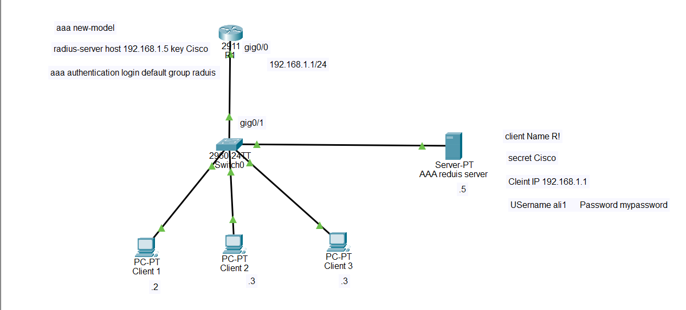

# AAA with RADIUS and Telnet Configuration in Cisco Packet Tracer

## 1. What is AAA?

**AAA** stands for **Authentication, Authorization, and Accounting**. It is a security framework used to control and monitor access to network devices such as routers and switches.

AAA has three main functions:

* **Authentication** – Verifies who the user is by checking the username and password.
* **Authorization** – Determines what the authenticated user is allowed to do.
* **Accounting** – Records information about the user's activity, such as login times and commands.

Instead of creating users locally on every router, AAA can use a central authentication server such as a **RADIUS server**.

## 2. What is RADIUS?

**RADIUS (Remote Authentication Dial-In User Service)** is an AAA protocol that allows a network device to communicate with a central server for user authentication.

RADIUS commonly uses:

* **UDP 1812** – Authentication
* **UDP 1813** – Accounting

In this topology, R1 sends the user's login credentials to the RADIUS server. The RADIUS server checks the username and password and tells R1 whether the login should be accepted or rejected.

## 3. What is Telnet?

**Telnet** is a protocol that allows remote access to a router or switch through a command-line interface.

Telnet uses:

* **TCP port 23**

However, Telnet is **not encrypted**, so usernames, passwords, and management traffic can be exposed. In real networks, **SSH is preferred** because SSH provides encryption.

In this Packet Tracer lab, Telnet is being used to demonstrate how AAA and RADIUS authentication work.

## 4. Topology



## 5. IP Addressing

```text
R1 G0/0:       192.168.1.1/24
Client1:       192.168.1.2/24
Client2:       192.168.1.3/24
Client3:       192.168.1.4/24
AAA Server:    192.168.1.5/24

Subnet Mask:
255.255.255.0

Default Gateway for PCs and Server:
192.168.1.1
```

## 6. Configure R1's Interface

Open **R1 → CLI**:

```cisco
enable
configure terminal

hostname R1

interface gigabitEthernet 0/0
 ip address 192.168.1.1 255.255.255.0
 no shutdown
 exit
```

Verify the interface:

```cisco
show ip interface brief
```

The interface should show:

```text
GigabitEthernet0/0    192.168.1.1    up    up
```

## 7. Enable AAA

Enable the AAA framework:

```cisco
aaa new-model
```

This activates AAA functionality on R1.

## 8. Configure the RADIUS Server on R1

Tell R1 where the RADIUS server is located:

```cisco
radius-server host 192.168.1.5 key Cisco
```

Here:

```text
192.168.1.5 = RADIUS server IP address
Cisco       = shared secret
```

The shared secret must be exactly the same on R1 and the RADIUS server.

## 9. Configure AAA Authentication

Tell R1 to use RADIUS to authenticate users:

```cisco
aaa authentication login default group radius
```

This means:

```text
User tries to log in
        ↓
R1 sends authentication request to RADIUS
        ↓
RADIUS checks username/password
        ↓
RADIUS sends ACCEPT or REJECT
```

## 10. Configure the VTY Lines for Telnet

The VTY lines are used for remote access to the router.

```cisco
line vty 0 4
 login authentication default
 transport input telnet
 exit
```

The commands mean:

```text
login authentication default
        ↓
Use the AAA authentication method named "default".

transport input telnet
        ↓
Allow Telnet connections through the VTY lines.
```

## 11. Configure the RADIUS Server

Open:

```text
Server → Services → AAA
```

Turn the AAA service **On**.

Add R1 as a client:

```text
Client Name: R1
Client IP:   192.168.1.1
Secret:      Cisco
```

The secret must match the router configuration:

```cisco
radius-server host 192.168.1.5 key Cisco
```

## 12. Create the RADIUS User

On the Packet Tracer AAA server, add:

```text
Username: ali1
Password: mypassword
```

Click **Add**.

Now the RADIUS server has a user called `ali1`.

## 13. Configure Client1

Go to:

```text
Client1 → Desktop → IP Configuration
```

Configure:

```text
IP Address:       192.168.1.2
Subnet Mask:      255.255.255.0
Default Gateway: 192.168.1.1
```

## 14. Configure Client2

```text
IP Address:       192.168.1.3
Subnet Mask:      255.255.255.0
Default Gateway: 192.168.1.1
```

## 15. Configure Client3

```text
IP Address:       192.168.1.4
Subnet Mask:      255.255.255.0
Default Gateway: 192.168.1.1
```

## 16. Configure the AAA Server IP Address

Go to:

```text
Server → Desktop → IP Configuration
```

Configure:

```text
IP Address:       192.168.1.5
Subnet Mask:      255.255.255.0
Default Gateway: 192.168.1.1
```

## 17. Test Connectivity

Before testing Telnet, make sure the devices can reach R1.

From Client1:

```text
Desktop → Command Prompt
```

Run:

```text
ping 192.168.1.1
```

You should receive replies from R1.

Also test the RADIUS server:

```text
ping 192.168.1.5
```

If these tests fail, check the IP addresses, subnet masks, cables, switch connections, and R1's interface.

## 18. Test Telnet

From Client1:

```text
Desktop → Command Prompt
```

Enter:

```text
telnet 192.168.1.1
```

R1 should ask for the username and password.

Enter:

```text
Username: ali1
Password: mypassword
```

If authentication succeeds, you should receive:

```text
R1#
```

You are now remotely managing R1 through Telnet, while the credentials are being authenticated by the RADIUS server.

## 19. How the Authentication Process Works

```text
Client1
192.168.1.2
     │
     │ Telnet
     │ TCP 23
     ↓
    R1
192.168.1.1
     │
     │ RADIUS authentication
     │ UDP 1812
     ↓
RADIUS Server
192.168.1.5
     │
     │ Check:
     │ Username = ali1
     │ Password = mypassword
     ↓
 ACCEPT or REJECT
     │
     ↓
    R1
     │
     ↓
Client gets access or is denied
```

## 20. Verify the Configuration

Check AAA:

```cisco
show running-config | include aaa
```

Check the RADIUS configuration:

```cisco
show running-config | include radius
```

Check the VTY configuration:

```cisco
show running-config | section line vty
```

You should see:

```text
line vty 0 4
 login authentication default
 transport input telnet
```

You can also check the running configuration:

```cisco
show running-config
```

## 21. Complete R1 Configuration

```cisco
enable
configure terminal

hostname R1

interface gigabitEthernet 0/0
 ip address 192.168.1.1 255.255.255.0
 no shutdown
 exit

aaa new-model

radius-server host 192.168.1.5 key Cisco

aaa authentication login default group radius

line vty 0 4
 login authentication default
 transport input telnet
 exit

end

copy running-config startup-config
```

## 22. RADIUS Server Configuration

```text
Services → AAA → On

Client:
Client Name: R1
Client IP:   192.168.1.1
Secret:      Cisco

User:
Username:    ali1
Password:    mypassword
```

## 23. Important Commands to Remember

```text
aaa new-model
        ↓
Enables AAA.

radius-server host 192.168.1.5 key Cisco
        ↓
Tells R1 where the RADIUS server is and defines the shared secret.

aaa authentication login default group radius
        ↓
Tells R1 to authenticate login attempts using RADIUS.

line vty 0 4
        ↓
Selects the remote-access VTY lines.

login authentication default
        ↓
Makes the VTY lines use the AAA method named "default".

transport input telnet
        ↓
Allows Telnet connections.

copy running-config startup-config
        ↓
Saves the configuration.
```

## 24. Final Concept

The complete process is:

```text
User
  ↓
Telnet to R1
  ↓
R1 receives username/password
  ↓
R1 contacts RADIUS Server
  ↓
RADIUS checks the credentials
  ↓
       ┌───────────────┐
       │               │
    ACCEPT           REJECT
       │               │
       ↓               ↓
   R1 allows        R1 denies
    access           access
```

**AAA** controls authentication, authorization, and accounting. **RADIUS** provides centralized AAA authentication. **Telnet** provides the remote management connection, using **TCP port 23**. In this lab, the RADIUS server stores the user `ali1`, while R1 uses the RADIUS server to verify that user's credentials.
