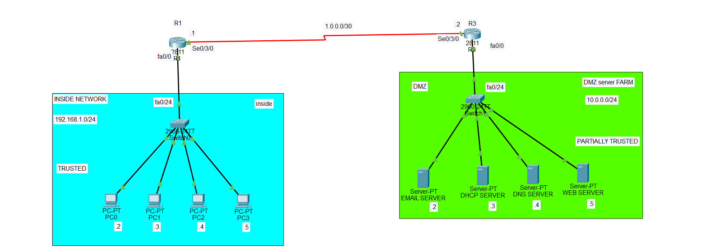

# Zone-Based Firewall (ZBF) Configuration in Cisco Packet Tracer

## 1. What is a Zone-Based Firewall?

A **Zone-Based Firewall (ZBF)** is a Cisco firewall feature that controls traffic between different **security zones** on a router.

Instead of applying an ACL directly to an interface, ZBF places interfaces into **zones** and then creates security policies that control traffic moving from one zone to another.

The basic idea is:

```text
Zone A → Firewall Policy → Zone B
```

The firewall decides whether traffic is:

* **Allowed (Pass)**
* **Dropped (Drop)**
* **Inspected (Inspect)**

ZBF is called **zone-based** because security policies are applied between zones rather than directly to individual interfaces.

## 2. What is a Security Zone?

A **zone** is a logical group of interfaces that share the same security level or trust relationship.

In this topology, we have two zones:

```text
INSIDE
192.168.1.0/24
Trusted network
        │
        │
        ↓
       R1
        │
        │ WAN
        ↓
       R3
        │
        ↓
DMZ
10.0.0.0/24
Partially trusted network
```

### Inside Zone

The inside network contains trusted client devices:

```text
192.168.1.0/24
```

PCs:

```text
PC0 = 192.168.1.2
PC1 = 192.168.1.3
PC2 = 192.168.1.4
PC3 = 192.168.1.5
```

### DMZ Zone

The DMZ contains servers that provide services to other networks:

```text
10.0.0.0/24
```

Servers:

```text
Email Server = 10.0.0.2
DHCP Server  = 10.0.0.3
DNS Server   = 10.0.0.4
Web Server   = 10.0.0.5
```

## 3. Topology



R1 connects the trusted inside network to the WAN, while R3 connects the WAN to the DMZ.

## 4. IP Addressing

### R1

```text
Fa0/0:    192.168.1.1/24
Se0/3/0:  1.0.0.1/30
```

### R3

```text
Se0/3/0:  1.0.0.2/30
Fa0/0:    10.0.0.1/24
```

### Inside PCs

```text
PC0: 192.168.1.2/24
PC1: 192.168.1.3/24
PC2: 192.168.1.4/24
PC3: 192.168.1.5/24

Default Gateway:
192.168.1.1
```

### DMZ Servers

```text
Email Server: 10.0.0.2/24
DHCP Server:  10.0.0.3/24
DNS Server:   10.0.0.4/24
Web Server:   10.0.0.5/24

Default Gateway:
10.0.0.1
```

## 5. Configure R1

```cisco
enable
configure terminal

hostname R1

interface fa0/0
 ip address 192.168.1.1 255.255.255.0
 no shutdown
 exit

interface serial 0/3/0
 ip address 1.0.0.1 255.255.255.252
 no shutdown
 exit
```

## 6. Configure R3

```cisco
enable
configure terminal

hostname R3

interface serial 0/3/0
 ip address 1.0.0.2 255.255.255.252
 no shutdown
 exit

interface fa0/0
 ip address 10.0.0.1 255.255.255.0
 no shutdown
 exit
```

## 7. Configure Routing

The routers need routes to reach the remote networks.

### R1

```cisco
ip route 10.0.0.0 255.255.255.0 1.0.0.2
```

This tells R1:

```text
To reach 10.0.0.0/24,
send the traffic to R3 at 1.0.0.2.
```

### R3

```cisco
ip route 192.168.1.0 255.255.255.0 1.0.0.1
```

This tells R3:

```text
To reach 192.168.1.0/24,
send the traffic to R1 at 1.0.0.1.
```

Test connectivity before configuring the firewall:

```text
PC0 → ping 10.0.0.5
```

The ping should work before applying restrictive firewall policies.

## 8. Create the Security Zones

On R3, create the two zones:

```cisco
zone security INSIDE
zone security DMZ
```

The names are not required to be exactly `INSIDE` and `DMZ`, but these names make the configuration easier to understand.

## 9. Assign Interfaces to Zones

The interface toward the inside/WAN side is placed in the appropriate zone, and the interface toward the server network is placed in the DMZ.

For this topology, on R3:

```cisco
interface serial 0/3/0
 zone-member security INSIDE
 exit

interface fa0/0
 zone-member security DMZ
 exit
```

Now R3 understands:

```text
Se0/3/0 → INSIDE zone
Fa0/0   → DMZ zone
```

## 10. Create a Class Map

A **class map** identifies the traffic that we want the firewall to inspect.

For example, to identify ICMP traffic:

```cisco
class-map type inspect match-any INSIDE-TO-DMZ
 match protocol icmp
```

This class map identifies ICMP traffic such as ping.

You can also create a class map for web traffic:

```cisco
class-map type inspect match-any WEB-TRAFFIC
 match protocol http
```

And HTTPS:

```cisco
class-map type inspect match-any HTTPS-TRAFFIC
 match protocol https
```

## 11. Create a Policy Map

The **policy map** determines what the firewall does with the traffic identified by the class map.

For example:

```cisco
policy-map type inspect INSIDE-TO-DMZ-POLICY

 class type inspect INSIDE-TO-DMZ
  inspect

 class class-default
  drop
```

Here:

```text
ICMP traffic → inspect
Everything else → drop
```

The `inspect` action is important because it allows the firewall to track the traffic and its return traffic.

## 12. Create the Zone Pair

A **zone pair** defines the direction in which the firewall policy applies.

For traffic from the INSIDE zone to the DMZ:

```cisco
zone-pair security INSIDE-TO-DMZ source INSIDE destination DMZ
 service-policy type inspect INSIDE-TO-DMZ-POLICY
```

The direction is:

```text
INSIDE → DMZ
```

Therefore, the policy controls traffic going from the inside network toward the DMZ.

## 13. Understanding Inspect

`inspect` is different from simply `permit`.

When the firewall inspects a connection, it keeps track of the traffic.

For example:

```text
PC0 → Web Server
     ↓
 INSIDE
     ↓
   R3
     ↓
   DMZ
     ↓
Web Server
```

If the traffic is inspected, the firewall understands the connection and can allow legitimate return traffic.

Conceptually:

```text
Inside → DMZ
   │
   │ INSPECT
   ↓
Allowed connection
   │
   ↓
Return traffic
   │
   ↓
Allowed as part of the established session
```

## 14. Example: Allow HTTP from Inside to DMZ

If you want inside users to access the web server using HTTP:

```cisco
class-map type inspect match-any HTTP-TRAFFIC
 match protocol http
```

Then:

```cisco
policy-map type inspect INSIDE-TO-DMZ-POLICY

 class type inspect HTTP-TRAFFIC
  inspect

 class class-default
  drop
```

Then apply the policy to the zone pair:

```cisco
zone-pair security INSIDE-TO-DMZ source INSIDE destination DMZ
 service-policy type inspect INSIDE-TO-DMZ-POLICY
```

Now:

```text
PC → HTTP request → Web Server
       TCP 80
          ↓
       INSPECT
          ↓
        ALLOW
```

## 15. Allow HTTPS

For HTTPS:

```cisco
class-map type inspect match-any HTTPS-TRAFFIC
 match protocol https
```

Add it to the policy:

```cisco
policy-map type inspect INSIDE-TO-DMZ-POLICY

 class type inspect HTTP-TRAFFIC
  inspect

 class type inspect HTTPS-TRAFFIC
  inspect

 class class-default
  drop
```

Now inside users can access the web server using:

```text
http://10.0.0.5
```

and:

```text
https://10.0.0.5
```

provided the corresponding services are enabled on the Packet Tracer web server.

## 16. Allow DNS

If inside clients need to query the DNS server in the DMZ:

```cisco
class-map type inspect match-any DNS-TRAFFIC
 match protocol dns
```

Then:

```cisco
policy-map type inspect INSIDE-TO-DMZ-POLICY

 class type inspect DNS-TRAFFIC
  inspect

 class class-default
  drop
```

## 17. Allow Multiple Services

You can create one class map containing multiple protocols:

```cisco
class-map type inspect match-any INSIDE-TO-DMZ-TRAFFIC
 match protocol http
 match protocol https
 match protocol dns
 match protocol icmp
```

Then:

```cisco
policy-map type inspect INSIDE-TO-DMZ-POLICY

 class type inspect INSIDE-TO-DMZ-TRAFFIC
  inspect

 class class-default
  drop
```

This means:

```text
HTTP   → INSPECT
HTTPS  → INSPECT
DNS    → INSPECT
ICMP   → INSPECT
Other  → DROP
```

## 18. Important Concept: Zone-to-Zone Traffic

With ZBF, traffic moving between zones is controlled by a **zone-pair**.

For example:

```text
INSIDE ───────→ DMZ
          │
          ↓
    Zone Pair Policy
          │
     ┌────┴────┐
     │         │
  Inspect    Drop
```

If there is **no zone pair/policy allowing the traffic**, traffic between zones is generally dropped.

This is different from ordinary routing.

Routing answers:

> "Where should the packet go?"

The firewall answers:

> "Is this traffic allowed to go there?"

## 19. Important Difference Between ACL and ZBF

### ACL

An ACL normally works by matching things such as:

```text
Source IP
Destination IP
Protocol
Port
```

and then:

```text
Permit
Deny
```

### Zone-Based Firewall

ZBF works using:

```text
Zone
   ↓
Zone Pair
   ↓
Class Map
   ↓
Policy Map
   ↓
Inspect / Pass / Drop
```

The basic ZBF structure is:

```text
Interface
    ↓
Zone
    ↓
Zone Pair
    ↓
Class Map
    ↓
Policy Map
    ↓
Inspect / Pass / Drop
```

## 20. Important Direction Concept

Suppose:

```text
INSIDE → R3 → DMZ
```

The traffic moves from the **INSIDE zone** to the **DMZ zone**.

The zone pair is:

```cisco
zone-pair security INSIDE-TO-DMZ source INSIDE destination DMZ
```

The reverse direction is different:

```text
DMZ → R3 → INSIDE
```

That would require a policy from:

```text
DMZ → INSIDE
```

For example:

```cisco
zone-pair security DMZ-TO-INSIDE source DMZ destination INSIDE
```

Do not assume that creating an INSIDE-to-DMZ policy automatically creates a DMZ-to-INSIDE policy. The directions are separate security policies.

## 21. Verify the Configuration

Check zones:

```cisco
show zone security
```

Check zone pairs:

```cisco
show zone-pair security
```

Check the policy:

```cisco
show policy-map type inspect zone-pair
```

Check interfaces:

```cisco
show ip interface brief
```

Check routing:

```cisco
show ip route
```

## 22. Save the Configuration

```cisco
end
copy running-config startup-config
```

## 23. Basic Configuration Structure

The important commands to remember are:

```cisco
zone security INSIDE
zone security DMZ

interface serial 0/3/0
 zone-member security INSIDE
 exit

interface fa0/0
 zone-member security DMZ
 exit

class-map type inspect match-any INSIDE-TO-DMZ
 match protocol icmp

policy-map type inspect INSIDE-TO-DMZ-POLICY
 class type inspect INSIDE-TO-DMZ
  inspect
 class class-default
  drop

zone-pair security INSIDE-TO-DMZ source INSIDE destination DMZ
 service-policy type inspect INSIDE-TO-DMZ-POLICY
```

## 24. Final Concept

The easiest way to understand Zone-Based Firewall is:

```text
                  R3 FIREWALL
                      │
          ┌───────────┴───────────┐
          │                       │
       INSIDE                    DMZ
    192.168.1.0/24            10.0.0.0/24
          │                       │
         PCs                    Servers
```

When a packet travels:

```text
INSIDE → DMZ
```

R3 checks the **zone-pair policy**.

The policy checks the traffic using the **class map**.

The **policy map** decides what to do:

```text
INSIDE → DMZ
     ↓
Class Map
     ↓
Policy Map
     ↓
INSPECT → allow and track
PASS    → allow without inspection
DROP    → deny
```

The main idea is:

> **A Zone-Based Firewall controls traffic between security zones. You create zones, assign interfaces to those zones, identify traffic with class maps, define the action with policy maps, and connect the zones with a zone pair.**
