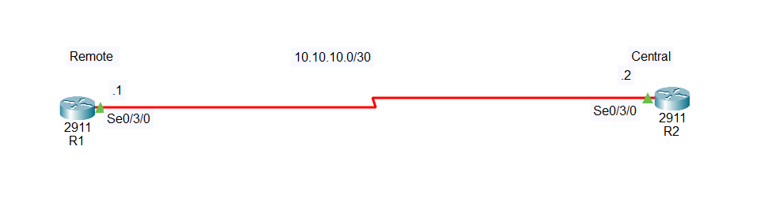

# PPP PAP Authentication Configuration

## What is PAP Authentication?

**PAP (Password Authentication Protocol)** is an authentication method used with **PPP (Point-to-Point Protocol)**.

PAP allows two routers connected through a serial link to verify each other's identity using a **username and password**.

In simple terms:

* Router 1 sends its username and password to Router 2.
* Router 2 checks whether the information is correct.
* Router 2 also sends its username and password to Router 1.
* Router 1 checks whether the information is correct.

If both usernames and passwords match, the PPP connection can be established.

> **Note:** PAP sends the username and password in a simple form, so it is less secure than CHAP. PAP is mainly useful for learning and basic authentication scenarios.

---

# Network Topology



## IP Addressing Table

| Device | Interface    | IP Address | Subnet Mask     |
| ------ | ------------ | ---------- | --------------- |
| R1     | Serial 0/3/0 | 10.10.10.1 | 255.255.255.252 |
| R2     | Serial 0/3/0 | 10.10.10.2 | 255.255.255.252 |

---

# Step 1: Create the Topology in Cisco Packet Tracer

1. Open **Cisco Packet Tracer**.
2. Add two **Cisco 2911 routers**.
3. Make sure both routers have serial interfaces available.
4. If the serial interface is missing, turn off the router and install a serial module.
5. Connect R1 and R2 using a **Serial DCE cable**.

Connect:

```text
R1 Serial 0/3/0  ----------------  R2 Serial 0/3/0
```

The router connected to the **DCE side** must provide a clock rate.

---

# Step 2: Configure Router R1

Enter the following commands:

```bash
enable
configure terminal

username R2 secret PasswordR2

interface serial 0/3/0
ip address 10.10.10.1 255.255.255.252
encapsulation ppp
ppp authentication pap
ppp pap sent-username R1 password PasswordR1
no shutdown

end
```

If R1 is the **DCE side**, configure:

```bash
configure terminal
interface serial 0/3/0
clock rate 64000
end
```

## Explanation of R1 Authentication

```bash
username R2 secret PasswordR2
```

R1 expects R2 to send:

* Username: `R2`
* Password: `PasswordR2`

```bash
ppp pap sent-username R1 password PasswordR1
```

R1 sends the following information to R2:

* Username: `R1`
* Password: `PasswordR1`

---

# Step 3: Configure Router R2

Enter the following commands:

```bash
enable
configure terminal

username R1 secret PasswordR1

interface serial 0/3/0
ip address 10.10.10.2 255.255.255.252
encapsulation ppp
ppp authentication pap
ppp pap sent-username R2 password PasswordR2
no shutdown

end
```

## Explanation of R2 Authentication

```bash
username R1 secret PasswordR1
```

R2 expects R1 to send:

* Username: `R1`
* Password: `PasswordR1`

```bash
ppp pap sent-username R2 password PasswordR2
```

R2 sends the following information to R1:

* Username: `R2`
* Password: `PasswordR2`

---

# Step 4: Understand the Authentication Process

The following table shows how PAP authentication works:

| Router | Sends Username | Sends Password | Other Router Must Have          |
| ------ | -------------- | -------------- | ------------------------------- |
| R1     | R1             | PasswordR1     | `username R1 secret PasswordR1` |
| R2     | R2             | PasswordR2     | `username R2 secret PasswordR2` |

### R1 → R2

R1 sends:

```text
Username: R1
Password: PasswordR1
```

R2 checks its configuration:

```bash
username R1 secret PasswordR1
```

The information matches, so R2 accepts R1.

### R2 → R1

R2 sends:

```text
Username: R2
Password: PasswordR2
```

R1 checks its configuration:

```bash
username R2 secret PasswordR2
```

The information matches, so R1 accepts R2.

---

# Step 5: Verify the Configuration

Check the interface status on both routers:

```bash
show ip interface brief
```

The serial interface should show:

```text
Status: up
Protocol: up
```

For more information about the serial interface, use:

```bash
show interfaces serial 0/3/0
```

You can also check the PPP configuration using:

```bash
show running-config
```

---

# Step 6: Test Connectivity

From R1, ping R2:

```bash
ping 10.10.10.2
```

From R2, ping R1:

```bash
ping 10.10.10.1
```

If PAP and PPP are configured correctly, the ping should be successful.

---

# Important Commands

## Enable PPP

```bash
encapsulation ppp
```

Changes the serial interface from the default Cisco HDLC protocol to PPP.

## Enable PAP Authentication

```bash
ppp authentication pap
```

Requires the connected router to authenticate using PAP.

## Create Login Information for the Other Router

```bash
username R2 secret PasswordR2
```

This means:

> "I expect the other router to send this username and password."

## Send Your Username and Password

```bash
ppp pap sent-username R1 password PasswordR1
```

This means:

> "This is the username and password I will send to the other router."

## Configure the DCE Clock Rate

```bash
clock rate 64000
```

This command is configured only on the **DCE side** of the serial connection.

---

# Troubleshooting

If the serial connection is not working, check the following:

```bash
show ip interface brief
```

Make sure the interface status is:

```text
up/up
```

Check that both routers are using PPP:

```bash
show interfaces serial 0/3/0
```

Make sure the username and password match correctly.

For example:

R1 sends:

```text
R1 / PasswordR1
```

Therefore, R2 must have:

```bash
username R1 secret PasswordR1
```

Also make sure that the `clock rate` command is configured on the DCE side and that both serial interfaces have the `no shutdown` command.

---

# Conclusion

In this lab, R1 and R2 were connected using a serial connection with the network **10.10.10.0/30**.

The routers were configured to use **PPP encapsulation** and **PAP authentication**. Each router sends its own username and password, while the other router stores the matching credentials using the `username` command.

After the PPP and PAP configuration is complete, the connection can be verified using `show ip interface brief` and tested using the `ping` command.

**Simple rule to remember:**

> `username` = What I expect from the other router.

> `ppp pap sent-username` = What I send to the other router.
