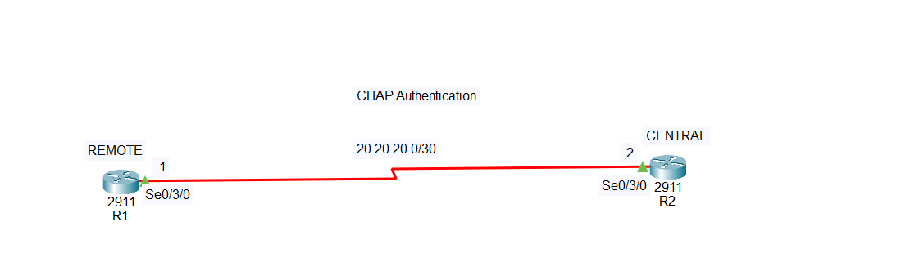

# PPP CHAP Authentication Configuration

## What is CHAP Authentication?

**CHAP (Challenge Handshake Authentication Protocol)** is an authentication method used with **PPP (Point-to-Point Protocol)**.

CHAP allows two routers connected through a serial link to verify each other's identity.

Unlike PAP, CHAP does **not send the actual password directly across the network**. Instead, CHAP uses a **challenge and response process**, making it more secure than PAP.

### In simple terms:

1. One router sends a **challenge**.
2. The other router responds using its configured password.
3. The router checks the response.
4. If the information matches, authentication is successful.
5. The serial connection becomes operational.

For CHAP to work correctly, each router must have:

* The correct username of the other router.
* The correct password.
* PPP encapsulation.
* CHAP authentication enabled.

> **Important:** By default, the CHAP username is usually the **hostname of the remote router**.

---

# Network Topology



## IP Addressing Table

| Device | Interface    | IP Address | Subnet Mask     |
| ------ | ------------ | ---------- | --------------- |
| R1     | Serial 0/3/0 | 20.20.20.1 | 255.255.255.252 |
| R2     | Serial 0/3/0 | 20.20.20.2 | 255.255.255.252 |

---

# Step 1: Create the Topology in Cisco Packet Tracer

1. Open **Cisco Packet Tracer**.
2. Add two **Cisco 2911 routers**.
3. Make sure both routers have serial interfaces.
4. If the serial interface is missing, turn off the router and install a serial module.
5. Connect R1 and R2 using a **Serial DCE cable**.

The connection should be:

```text id="i7z6bf"
R1 Serial 0/3/0  ----------------  R2 Serial 0/3/0
```

The router connected to the **DCE side** requires the `clock rate` command.

---

# Step 2: Configure Router R1

Enter the following commands on R1:

```bash id="jjc1y9"
enable
configure terminal

hostname R1

username R2 secret CHAPpassword

interface serial 0/3/0
ip address 20.20.20.1 255.255.255.252
encapsulation ppp
ppp authentication chap
no shutdown

end
```

If R1 is connected to the **DCE side**, configure:

```bash id="4bqz8d"
configure terminal
interface serial 0/3/0
clock rate 64000
end
```

## Explanation of R1 Configuration

### `hostname R1`

```bash id="wlzd1v"
hostname R1
```

This gives the router the name **R1**.

R2 will use this name when authenticating R1.

---

### `username R2 secret CHAPpassword`

```bash id="dtmy4p"
username R2 secret CHAPpassword
```

This means that R1 expects the remote router to identify itself as:

```text id="w78d6w"
Username: R2
Password: CHAPpassword
```

The username **R2** must match the hostname of Router R2.

---

### `encapsulation ppp`

```bash id="6o8pgd"
encapsulation ppp
```

Changes the serial interface from the default Cisco HDLC encapsulation to **PPP**.

CHAP works with PPP.

---

### `ppp authentication chap`

```bash id="s4vuw7"
ppp authentication chap
```

Enables CHAP authentication on the serial interface.

---

# Step 3: Configure Router R2

Enter the following commands on R2:

```bash id="4s2ygc"
enable
configure terminal

hostname R2

username R1 secret CHAPpassword

interface serial 0/3/0
ip address 20.20.20.2 255.255.255.252
encapsulation ppp
ppp authentication chap
no shutdown

end
```

## Explanation of R2 Configuration

### `hostname R2`

```bash id="1kzz9b"
hostname R2
```

This gives the router the name **R2**.

R1 will use this name when authenticating R2.

---

### `username R1 secret CHAPpassword`

```bash id="kjh4ds"
username R1 secret CHAPpassword
```

This means that R2 expects the remote router to identify itself as:

```text id="r0b3xq"
Username: R1
Password: CHAPpassword
```

The username **R1** must match the hostname of Router R1.

---

# Step 4: How CHAP Authentication Works

The authentication process works in both directions.

### R1 authenticates R2

R2 identifies itself as:

```text id="f7e4q6"
Username: R2
Password: CHAPpassword
```

R1 checks:

```bash id="az1gbf"
username R2 secret CHAPpassword
```

If the information matches, R1 accepts R2.

---

### R2 authenticates R1

R1 identifies itself as:

```text id="rcl20s"
Username: R1
Password: CHAPpassword
```

R2 checks:

```bash id="p5c6j7"
username R1 secret CHAPpassword
```

If the information matches, R2 accepts R1.

---

# Step 5: Verify the Serial Connection

On both routers, use:

```bash id="wr91us"
show ip interface brief
```

A successful connection should show:

```text id="u35jtf"
Interface              IP-Address      OK? Method Status                Protocol
Serial0/3/0            20.20.20.1      YES manual up                    up
```

The important part is:

```text id="ebq3l1"
Status: up
Protocol: up
```

You can also check the serial interface using:

```bash id="b6t2qn"
show interfaces serial 0/3/0
```

---

# Step 6: Test Connectivity

From R1, ping R2:

```bash id="my87wq"
ping 20.20.20.2
```

From R2, ping R1:

```bash id="k0vtz7"
ping 20.20.20.1
```

If the configuration is correct, the ping should be successful.

Example:

```text id="e5zh7d"
!!!!!
```

This means that the connection between R1 and R2 is working.

---

# Important Commands

## Configure PPP

```bash id="t7msbv"
encapsulation ppp
```

Enables PPP on the serial interface.

## Enable CHAP

```bash id="ng9e4c"
ppp authentication chap
```

Requires CHAP authentication on the PPP connection.

## Create Credentials for the Remote Router

On R1:

```bash id="dvcdz9"
username R2 secret CHAPpassword
```

On R2:

```bash id="u7gyjd"
username R1 secret CHAPpassword
```

## Configure Clock Rate on the DCE Side

```bash id="6ohclz"
clock rate 64000
```

Only configure this command on the router connected to the **DCE side**.

## Check Interface Status

```bash id="8o3h9z"
show ip interface brief
```

## Test Connectivity

```bash id="ynm6xm"
ping 20.20.20.2
```

---

# Troubleshooting

If the link remains down, check the following:

### 1. Make sure both routers use PPP

```bash id="0o1e0t"
show interfaces serial 0/3/0
```

Both routers should use PPP encapsulation.

### 2. Check the usernames

On R1:

```bash id="60t1p9"
username R2 secret CHAPpassword
```

The username must match R2's hostname.

On R2:

```bash id="dlh7wn"
username R1 secret CHAPpassword
```

The username must match R1's hostname.

### 3. Check the passwords

The CHAP passwords must match on both sides.

### 4. Check the interface status

```bash id="cyqxmo"
show ip interface brief
```

The serial interfaces should show:

```text id="kkm0zq"
up/up
```

### 5. Check the DCE clock rate

If the router is connected to the DCE side:

```bash id="q98tqm"
interface serial 0/3/0
clock rate 64000
```

---

# Conclusion

In this lab, two Cisco 2911 routers were connected through a serial link using the **20.20.20.0/30** network.

The connection was configured with:

* **PPP encapsulation**
* **CHAP authentication**
* **R1 IP address: 20.20.20.1**
* **R2 IP address: 20.20.20.2**

CHAP is more secure than PAP because it uses a **challenge-response authentication process** instead of sending the actual password directly across the serial connection.

### Simple rule to remember:

> The `hostname` identifies the router.

> The `username` command contains the name of the remote router.

> The `secret` must match the CHAP password configured for authentication.

When the usernames and passwords are configured correctly on both routers, the serial link should become **up/up** and the routers should successfully communicate with each other.
