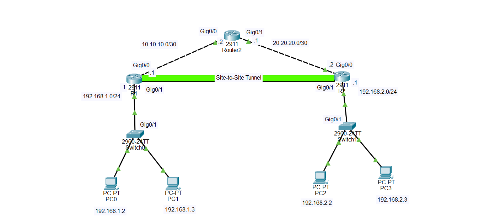

# Site-to-Site IPsec VPN — Cisco Packet Tracer Lab

## 1. Introduction

A **Site-to-Site VPN (Virtual Private Network)** securely connects two separate private networks through an intermediate or public network.

In this lab, we connect the LAN of **R1 (192.168.1.0/24)** to the LAN of **R2 (192.168.2.0/24)** using an **IPsec Site-to-Site VPN**.

The VPN creates a secure logical tunnel between R1 and R2. Devices on the two LANs can communicate with each other as if they were connected through a private network, even though the routers communicate through a transit network.

### Main purpose of the VPN

Without the VPN, traffic between:

* PC0: `192.168.1.2`
* PC2: `192.168.2.2`

would travel through the routers normally.

With the Site-to-Site VPN, traffic between the two private LANs is identified as interesting traffic and is encrypted before being sent across the transit network.

For example:

`PC0 → R1 → encrypted IPsec tunnel → R2 → PC2`

The VPN protects the traffic using IPsec security mechanisms.

---

## 2. Understanding the Topology

The topology contains three routers:

* **R1** — Cisco 2911
* **Router2** — Cisco 2911, acting as the transit/ISP router
* **R2** — Cisco 2911

There are two private LANs:

* Site 1: `192.168.1.0/24`
* Site 2: `192.168.2.0/24`

The transit networks between the VPN routers and Router2 are:

* R1 ↔ Router2: `10.10.10.0/30`
* Router2 ↔ R2: `20.20.20.0/30`

The VPN tunnel is logically established between **R1 and R2**.

### Topology



---

# 3. IP Addressing Table

| Device  | Interface          | IP Address    | Subnet Mask       |
| ------- | ------------------ | ------------- | ----------------- |
| R1      | GigabitEthernet0/0 | `10.10.10.1`  | `255.255.255.252` |
| Router2 | GigabitEthernet0/0 | `10.10.10.2`  | `255.255.255.252` |
| Router2 | GigabitEthernet0/1 | `20.20.20.1`  | `255.255.255.252` |
| R2      | GigabitEthernet0/0 | `20.20.20.2`  | `255.255.255.252` |
| R1      | GigabitEthernet0/1 | `192.168.1.1` | `255.255.255.0`   |
| R2      | GigabitEthernet0/1 | `192.168.2.1` | `255.255.255.0`   |
| PC0     | NIC                | `192.168.1.2` | `255.255.255.0`   |
| PC1     | NIC                | `192.168.1.3` | `255.255.255.0`   |
| PC2     | NIC                | `192.168.2.2` | `255.255.255.0`   |
| PC3     | NIC                | `192.168.2.3` | `255.255.255.0`   |

### Default gateways

Site 1:

```text
PC0 → 192.168.1.1
PC1 → 192.168.1.1
```

Site 2:

```text
PC2 → 192.168.2.1
PC3 → 192.168.2.1
```

---

# 4. How the Site-to-Site VPN Works

The VPN configuration has several important components.

### 1. Interesting traffic

We define which traffic should be protected by the VPN.

In this lab:

```text
192.168.1.0/24 ↔ 192.168.2.0/24
```

Therefore:

```text
PC0 (192.168.1.2) → PC2 (192.168.2.2)
```

is protected by IPsec.

But traffic such as:

```text
PC0 → Router2
```

is not VPN-protected because it is not traffic between the two protected LANs.

### 2. IKE Phase 1

The routers establish a secure management connection using **IKE Phase 1**.

They negotiate parameters such as:

* Encryption
* Hashing
* Authentication
* Diffie-Hellman group
* Lifetime
* Pre-shared key

### 3. IPsec Phase 2

After Phase 1 is established, the routers negotiate the IPsec security parameters used to protect the actual user data.

### 4. Encryption

When PC0 sends traffic to PC2:

```text
PC0
 ↓
R1
 ↓
Encrypt
 ↓
Router2
 ↓
R2
 ↓
Decrypt
 ↓
PC2
```

Router2 does not need to understand the private traffic inside the encrypted IPsec payload.

---

# 5. Step 1 — Build the Topology in Cisco Packet Tracer

Add the following devices:

```text
3 × Cisco 2911 routers
2 × Cisco 2960 switches
4 × PCs
```

Rename the routers:

```text
R1
Router2
R2
```

Connect them as follows:

```text
R1 G0/0       → Router2 G0/0
Router2 G0/1  → R2 G0/0

R1 G0/1       → Switch0
R2 G0/1       → Switch1

Switch0        → PC0
Switch0        → PC1

Switch1        → PC2
Switch1        → PC3
```

---

# 6. Step 2 — Configure R1 Interfaces

Enter R1:

```text
enable
configure terminal
hostname R1

interface gigabitEthernet0/0
ip address 10.10.10.1 255.255.255.252
no shutdown
exit

interface gigabitEthernet0/1
ip address 192.168.1.1 255.255.255.0
no shutdown
exit
```

---

# 7. Step 3 — Configure Router2 Interfaces

Enter Router2:

```text
enable
configure terminal
hostname Router2

interface gigabitEthernet0/0
ip address 10.10.10.2 255.255.255.252
no shutdown
exit

interface gigabitEthernet0/1
ip address 20.20.20.1 255.255.255.252
no shutdown
exit
```

Router2 is the transit router between R1 and R2.

---

# 8. Step 4 — Configure R2 Interfaces

Enter R2:

```text
enable
configure terminal
hostname R2

interface gigabitEthernet0/0
ip address 20.20.20.2 255.255.255.252
no shutdown
exit

interface gigabitEthernet0/1
ip address 192.168.2.1 255.255.255.0
no shutdown
exit
```

---

# 9. Step 5 — Configure the PCs

## PC0

```text
IP Address:      192.168.1.2
Subnet Mask:     255.255.255.0
Default Gateway: 192.168.1.1
```

## PC1

```text
IP Address:      192.168.1.3
Subnet Mask:     255.255.255.0
Default Gateway: 192.168.1.1
```

## PC2

```text
IP Address:      192.168.2.2
Subnet Mask:     255.255.255.0
Default Gateway: 192.168.2.1
```

## PC3

```text
IP Address:      192.168.2.3
Subnet Mask:     255.255.255.0
Default Gateway: 192.168.2.1
```

---

# 10. Step 6 — Configure Routing

The routers must know how to reach the remote LANs and transit networks.

## R1

R1 needs a route to Site 2:

```text
ip route 192.168.2.0 255.255.255.0 10.10.10.2
```

## Router2

Router2 needs routes to both private LANs:

```text
ip route 192.168.1.0 255.255.255.0 10.10.10.1
ip route 192.168.2.0 255.255.255.0 20.20.20.2
```

## R2

R2 needs a route to Site 1:

```text
ip route 192.168.1.0 255.255.255.0 20.20.20.1
```

At this point, routing should work even before the VPN is configured.

Test from PC0:

```text
ping 192.168.2.2
```

The ping should succeed if all interfaces, IP addresses, and routes are correct.

---

# 11. Step 7 — Configure IKE Phase 1 on R1

On R1:

```text
crypto isakmp policy 10
encryption aes
hash sha
authentication pre-share
group 5
lifetime 86400
exit
```

Configure the pre-shared key:

```text
crypto isakmp key cisco123 address 20.20.20.2
```

The key must match on both VPN routers.

---

# 12. Step 8 — Configure IKE Phase 1 on R2

On R2:

```text
crypto isakmp policy 10
encryption aes
hash sha
authentication pre-share
group 5
lifetime 86400
exit
```

Configure the same pre-shared key:

```text
crypto isakmp key cisco123 address 10.10.10.1
```

Important:

The encryption, hash, authentication, Diffie-Hellman group, and other Phase 1 parameters must be compatible on both routers.

The pre-shared key must be the same:

```text
cisco123
```

---

# 13. Step 9 — Create the IPsec Transform Set

The transform set defines how the actual data will be protected.

On R1:

```text
crypto ipsec transform-set VPN-SET esp-aes esp-sha-hmac
```

On R2:

```text
crypto ipsec transform-set VPN-SET esp-aes esp-sha-hmac
```

Both routers should use compatible transform-set parameters.

---

# 14. Step 10 — Create the Interesting Traffic ACL on R1

The ACL identifies traffic that should be encrypted.

On R1:

```text
access-list 110 permit ip 192.168.1.0 0.0.0.255 192.168.2.0 0.0.0.255
```

This means:

```text
Source:
192.168.1.0/24

Destination:
192.168.2.0/24
```

In other words:

```text
Site 1 LAN → Site 2 LAN
```

is interesting traffic.

---

# 15. Step 11 — Create the Interesting Traffic ACL on R2

On R2:

```text
access-list 110 permit ip 192.168.2.0 0.0.0.255 192.168.1.0 0.0.0.255
```

This is the reverse direction:

```text
Site 2 LAN → Site 1 LAN
```

The ACLs must describe the same traffic flow from opposite directions.

---

# 16. Step 12 — Create the Crypto Map on R1

On R1:

```text
crypto map VPN-MAP 10 ipsec-isakmp
set peer 20.20.20.2
set transform-set VPN-SET
match address 110
exit
```

This crypto map tells R1:

```text
Peer = R2
Protected traffic = ACL 110
Protection method = VPN-SET
```

---

# 17. Step 13 — Create the Crypto Map on R2

On R2:

```text
crypto map VPN-MAP 10 ipsec-isakmp
set peer 10.10.10.1
set transform-set VPN-SET
match address 110
exit
```

R2 now knows:

```text
Peer = R1
Protected traffic = ACL 110
Protection method = VPN-SET
```

---

# 18. Step 14 — Apply the Crypto Map to the Outside Interfaces

The crypto map must be applied to the interfaces facing the transit network.

On R1:

```text
interface gigabitEthernet0/0
crypto map VPN-MAP
exit
```

On R2:

```text
interface gigabitEthernet0/0
crypto map VPN-MAP
exit
```

The VPN tunnel is therefore associated with:

```text
R1 G0/0 ↔ transit network ↔ R2 G0/0
```

---

# 19. Step 15 — Save the Configuration

On R1:

```text
end
copy running-config startup-config
```

On Router2:

```text
end
copy running-config startup-config
```

On R2:

```text
end
copy running-config startup-config
```

---

# 20. Step 16 — Test the VPN

First test basic connectivity.

From PC0:

```text
ping 192.168.1.1
```

This tests the connection to R1.

Then:

```text
ping 10.10.10.2
```

This tests connectivity through the transit network.

Then test the remote LAN:

```text
ping 192.168.2.2
```

The first ping may trigger the VPN negotiation. It is normal for the first packet or packets to fail while the IPsec tunnel is being established.

Try the ping again.

---

# 21. Verify IKE Phase 1

On R1 or R2:

```text
show crypto isakmp sa
```

A successful IKE relationship should show an established/active state such as:

```text
QM_IDLE
```

`QM_IDLE` indicates that the IKE Phase 1 security association is established and ready for IPsec negotiation.

---

# 22. Verify IPsec

Use:

```text
show crypto ipsec sa
```

Look for counters such as:

```text
#pkts encaps
#pkts encrypt
#pkts decaps
#pkts decrypt
```

When PC0 communicates with PC2, these counters should increase.

For example:

```text
PC0 → PC2
```

should increase encryption/encapsulation counters on R1.

Traffic returning:

```text
PC2 → PC0
```

should increase decryption/decapsulation counters.

---

# 23. Verify the Crypto Map

Use:

```text
show crypto map
```

You should see information about:

```text
Peer
Transform set
Access-list
Interface
```

This confirms that the crypto map has been configured and applied.

---

# 24. Verify the ACL

On R1:

```text
show access-lists 110
```

On R2:

```text
show access-lists 110
```

You should see the packet counters increase when traffic between the two LANs is generated.

For example:

```text
PC0 → PC2
```

should match the ACL on R1.

---

# 25. Important Concept — The VPN Does Not Replace Routing

A common beginner mistake is thinking:

```text
VPN = Routing
```

This is incorrect.

They have different jobs.

### Routing

Routing determines:

```text
Where should the packet go?
```

### VPN

The VPN determines:

```text
Should this traffic be encrypted and protected?
```

Therefore, both routing and VPN configuration are required.

For example:

```text
PC0
192.168.1.2
   |
   ↓
R1
   |
   | Routing
   ↓
VPN encryption
   |
   ↓
Router2
   |
   ↓
R2
   |
   ↓
PC2
192.168.2.2
```

---

# 26. Important Concept — Router2 Is Not a VPN Endpoint

In this topology:

```text
R1 ================= R2
       VPN Tunnel
```

Router2 is only the transit router.

The IPsec peers are:

```text
R1 ↔ R2
```

Router2 simply forwards the encrypted packets.

The packet path is:

```text
PC0
 ↓
R1
 ↓
Router2
 ↓
R2
 ↓
PC2
```

The VPN relationship is:

```text
R1 ================= R2
       IPsec VPN
```

---

# 27. What Happens When PC0 Pings PC2?

Suppose:

```text
PC0 = 192.168.1.2
PC2 = 192.168.2.2
```

PC0 creates an ICMP Echo Request:

```text
Source:      192.168.1.2
Destination: 192.168.2.2
```

PC0 sends the packet to its default gateway:

```text
192.168.1.1
```

R1 receives the packet.

R1 checks its VPN ACL:

```text
192.168.1.0/24 → 192.168.2.0/24
```

The packet matches the ACL.

Therefore, R1 identifies it as interesting traffic.

R1 encrypts the packet using IPsec.

The encrypted packet travels:

```text
R1 → Router2 → R2
```

Router2 simply forwards the encrypted packet.

R2 receives it and decrypts it.

R2 sends the original packet toward:

```text
192.168.2.2
```

PC2 receives the ICMP Echo Request and sends the Echo Reply.

The reply travels back through the VPN:

```text
PC2
 ↓
R2
 ↓
Router2
 ↓
R1
 ↓
PC0
```

---

# 28. Troubleshooting

If the VPN does not work, troubleshoot in this order.

### Check interfaces

On every router:

```text
show ip interface brief
```

Make sure the required interfaces are:

```text
up
up
```

### Check routing

On R1:

```text
show ip route
```

On R2:

```text
show ip route
```

Make sure each router knows how to reach the remote LAN.

### Check transit connectivity

From R1:

```text
ping 10.10.10.2
```

From R2:

```text
ping 20.20.20.1
```

### Check IKE

```text
show crypto isakmp sa
```

If Phase 1 is not established, check:

* Peer IP address
* Pre-shared key
* Encryption
* Hash
* Authentication
* Diffie-Hellman group
* IKE policy

### Check IPsec

```text
show crypto ipsec sa
```

Check whether encryption and decryption counters are increasing.

### Check the ACL

```text
show access-lists 110
```

Make sure the ACL correctly identifies:

```text
192.168.1.0/24 ↔ 192.168.2.0/24
```

### Check the crypto map

```text
show crypto map
```

Make sure:

```text
Peer
Transform set
ACL
```

are correct.

### Check that the crypto map is applied

On R1:

```text
show running-config
```

Look under:

```text
interface gigabitEthernet0/0
```

You should see:

```text
crypto map VPN-MAP
```

Do the same on R2.

---

# 29. Useful Verification Commands

```text
show ip interface brief
show ip route
show running-config
show access-lists 110
show crypto isakmp sa
show crypto ipsec sa
show crypto map
```

---

# 30. Useful Testing Commands

From PC0:

```text
ping 192.168.1.1
ping 192.168.2.1
ping 192.168.2.2
ping 192.168.2.3
```

From PC2:

```text
ping 192.168.2.1
ping 192.168.1.1
ping 192.168.1.2
ping 192.168.1.3
```

You can also use:

```text
tracert 192.168.2.2
```

from PC0 to observe the path.

---

# 31. Key Terms

### VPN

Virtual Private Network. A technology used to securely connect networks over another network.

### Site-to-Site VPN

A VPN that connects two entire networks rather than connecting only one individual user.

### IPsec

A collection of protocols used to secure IP traffic through authentication, integrity, and encryption.

### IKE

Internet Key Exchange. Used to negotiate security parameters and establish the security association used by IPsec.

### Pre-shared Key

A secret password configured on both VPN peers.

Example:

```text
cisco123
```

### Crypto Map

A Cisco configuration that connects the VPN peer, protected traffic, and IPsec transform set.

### Interesting Traffic

Traffic identified by an ACL that should be protected by the VPN.

In this lab:

```text
192.168.1.0/24 ↔ 192.168.2.0/24
```

### Transform Set

Defines the IPsec protection algorithms used to secure the traffic.

Example:

```text
esp-aes esp-sha-hmac
```

---

# 32. Complete R1 Configuration

```text
enable
configure terminal

hostname R1

interface gigabitEthernet0/0
ip address 10.10.10.1 255.255.255.252
crypto map VPN-MAP
no shutdown
exit

interface gigabitEthernet0/1
ip address 192.168.1.1 255.255.255.0
no shutdown
exit

ip route 192.168.2.0 255.255.255.0 10.10.10.2

crypto isakmp policy 10
encryption aes
hash sha
authentication pre-share
group 5
lifetime 86400
exit

crypto isakmp key cisco123 address 20.20.20.2

crypto ipsec transform-set VPN-SET esp-aes esp-sha-hmac

access-list 110 permit ip 192.168.1.0 0.0.0.255 192.168.2.0 0.0.0.255

crypto map VPN-MAP 10 ipsec-isakmp
set peer 20.20.20.2
set transform-set VPN-SET
match address 110
exit

end
copy running-config startup-config
```

---

# 33. Complete Router2 Configuration

```text
enable
configure terminal

hostname Router2

interface gigabitEthernet0/0
ip address 10.10.10.2 255.255.255.252
no shutdown
exit

interface gigabitEthernet0/1
ip address 20.20.20.1 255.255.255.252
no shutdown
exit

ip route 192.168.1.0 255.255.255.0 10.10.10.1
ip route 192.168.2.0 255.255.255.0 20.20.20.2

end
copy running-config startup-config
```

---

# 34. Complete R2 Configuration

```text
enable
configure terminal

hostname R2

interface gigabitEthernet0/0
ip address 20.20.20.2 255.255.255.252
crypto map VPN-MAP
no shutdown
exit

interface gigabitEthernet0/1
ip address 192.168.2.1 255.255.255.0
no shutdown
exit

ip route 192.168.1.0 255.255.255.0 20.20.20.1

crypto isakmp policy 10
encryption aes
hash sha
authentication pre-share
group 5
lifetime 86400
exit

crypto isakmp key cisco123 address 10.10.10.1

crypto ipsec transform-set VPN-SET esp-aes esp-sha-hmac

access-list 110 permit ip 192.168.2.0 0.0.0.255 192.168.1.0 0.0.0.255

crypto map VPN-MAP 10 ipsec-isakmp
set peer 10.10.10.1
set transform-set VPN-SET
match address 110
exit

end
copy running-config startup-config
```

---

# 35. Final Verification

After completing the configuration:

```text
PC0 → ping 192.168.2.2
```

Then check R1:

```text
show crypto isakmp sa
```

Then:

```text
show crypto ipsec sa
```

Then:

```text
show access-lists 110
```

If the VPN is operating correctly:

```text
PC0
192.168.1.2
      |
      ↓
     R1
      |
      |  Encrypted IPsec Traffic
      |====================|
      |                    |
   Router2               R2
                         |
                         ↓
                       PC2
                    192.168.2.2
```

The most important idea to remember is:

**Routing gets the packet to the remote network, while IPsec encrypts and protects the traffic between the two VPN sites.**

This lab demonstrates a basic **Cisco Site-to-Site IPsec VPN** using R1 and R2 as VPN peers and Router2 as the transit network.
