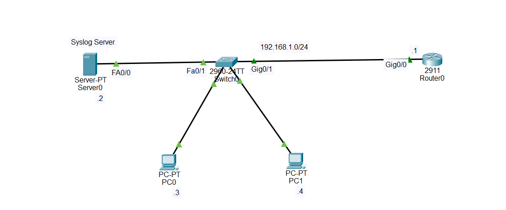

# Cisco Syslog Server Configuration — Cisco Packet Tracer Lab

## 1. Introduction

**Syslog** is a protocol used to collect, store, and monitor system messages generated by network devices such as routers, switches, firewalls, and servers.

Instead of checking logs separately on every router or switch, a network administrator can configure the devices to send their log messages to a central **Syslog Server**.

In this lab, we will configure a **Cisco Router0** to send its system log messages to a **Syslog Server**.

The Syslog Server will receive and display messages generated by the router, such as:

* Interface status changes
* Configuration changes
* Login or authentication events
* Routing events
* System notifications
* Warning messages
* Error messages
* Debug messages, when enabled

The main idea is:

```text
Network Device
      |
      | Syslog messages
      ↓
Syslog Server
      |
      ↓
Centralized logging and monitoring
```

This is useful because a network administrator does not need to log in to every router individually to inspect its logs.

---

# 2. Understanding Syslog

Syslog is based on a **client-server model**.

The network device acts as the **Syslog client**, while the Syslog server receives and stores the messages.

In this lab:

```text
Router0 = Syslog Client
Server0 = Syslog Server
```

The router generates a message such as:

```text
%LINK-5-CHANGED: Interface GigabitEthernet0/0 changed state to up
```

The router can send this message to the Syslog server.

The Syslog server then displays the message in its Syslog service.

---

# 3. Why Use a Syslog Server?

Without a centralized Syslog server, messages are mainly available locally on the network device.

For example:

```text
Router0
   |
   +---- Local logs
```

With a Syslog server:

```text
                  +----------------+
                  | Syslog Server  |
                  +----------------+
                    ↑      ↑      ↑
                    |      |      |
                   R1     R2     SW1
```

Multiple devices can send their logs to one central location.

This makes it easier to:

* Monitor the network
* Troubleshoot problems
* Investigate interface failures
* Monitor configuration changes
* Identify security-related events
* Keep historical logs
* Understand what happened on a device

---

# 4. Syslog Severity Levels

Cisco Syslog messages have severity levels from **0 to 7**.

The lower the number, the more serious the message.

```text
Level 0 — Emergencies
Level 1 — Alerts
Level 2 — Critical
Level 3 — Errors
Level 4 — Warnings
Level 5 — Notifications
Level 6 — Informational
Level 7 — Debugging
```

### Level 0 — Emergencies

The system is unusable.

```text
0 = Emergencies
```

### Level 1 — Alerts

Immediate action is required.

```text
1 = Alerts
```

### Level 2 — Critical

Critical conditions.

```text
2 = Critical
```

### Level 3 — Errors

Error conditions.

```text
3 = Errors
```

### Level 4 — Warnings

Warning conditions.

```text
4 = Warnings
```

### Level 5 — Notifications

Normal but significant events.

```text
5 = Notifications
```

### Level 6 — Informational

General information about the system.

```text
6 = Informational
```

### Level 7 — Debugging

Detailed debugging information.

```text
7 = Debugging
```

---

# 5. Important Concept — What Does a Logging Level Mean?

Suppose you configure:

```text
logging trap debugging
```

This means the router sends **severity level 0 through level 7** messages to the Syslog server.

It does NOT mean that only level 7 messages are sent.

The rule is:

```text
logging trap <level>
```

means:

```text
Send messages from level 0 up to the specified level.
```

For example:

```text
logging trap errors
```

means:

```text
0 Emergencies
1 Alerts
2 Critical
3 Errors
```

are sent.

But:

```text
4 Warnings
5 Notifications
6 Informational
7 Debugging
```

are not sent.

If you configure:

```text
logging trap informational
```

the router sends:

```text
0
1
2
3
4
5
6
```

If you configure:

```text
logging trap debugging
```

the router sends:

```text
0
1
2
3
4
5
6
7
```

Therefore, **the higher the configured severity number, the more messages are included.**

---

# 6. Topology

The topology contains:

* 1 Cisco 2911 router
* 1 Cisco 2960 switch
* 1 Server-PT Syslog server
* 2 PCs



---

# 7. IP Addressing Table

| Device        | Interface | IP Address    | Subnet Mask     | Default Gateway |
| ------------- | --------- | ------------- | --------------- | --------------- |
| Router0       | Gig0/0    | `192.168.1.1` | `255.255.255.0` | N/A             |
| Syslog Server | Fa0       | `192.168.1.2` | `255.255.255.0` | `192.168.1.1`   |
| PC0           | Fa0       | `192.168.1.3` | `255.255.255.0` | `192.168.1.1`   |
| PC1           | Fa0       | `192.168.1.4` | `255.255.255.0` | `192.168.1.1`   |

All devices are in the same subnet:

```text
192.168.1.0/24
```

---

# 8. Step 1 — Build the Topology in Cisco Packet Tracer

Add the following devices:

```text
1 × Cisco 2911 Router
1 × Cisco 2960 Switch
1 × Server-PT
2 × PCs
```

Rename the router:

```text
Router0
```

Rename the switch:

```text
Switch0
```

Rename the server:

```text
Server0
```

Connect the devices:

```text
Server0 → Switch0
Router0 → Switch0
PC0     → Switch0
PC1     → Switch0
```

You can use Copper Straight-Through cables.

---

# 9. Step 2 — Configure Router0

Enter Router0:

```text
enable
configure terminal
hostname Router0
```

Configure GigabitEthernet0/0:

```text
interface gigabitEthernet0/0
ip address 192.168.1.1 255.255.255.0
no shutdown
exit
```

Verify:

```text
show ip interface brief
```

You should see something similar to:

```text
GigabitEthernet0/0    192.168.1.1    YES    manual    up    up
```

---

# 10. Step 3 — Configure the Syslog Server

Click:

```text
Server0
```

Go to:

```text
Desktop
→ IP Configuration
```

Configure:

```text
IP Address:       192.168.1.2
Subnet Mask:      255.255.255.0
Default Gateway:  192.168.1.1
```

The server is now:

```text
192.168.1.2/24
```

---

# 11. Step 4 — Enable the Syslog Service

On Server0, go to:

```text
Services
```

Then select:

```text
SYSLOG
```

Make sure the Syslog service is:

```text
ON
```

The server is now ready to receive Syslog messages.

In Packet Tracer, the Syslog service provides the interface where received log messages can be viewed.

---

# 12. Step 5 — Configure PC0

Click:

```text
PC0
→ Desktop
→ IP Configuration
```

Configure:

```text
IP Address:       192.168.1.3
Subnet Mask:      255.255.255.0
Default Gateway:  192.168.1.1
```

---

# 13. Step 6 — Configure PC1

Click:

```text
PC1
→ Desktop
→ IP Configuration
```

Configure:

```text
IP Address:       192.168.1.4
Subnet Mask:      255.255.255.0
Default Gateway:  192.168.1.1
```

---

# 14. Step 7 — Test Basic Connectivity

Before configuring Syslog, make sure the devices can communicate.

From PC0:

```text
ping 192.168.1.1
```

This tests PC0 → Router0.

Then:

```text
ping 192.168.1.2
```

This tests PC0 → Syslog Server.

From Router0:

```text
ping 192.168.1.2
```

This tests Router0 → Syslog Server.

All of these should succeed before continuing.

---

# 15. Step 8 — Configure Router0 to Send Logs to the Syslog Server

Enter Router0:

```text
enable
configure terminal
```

Configure the Syslog server:

```text
logging host 192.168.1.2
```

This command tells Router0:

```text
Send Syslog messages to 192.168.1.2
```

Since:

```text
192.168.1.2 = Syslog Server
```

Router0 now knows where to send its logs.

---

# 16. Step 9 — Configure the Syslog Severity Level

For this lab, configure:

```text
logging trap informational
```

This tells Router0 to send Syslog messages from:

```text
Level 0
Level 1
Level 2
Level 3
Level 4
Level 5
Level 6
```

to the Syslog server.

It does not include level 7 debugging messages.

If you want all levels, including debugging, you can use:

```text
logging trap debugging
```

This includes:

```text
0 through 7
```

For a normal lab, `informational` is a good choice.

---

# 17. Step 10 — Add a Timestamp to Log Messages

Configure:

```text
service timestamps log datetime msec
```

This causes log messages to include the date and time.

For example, instead of seeing only:

```text
%LINK-5-CHANGED: Interface GigabitEthernet0/0 changed state to up
```

you can receive a message containing timestamp information.

Timestamps are very important when troubleshooting because they tell you **when an event happened**.

---

# 18. Step 11 — Configure the Router's Local Logging

You can also configure local logging:

```text
logging buffered 4096
```

This stores log messages in the router's local logging buffer.

You can view them with:

```text
show logging
```

There are therefore two useful places to look:

```text
Router0
   ↓
Local log buffer

Router0
   ↓
Syslog Server
```

The Syslog server provides centralized logging, while the router can maintain its own local log buffer.

---

# 19. Step 12 — Generate a Syslog Event

One of the easiest ways to generate a log message is to shut down and enable an interface.

On Router0:

```text
configure terminal
interface gigabitEthernet0/0
shutdown
```

The interface goes down.

You may see a message such as:

```text
%LINK-5-CHANGED: Interface GigabitEthernet0/0, changed state to administratively down
```

Then enable the interface again:

```text
no shutdown
```

You may see messages indicating that the interface changed state.

These events can be sent to the Syslog server.

---

# 20. Step 13 — Check the Syslog Server

Go to:

```text
Server0
→ Services
→ SYSLOG
```

You should see received Syslog messages.

The exact appearance of the messages can vary depending on the Packet Tracer version.

You may see events related to:

```text
Interface status
Configuration changes
System notifications
Warnings
Errors
```

This confirms that Router0 is sending its logs to the central Syslog server.

---

# 21. Step 14 — Verify Syslog Configuration on Router0

Use:

```text
show running-config
```

Look for:

```text
logging host 192.168.1.2
logging trap informational
service timestamps log datetime msec
logging buffered 4096
```

You can also use:

```text
show logging
```

This displays the router's current logging information and local log messages.

---

# 22. Understanding `show logging`

The command:

```text
show logging
```

is used to inspect the router's logging configuration and local log buffer.

It can show information such as:

```text
Logging enabled
Logging buffer
Logging host
Trap logging level
Console logging level
Timestamp configuration
Recent log messages
```

Remember:

```text
show logging
```

shows the router's logging information.

It does not mean that you are viewing the Syslog server's complete database.

For the centralized logs, open the Syslog service on:

```text
Server0
→ Services
→ SYSLOG
```

---

# 23. Understanding the Complete Process

The complete Syslog process is:

```text
1. Router0 generates an event
             ↓
2. Router0 creates a Syslog message
             ↓
3. Router0 checks the configured logging level
             ↓
4. Router0 sends the message to 192.168.1.2
             ↓
5. Switch0 forwards the message
             ↓
6. Server0 receives the Syslog message
             ↓
7. Server0 displays/stores the message
```

In this topology:

```text
Router0
192.168.1.1
     |
     | Syslog message
     ↓
Switch0
     |
     ↓
Server0
192.168.1.2
```

---

# 24. Understanding the Syslog Message Format

A Cisco Syslog message commonly contains information about:

```text
Device
Timestamp
Facility
Severity
Message ID
Description
```

For example:

```text
%LINK-5-CHANGED
```

can be interpreted as:

```text
LINK = facility
5    = severity
CHANGED = message/event
```

Therefore:

```text
%LINK-5-CHANGED
```

means that the message belongs to the LINK facility and has severity level 5.

---

# 25. Syslog Facility

The **facility** identifies the type or source of the message.

Examples can include:

```text
LINK
LINEPROTO
SYS
CONFIG
OSPF
IP
```

For example:

```text
%LINEPROTO-5-UPDOWN
```

The facility is:

```text
LINEPROTO
```

The severity is:

```text
5
```

The event is:

```text
UPDOWN
```

---

# 26. Syslog Severity vs Logging Trap

It is very important not to confuse the severity level of a message with the configured logging threshold.

Suppose a message is:

```text
%LINK-5-CHANGED
```

The `5` means the individual message has severity:

```text
5 = Notifications
```

If the router is configured with:

```text
logging trap informational
```

then level 5 is sent because:

```text
5 <= 6
```

If the router is configured with:

```text
logging trap errors
```

then level 5 is NOT sent because:

```text
5 > 3
```

If the router is configured with:

```text
logging trap debugging
```

then level 5 is sent because:

```text
5 <= 7
```

The important rule is:

```text
Configured level = maximum severity number allowed to be sent
```

---

# 27. Logging Configuration Example

A simple Syslog configuration on Router0 is:

```text
enable
configure terminal

logging host 192.168.1.2
logging trap informational
service timestamps log datetime msec
logging buffered 4096

end
copy running-config startup-config
```

This configuration means:

```text
Syslog Server = 192.168.1.2
Trap Level    = Informational (0–6)
Timestamp     = Enabled
Local Buffer  = 4096 bytes
```

---

# 28. Complete Router0 Configuration

```text
enable
configure terminal

hostname Router0

interface gigabitEthernet0/0
ip address 192.168.1.1 255.255.255.0
no shutdown
exit

logging host 192.168.1.2
logging trap informational
service timestamps log datetime msec
logging buffered 4096

end
copy running-config startup-config
```

---

# 29. Useful Verification Commands

Check interface status:

```text
show ip interface brief
```

Check routing:

```text
show ip route
```

Check logging:

```text
show logging
```

Check the running configuration:

```text
show running-config
```

Check connectivity to the Syslog server:

```text
ping 192.168.1.2
```

---

# 30. Troubleshooting

If the Syslog server does not receive messages, troubleshoot in this order.

### 1. Check Router0 interface

```text
show ip interface brief
```

Make sure:

```text
GigabitEthernet0/0 = up/up
```

### 2. Check the server IP address

Server0 should have:

```text
IP Address: 192.168.1.2
Subnet Mask: 255.255.255.0
Gateway: 192.168.1.1
```

### 3. Test connectivity

From Router0:

```text
ping 192.168.1.2
```

If this fails, fix the network connection before troubleshooting Syslog.

### 4. Check the Syslog service

On Server0:

```text
Services
→ SYSLOG
```

Make sure:

```text
SYSLOG = ON
```

### 5. Check Router0 logging configuration

Use:

```text
show running-config
```

Look for:

```text
logging host 192.168.1.2
```

### 6. Check the logging status

Use:

```text
show logging
```

Verify that the Syslog server is configured.

### 7. Generate a new event

For example:

```text
interface gigabitEthernet0/0
shutdown
```

Then:

```text
no shutdown
```

Return to:

```text
Server0
→ Services
→ SYSLOG
```

and check for the new messages.

---

# 31. Local Logging vs Syslog Server

These two concepts are related but different.

### Local logging

The router keeps log messages locally.

Example:

```text
logging buffered 4096
```

View them with:

```text
show logging
```

### Remote Syslog logging

The router sends messages to another device, the Syslog server.

Example:

```text
logging host 192.168.1.2
```

The advantage is centralized monitoring.

---

# 32. Console Logging, Buffered Logging, and Syslog Logging

Cisco devices can send logs to different destinations.

### Console logging

Messages appear directly on the router console.

### Buffered logging

Messages are stored in the router's memory.

```text
logging buffered 4096
```

### Syslog logging

Messages are sent to a remote Syslog server.

```text
logging host 192.168.1.2
```

Conceptually:

```text
                       +------------------+
                       |   Syslog Server  |
                       |   192.168.1.2    |
                       +--------▲---------+
                                |
                                | Remote logs
                                |
+----------------+              |
|    Router0     |--------------+
| 192.168.1.1    |
+----------------+
       |
       +---- Console logs
       |
       +---- Local buffered logs
```

---

# 33. Final Lab Objective

The goal of this lab is to demonstrate centralized logging.

After completing the configuration, the environment should work like this:

```text
                 Syslog Messages
                       |
                       ↓
              +----------------+
              |    Server0     |
              | Syslog Server  |
              | 192.168.1.2    |
              +-------▲--------+
                      |
                      |
                 +----+----+
                 | Switch0 |
                 +----▲----+
                      |
                      |
              +-------+--------+
              |    Router0     |
              | 192.168.1.1    |
              +----------------+
```

When an event occurs on Router0:

```text
Router0 Event
     ↓
Syslog Message
     ↓
Switch0
     ↓
Syslog Server
     ↓
Log displayed/stored
```

---

# 34. Key Commands to Remember

```text
logging host 192.168.1.2
```

Specifies the remote Syslog server.

```text
logging trap informational
```

Specifies the maximum severity level sent to the Syslog server.

```text
service timestamps log datetime msec
```

Adds timestamps to log messages.

```text
logging buffered 4096
```

Stores logs locally in the router's logging buffer.

```text
show logging
```

Displays the router's logging information.

```text
show running-config
```

Displays the current configuration.

```text
ping 192.168.1.2
```

Tests connectivity between Router0 and the Syslog server.

---

# 35. Final Summary

A **Syslog Server** provides centralized collection of log messages from network devices.

In this Packet Tracer lab:

```text
Router0 = Syslog Client
Server0 = Syslog Server
Switch0 = Layer 2 Connectivity
PC0/PC1 = End Devices
```

The Syslog server is:

```text
192.168.1.2
```

Router0 is:

```text
192.168.1.1
```

The important configuration on Router0 is:

```text
logging host 192.168.1.2
logging trap informational
service timestamps log datetime msec
logging buffered 4096
```

The most important concept to remember is:

**The router generates the log → the router sends the log → the Syslog server receives and displays/stores the log.**

Also remember the severity rule:

```text
0 = Emergencies
1 = Alerts
2 = Critical
3 = Errors
4 = Warnings
5 = Notifications
6 = Informational
7 = Debugging
```

And:

```text
logging trap informational
```

means:

```text
Send levels 0 through 6
```

while:

```text
logging trap debugging
```

means:

```text
Send levels 0 through 7
```

Therefore, Syslog allows a network administrator to monitor network devices from a **centralized logging location** instead of checking each device individually.
