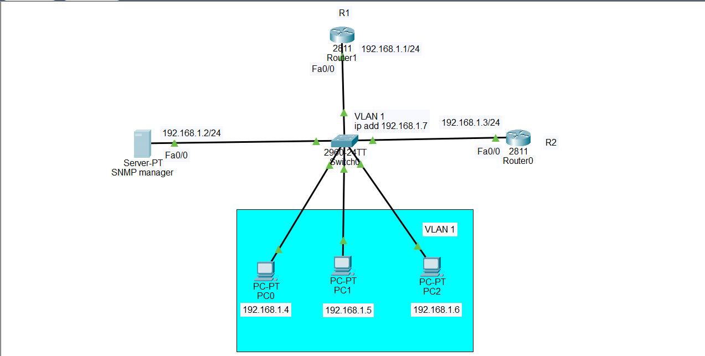

# SNMP Server Configuration — Cisco Packet Tracer Lab

## 1. Introduction

**SNMP (Simple Network Management Protocol)** is a protocol used to **monitor and manage network devices** such as routers, switches, servers, printers, and access points.

In this lab, we will configure a **Server-PT as an SNMP Manager** and configure the Cisco routers and switch to act as **SNMP-managed devices**.

The basic idea is:

```text
SNMP Manager
     |
     | SNMP
     ↓
Network Devices
```

The SNMP Manager can ask network devices for information such as:

* Interface status
* Packets sent and received
* Errors
* Device information
* Network statistics
* Other SNMP-supported values

The network device runs an **SNMP agent**. The agent receives SNMP requests and provides the requested information.

---

# 2. Important SNMP Components in This Lab

There are three important concepts in this topology.

### SNMP Manager

The Server-PT with IP:

```text
192.168.1.2
```

acts as the **SNMP Manager**.

It is the system used to monitor the network devices.

### SNMP Agent

The SNMP agent runs on the managed network devices:

```text
R1
R2
Switch0
```

The agent provides information about the device to the SNMP Manager.

### Managed Devices

The devices being monitored are:

```text
R1
R2
Switch0
```

---

# 3. Topology



---

# 4. IP Addressing Table

| Device       | Interface | IP Address    | Subnet Mask     | Default Gateway |
| ------------ | --------- | ------------- | --------------- | --------------- |
| R1 / Router1 | Fa0/0     | `192.168.1.1` | `255.255.255.0` | N/A             |
| SNMP Manager | Fa0       | `192.168.1.2` | `255.255.255.0` | `192.168.1.1`   |
| R2 / Router0 | Fa0/0     | `192.168.1.3` | `255.255.255.0` | N/A             |
| PC0          | Fa0       | `192.168.1.4` | `255.255.255.0` | `192.168.1.1`   |
| PC1          | Fa0       | `192.168.1.5` | `255.255.255.0` | `192.168.1.1`   |
| PC2          | Fa0       | `192.168.1.6` | `255.255.255.0` | `192.168.1.1`   |
| Switch0      | VLAN 1    | `192.168.1.7` | `255.255.255.0` | `192.168.1.1`   |

All devices belong to:

```text
192.168.1.0/24
```

---

# 5. How SNMP Works in This Topology

The communication looks like this:

```text
                     SNMP Request
SNMP Manager ------------------------------> R1
192.168.1.2                                  |
                                             |
                     SNMP Response           |
SNMP Manager <-------------------------------+
```

The same manager can monitor R2 and Switch0:

```text
                         +------ R1
                         |
                         |
SNMP Manager ------------+------ R2
192.168.1.2              |
                         |
                         +------ Switch0
```

The SNMP Manager can ask:

```text
"What is your interface status?"
"How many packets have you received?"
"How many errors do you have?"
"What is your device information?"
```

The SNMP agent on the device responds with the requested information.

---

# 6. SNMP Community String

For SNMPv1 and SNMPv2c, a **community string** is used.

You can think of it as a shared password/name between the SNMP Manager and the managed device.

For example:

```text
public
```

or:

```text
cisco123
```

In this lab we will use:

```text
cisco123
```

There are two common permissions:

```text
RO = Read Only
RW = Read Write
```

### Read Only

```text
snmp-server community cisco123 ro
```

The SNMP Manager can read/monitor information.

Think:

```text
RO = Look
```

### Read Write

```text
snmp-server community cisco123 rw
```

The SNMP Manager can read and, where supported, modify SNMP-managed values.

Think:

```text
RW = Look + Change
```

For a monitoring lab, **RO is normally sufficient**.

---

# 7. Step 1 — Build the Topology

Add these devices to Cisco Packet Tracer:

```text
2 × Cisco 2811 routers
1 × Cisco 2960 switch
1 × Server-PT
3 × PCs
```

Rename the devices:

```text
Router1 → R1
Router0 → R2
Switch0 → Switch0
Server → SNMP-Manager
```

You can keep the PC names:

```text
PC0
PC1
PC2
```

---

# 8. Step 2 — Connect the Devices

Connect:

```text
R1 Fa0/0 → Switch0
R2 Fa0/0 → Switch0
SNMP Manager → Switch0
PC0 → Switch0
PC1 → Switch0
PC2 → Switch0
```

Use Copper Straight-Through cables.

Because all devices are in the same subnet, the switch provides Layer 2 connectivity between them.

---

# 9. Step 3 — Configure R1

Enter R1:

```text
enable
configure terminal
hostname R1
```

Configure FastEthernet0/0:

```text
interface fastEthernet0/0
ip address 192.168.1.1 255.255.255.0
no shutdown
exit
```

Configure SNMP:

```text
snmp-server community cisco123 ro
```

This means:

```text
Community string = cisco123
Permission = Read Only
```

Exit:

```text
end
```

Save:

```text
copy running-config startup-config
```

---

# 10. Step 4 — Configure R2

Enter R2:

```text
enable
configure terminal
hostname R2
```

Configure FastEthernet0/0:

```text
interface fastEthernet0/0
ip address 192.168.1.3 255.255.255.0
no shutdown
exit
```

Configure SNMP:

```text
snmp-server community cisco123 ro
```

Exit:

```text
end
```

Save:

```text
copy running-config startup-config
```

---

# 11. Step 5 — Configure Switch0 Management IP

A Layer 2 switch does not normally receive its management IP on a physical switch port.

Instead, we configure an **SVI (Switched Virtual Interface)**.

In this topology, we use:

```text
VLAN 1
IP = 192.168.1.7
```

Enter Switch0:

```text
enable
configure terminal
```

Configure VLAN 1:

```text
interface vlan 1
ip address 192.168.1.7 255.255.255.0
no shutdown
exit
```

Configure the default gateway:

```text
ip default-gateway 192.168.1.1
```

Now configure SNMP:

```text
snmp-server community cisco123 ro
```

Exit:

```text
end
```

Save:

```text
copy running-config startup-config
```

---

# 12. Why Does the Switch Need a Management IP?

The switch needs an IP address so that the SNMP Manager can communicate with it at Layer 3.

Remember:

```text
Switch port ≠ Management IP
```

The physical ports are Layer 2 interfaces.

The management IP is configured on:

```text
interface vlan 1
```

Therefore:

```text
Switch0
   |
   +--- VLAN 1
          |
          +--- 192.168.1.7
```

The SNMP Manager can then monitor Switch0 using:

```text
192.168.1.7
```

---

# 13. Step 6 — Configure the SNMP Manager Server

Click the Server-PT.

Go to:

```text
Desktop
→ IP Configuration
```

Configure:

```text
IP Address:       192.168.1.2
Subnet Mask:      255.255.255.0
Default Gateway:  192.168.1.1
```

The server is now:

```text
192.168.1.2/24
```

---

# 14. Step 7 — Check the SNMP Service on the Server

In Cisco Packet Tracer, click:

```text
Server-PT
→ Services
```

Look for the available management services.

Depending on your Packet Tracer version, the Server-PT may not provide a full graphical SNMP Manager application like dedicated NMS software.

This is important:

**Configuring SNMP on the routers and switch is the main Cisco-side configuration. Packet Tracer's Server-PT may not provide a complete real-world SNMP monitoring dashboard.**

Therefore, the lab can demonstrate the **SNMP agent configuration**, connectivity, and SNMP concepts, but Packet Tracer has limitations compared with real SNMP monitoring software.

---

# 15. Step 8 — Configure PC0

Click:

```text
PC0
→ Desktop
→ IP Configuration
```

Configure:

```text
IP Address:       192.168.1.4
Subnet Mask:      255.255.255.0
Default Gateway:  192.168.1.1
```

---

# 16. Step 9 — Configure PC1

Configure:

```text
IP Address:       192.168.1.5
Subnet Mask:      255.255.255.0
Default Gateway:  192.168.1.1
```

---

# 17. Step 10 — Configure PC2

Configure:

```text
IP Address:       192.168.1.6
Subnet Mask:      255.255.255.0
Default Gateway:  192.168.1.1
```

---

# 18. Step 11 — Test Connectivity

Before testing SNMP, make sure the network itself works.

From the SNMP Manager server, test R1:

```text
ping 192.168.1.1
```

Test R2:

```text
ping 192.168.1.3
```

Test Switch0:

```text
ping 192.168.1.7
```

Test PC0:

```text
ping 192.168.1.4
```

Test PC1:

```text
ping 192.168.1.5
```

Test PC2:

```text
ping 192.168.1.6
```

All reachable devices should respond.

If the ping fails, fix the IP addressing, cables, interfaces, or switch configuration before troubleshooting SNMP.

---

# 19. Step 12 — Verify SNMP on R1

On R1:

```text
show running-config
```

Look for:

```text
snmp-server community cisco123 ro
```

You can also check:

```text
show snmp
```

This command displays SNMP-related information and statistics.

---

# 20. Step 13 — Verify SNMP on R2

On R2:

```text
show running-config
```

Look for:

```text
snmp-server community cisco123 ro
```

Then:

```text
show snmp
```

---

# 21. Step 14 — Verify SNMP on Switch0

On Switch0:

```text
show running-config
```

Look for:

```text
snmp-server community cisco123 ro
```

Then:

```text
show snmp
```

---

# 22. Step 15 — Verify the Switch Management Interface

On Switch0:

```text
show ip interface brief
```

You should see something similar to:

```text
Interface              IP-Address      Status      Protocol

Vlan1                  192.168.1.7     up          up
```

If VLAN 1 is not up/up, check that at least one active switch port belongs to VLAN 1 and that the interface is not administratively down.

---

# 23. Understanding the Complete SNMP Communication

Suppose the SNMP Manager wants information from R1.

The process is:

```text
SNMP Manager
192.168.1.2
      |
      | SNMP Request
      | "Give me interface information."
      ↓
Switch0
      |
      ↓
R1
192.168.1.1
      |
      | SNMP Agent
      ↓
Collects information
      |
      | SNMP Response
      ↓
Switch0
      |
      ↓
SNMP Manager
192.168.1.2
```

The same process can happen with R2:

```text
SNMP Manager
192.168.1.2
      |
      ↓
Switch0
      |
      ↓
R2
192.168.1.3
```

And with the switch:

```text
SNMP Manager
192.168.1.2
      |
      ↓
Switch0
192.168.1.7
```

---

# 24. RO Configuration

The command:

```text
snmp-server community cisco123 ro
```

means:

```text
SNMP community = cisco123
Permission     = Read Only
```

The manager can retrieve information.

Think:

```text
Manager → "Tell me your interface statistics."

Device → "Here they are."
```

The manager is not given write permission through this community.

---

# 25. RW Configuration

If you instead configure:

```text
snmp-server community cisco123 rw
```

then:

```text
RW = Read + Write
```

The SNMP manager can read information and, where the device/MIB supports it, modify SNMP-managed values.

For this monitoring lab, we normally use:

```text
snmp-server community cisco123 ro
```

because monitoring normally requires read access.

---

# 26. Important Security Note

The configuration:

```text
snmp-server community cisco123 ro
```

is based on **SNMPv1/v2c-style community strings**.

The community string is not encrypted like an SNMPv3 credential.

Therefore, avoid using simple community strings such as:

```text
public
private
cisco
12345
```

in a real production network.

For production environments, prefer **SNMPv3**, which supports authentication and encryption/privacy.

---

# 27. SNMP vs Syslog

You have already learned Syslog, so compare them.

### SNMP

Used mainly for:

```text
Monitoring device information
```

Example:

```text
CPU = 45%
Interface traffic = 70 Mbps
Packets received = 500,000
```

### Syslog

Used mainly for:

```text
Recording events/logs
```

Example:

```text
GigabitEthernet0/0 changed state to down.
```

Simple memory trick:

```text
SNMP   = How is the device performing?

Syslog = What happened on the device?
```

---

# 28. SNMP Components in This Lab

```text
+------------------------------------------------+
|              SNMP MANAGER                      |
|                                                |
| Server-PT                                      |
| 192.168.1.2                                    |
+----------------------+-------------------------+
                       |
                       | SNMP
                       |
          +------------+------------+
          |                         |
          ↓                         ↓
       +------+                  +------+
       |  R1  |                  |  R2  |
       | .1   |                  | .3   |
       +------+                  +------+
          |
          |
          ↓
      +---------+
      | Switch0 |
      |   .7    |
      +---------+
```

The three managed devices are:

```text
R1
R2
Switch0
```

The SNMP Manager is:

```text
192.168.1.2
```

---

# 29. Important Commands

### Configure a read-only SNMP community

```text
snmp-server community cisco123 ro
```

### Configure a read-write SNMP community

```text
snmp-server community cisco123 rw
```

### Check SNMP information

```text
show snmp
```

### Check the configuration

```text
show running-config
```

### Check interfaces

```text
show ip interface brief
```

### Test connectivity

```text
ping 192.168.1.2
ping 192.168.1.3
ping 192.168.1.7
```

---

# 30. Complete R1 Configuration

```text
enable
configure terminal

hostname R1

interface fastEthernet0/0
ip address 192.168.1.1 255.255.255.0
no shutdown
exit

snmp-server community cisco123 ro

end
copy running-config startup-config
```

---

# 31. Complete R2 Configuration

```text
enable
configure terminal

hostname R2

interface fastEthernet0/0
ip address 192.168.1.3 255.255.255.0
no shutdown
exit

snmp-server community cisco123 ro

end
copy running-config startup-config
```

---

# 32. Complete Switch0 Configuration

```text
enable
configure terminal

hostname Switch0

interface vlan 1
ip address 192.168.1.7 255.255.255.0
no shutdown
exit

ip default-gateway 192.168.1.1

snmp-server community cisco123 ro

end
copy running-config startup-config
```

---

# 33. Final Verification Checklist

```text
[ ] R1 Fa0/0 = 192.168.1.1/24
[ ] SNMP Manager = 192.168.1.2/24
[ ] R2 Fa0/0 = 192.168.1.3/24
[ ] PC0 = 192.168.1.4/24
[ ] PC1 = 192.168.1.5/24
[ ] PC2 = 192.168.1.6/24
[ ] Switch VLAN 1 = 192.168.1.7/24
[ ] R1 SNMP configured
[ ] R2 SNMP configured
[ ] Switch0 SNMP configured
[ ] SNMP community string matches
[ ] Basic connectivity works
[ ] show snmp works
```

# 34. Final Summary

The main goal of this lab is to understand how **SNMP allows a central management system to monitor network devices**.

In this topology:

```text
SNMP Manager = 192.168.1.2

R1 = 192.168.1.1
R2 = 192.168.1.3
Switch0 = 192.168.1.7
```

The SNMP configuration is:

```text
snmp-server community cisco123 ro
```

This means:

```text
cisco123 = Community String
ro       = Read Only
```

The overall communication is:

```text
SNMP Manager
     |
     | Request
     ↓
SNMP Agent
     |
     | Response
     ↓
SNMP Manager
```

Remember the five important SNMP concepts:

```text
Manager = Asks/monitors
Agent   = Collects and responds
Device  = Being monitored
MIB     = Catalog/structure of information
OID     = Address identifying a specific object
```

And remember:

```text
SNMP   → Monitor network/device information
Syslog → Collect device events/logs
```

Finally, for Cisco Packet Tracer, the router and switch commands demonstrate the **SNMP agent configuration**, but Packet Tracer's Server-PT has limitations and may not provide the same full SNMP Manager/NMS functionality found in real monitoring platforms. A real NMS would use the configured SNMP agents to poll the devices and display their data in dashboards and graphs.
